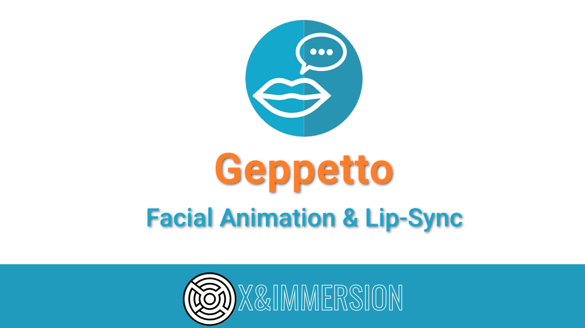

Welcome to the **Geppetto UE Plugin** for Unreal Engine. This document will show you how to use the plugin in Unreal Engine.

**Geppetto is a facial animation and lip-sync plugin for Unreal Engine, designed to automatically generate lip-sync animations from audio or text files.**

**The latest version (2.1.0) introduces a better lipsync render and the ability to export your Geppetto sequence as an animation asset, enabling versatility and increased customization. This version also includes new features like headshift.**

# Table of contents

### **[Setup](./docs/Setup.md)**

- **[Prerequisites](./docs/Setup.md#11-prerequisites)**
- **[Metahuman](./docs/Setup.md#12-metahuman)**
- **[Installation – Fab](./docs/Setup.md#13-installation---fab)**
- **[Installation – Source Code](./docs/Setup.md#14-installation---source-code)**

### **[Getting Started](./docs/GettingStarted.md)**

- **[What is Geppetto ?](./docs/GettingStarted.md#21-what-is-geppetto)**
- **[Character setup](./docs/GettingStarted.md#22-character-setup)**
- **[Geppetto Data Tables](./docs/GettingStarted.md#23-geppetto-data-tables)**
- **[Generate phonemes and emotions in the editor](./docs/GettingStarted.md#24-generate-phonemes-and-emotions-in-the-editor)**
- **[Generate phonemes and emotions on runtime](./docs/GettingStarted.md#25-generate-phonemes-and-emotions-on-runtime)**
- **[Play lip-sync on a character](./docs/GettingStarted.md#26-play-lip-sync-on-a-character)**
- **[Export lipsync as an animation](./docs/GettingStarted.md#27-export-lipsync-as-an-animation)**
- **[Play an emotion on a character](./docs/GettingStarted.md#28-play-an-emotion-on-a-character)**
- **[Play a micro expression on a character](./docs/GettingStarted.md#29-play-a-micro-expression-on-a-character)**

### **[Demo](./docs/Demo.md)**

- **[How to Open the Demo Level](./docs/Demo.md#21-how-to-open-the-demo-level)**
- **[Play with the Demo Level](./docs/Demo.md#22-play-with-the-demo-level)**
- **[Understand the Demo Level](./docs/Demo.md#23-understand-the-demo-level)**

### **[API](./docs/API.md)**

- **[Geppetto Base Component](./docs/API.md#41-geppetto-base-component)**
- **[Geppetto SoundWave Player](./docs/API.md#42-geppetto-soundwave-player)**
- **[Geppetto Player Component](./docs/API.md#43-geppetto-player-component)**
- **[Geppetto Sequencer Component](./docs/API.md#44-geppetto-sequencer-component)**
- **[Geppetto Phoneme Data Table](./docs/API.md#45-geppetto-phoneme-data-table)**
- **[Geppetto Emotion Data Table](./docs/API.md#46-geppetto-emotion-data-table)**
- **[Geppetto Micro Expressions Data Table](./docs/API.md#47-geppetto-micro-expressions-data-table)**
- **[Geppetto Blueprint Library (Editor only)](./docs/API.md#48-geppetto-blueprint-library-editor-only)**
- **[Geppetto Blueprint Library](./docs/API.md#49-geppetto-blueprint-library)**
- **[Data Assets](./docs/API.md#410-data-assets)**
- **[Geppetto Sequence](./docs/API.md#411-geppetto-sequence)**
- **[Enums](./docs/API.md#412-enums)**
- **[Structs](./docs/API.md#413-structs)**

### **[Others](./docs/Others.md)**

- **[Resources & General explanations](./docs/Others.md#5-resources--general-explanations)**
  - **[How does the Geppetto model work ?](./docs/Others.md#51-how-does-the-geppetto-model-work)**
  - **[Amplitude Calculation](./docs/Others.md#52-amplitude-calculation)**
- **[Adding Emotion Tags](./docs/Others.md#6-adding-emotion-tags)**
- **[Output](./docs/Others.md#7-output)**

# Contact

If you have any question, do not hesitate to contact us through our [Discord server](https://discord.gg/qDMwNCDE8X) or by mail at [support@xandimmersion.com](mailto:support@xandimmersion.com).
