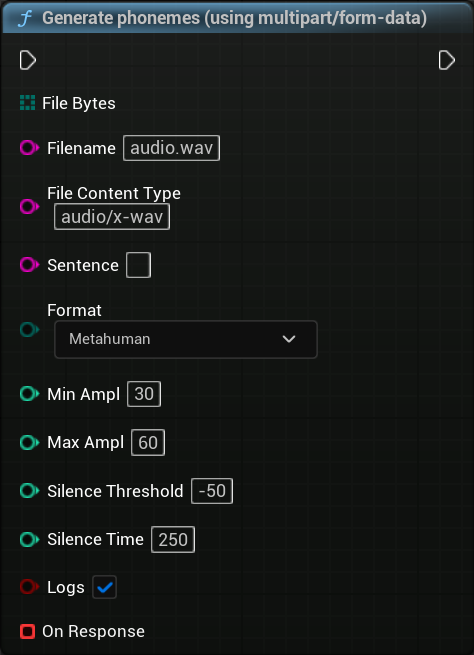
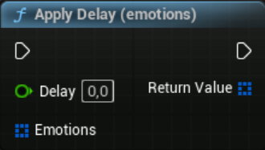
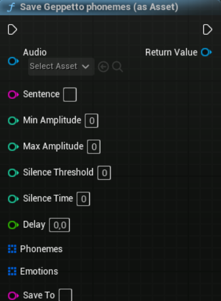

# Geppetto UE 2.0.0 – API Reference

This chapter documents all the components, nodes, structures, enums, and tools provided by the Geppetto plugin.

**[← Table of contents](../README.md#table-of-contents)**

---

### On this page

- **[Geppetto Sound Wave Player Component](#41-geppetto-sound-wave-player-component)**
- **[Geppetto Phoneme Data Table](#42-geppetto-phoneme-data-table)**
- **[Geppetto Emotion Data Table](#43-geppetto-emotion-data-table)**
- **[Geppetto Micro Expressions Data Table](#44-geppetto-micro-expressions-data-table)**
- **[Geppetto Headshift Data Table](#45-geppetto-headshift-data-table)**
- **[Geppetto Blueprint Library (Editor only)](#46-geppetto-blueprint-library-editor-only)**
- **[Geppetto Blueprint Library](#47-geppetto-blueprint-library)**
- **[Data Assets](#48-data-assets)**
- **[Geppetto Sequence](#49-geppetto-sequence)**
- **[Enums](#410-enums)**
- **[Structs](#411-structs)**
- **[Emotion Tag System](#412-emotion-tag-system)**

---

## 4.1 Geppetto Sound Wave Player Component

The base component inherited by other Geppetto Player Components such as `GeppettoDemoPlayerComponent`. 
At `BeginPlay`, it retrieves a reference to the `Audio Component` from the owner.

> [!NOTE]
> If you have multiple Audio Component or if the one used is not part of the Actor, you can directly set the variable `AudioComponent` to the correct component, prior to playing any Lipsync animation. You can do the same with the Skeletal Mesh. **In this case, please create a new child component and override the function Set Morph Target**. [See more](#component-inheritance)

When playing a lipsync, it generates Morph Target curves from the phonemes and emotions contained in the DataAsset, the Sequence or the arrays passed in parameters.
Then it updates each MorphTarget based on the current play time which can be synced with the component tick or the current audio playback time.

The Unreal events `OnPhonemeChanged` and `OnEmotionChanged` are broadcasted each time a phoneme or an emotion needs to be animated.
The other events `OnLipsyncStarted`, `OnLipsyncChanged`, and `OnLipsyncFinished` are broadcasted each a lipsync animation start, change or is finished.

### Variables

| **Field** | Type | Description |
|-------|------|-------------|
| **Update Duration From Audio Component** | `bool` | If true, sync animation with the audio play time. |
| **Blend With Animation Morph Target Values** | `bool` | If true, blend the Geppetto Morph Target values with the already existing animation values |
| **Audio Duration**            | `float` | Duration of the audio (used internally) |
| **Previous Playback Percent** | `float` | Previous progress of the audio (used internally) |
| **Current Audio Play Time**   | `float` | Current time of the playback. |
| **Max Slope**                 | `float` | The maximum slope value allowed when creating Morph Target curves |
| **Min Time Step**             | `float` | The minimum amount of time (in seconds) required between two Morph Target keys |

### Inherited properties

The `Geppetto SoundWave Player Component` is inherited from a C++ Component named `Geppetto Base Component`. This base C++ expose some other properties that can be set through the component details.

| Property name | Type | Description |
|---------------|------|-------------|
| **Phoneme Data Table** | `UDataTable` | The Phoneme Data Table used to translate a phoneme like 'A' into a list of Morph Target values. |
| **Emotion Data Table** | `UDataTable` | The Emotion Data table used to translate an emotion like 'Happy' into a list of Morph Target values. |
| **Micro Expression Data Table** | `UDataTable` | The Micro Expression Data Table used to translate a micro expression like 'Blink' into a list of Morph Target values. |
| **Headshift Data Table** | `UDataTable` | The headshift Data table used to transalte an headshift pose like `generic` into a list of **bones** values. |
| **Headshift > Generic Headshift Movement** | `UCurveFloat` | The headshift generic movement curve override. |
| **Headshift > UseGenericHeadshift** | `bool` | Set it to true to have a generic headshift animation on your character. |
| **Headshift > UseEmotionHeadshift** | `bool` | Set it to true to perform an headshift animation when playing emotions. |

You can see on the component that there are a lot of other properties listed in read-only. These values are calculated and used internally and should **NOT** be set by the user itself. However, you can use this window to debug the animation.

### Events

| Event name                 | Description |
|-----------------------|-------------|
| `On Lipsync Changed`  | Broadcasted each time the lipsync animation has changed, meaning each time the nodes `Play From Arrays`, `Play from Data Asset`, `Play From Sequence` or `Generate and Play` are called. |
| `On Lipsync Started`  | Broadcasted each time a lipsync animation starts. No parameters are provided |
| `On Lipsync Finished` | Broadcasted each time a lipsync animation ended. No parameters are provided |
| `On Phoneme Changed`  | Broadcasted each time a new phoneme needs to be processed with the following phoneme information: - The current Phoneme (with name and amplitude) - The next Phoneme (with name and amplitude) - The current Phoneme play time, in seconds |
| `On Emotion Changed`  | This event is broadcasted each time a new phoneme needs to be processed with the following emotion information: - The emotion name - The emotion Intensity - The emotion Transition time - The emotion Transition function - The emotion play time, in seconds |

### Functions

### 4.1.1 Generate and Play

Generate Lipsync at runtime with the provided audio and sentence *(optional)* and play it. This will internally call [Generate phonemes (using SoundWave)](#471-generate-phonemes-using-soundwave)

| Parameter name        | Description |
|-----------------------|-------------|
| **Audio**             | The SoundWave used to generate the lipsync. |
| **Opt Sentence**      | Optional speech text in the audio. If empty, will perform STT on the audio to extract sentence |
| **Quality**           | The lipsync generation quality. A higher quality will improve the results but may take longer to generate |
| **Auto Emotion**      | If true, will automatically determine and add emotions to the text based on the speech |
| **Amplitude Settings** | The min and max amplitudes used for phonemes generation (will impact the result animation) |

If needed, you are free to add other parameters to the event, or create an other Custom Event with more parameters.

### 4.1.2 Play From DataAsset

Play a lipsync animation provided by a [Geppetto DataAsset](#481-geppetto-data-asset)

| Parameter name              | Description |
|-----------------------------|-------------|
| **Data Asset** | The [Geppetto DataAsset](#481-geppetto-data-asset) that contains the lipsync phonemes and emotions (with time codes). |

### 4.1.3 Play From Arrays

Play a lipsync animation from the raw phonemes and emotions passed as parameters.

| Parameter name              | Description |
|-----------------------------|-------------|
| **Sound Wave** | The audio wav to play. |
| **Phonemes** | The phonemes to play. |
| **Emotions** | The emotions to play. |

### 4.1.4 Play From Sequence

Play a lipsync animation provided by a [Geppetto Sequence](#49-geppetto-sequence)

| Parameter name              | Description |
|-----------------------------|-------------|
| **Geppetto Sequence** | The [Geppetto Sequence](#49-geppetto-sequence) that contains the lipsync animation. |

### 4.1.5 Set Lipsync and Play (inherited from Base Component in C++)

Create the lipsync morph target curves from the given phonemes and emotions and play the animation. Compared to the node [Play From Arrays](#413-play-from-arrays), this function does **NOT** automatically sync the animation with the audio playback time.

| Parameter name        | Description |
|-----------------------|-------------|
| **Phonemes**          | The Phonemes list used to generate the lipsync. |
| **Emotions**          | *(can be empty)* The emotions list used to animate during the lipsync. |
| **Start Time**        | Indicate the delay between calling this node and the beginning of this animation (`0.0f` = no wait time) |
| **Max Slope**         | The maximum slope value allowed between two Morph Target keys |
| **Min Time Step**     | The minimum amount of time (in seconds) required between two Morph Target keys |

### 4.1.6 Set Lipsync (inherited from Base Component in C++)

Create the lipsync morph target curves from the given phonemes and emotions, but do not start playing the animation yet.

| Parameter name        | Description |
|-----------------------|-------------|
| **Phonemes**          | The Phonemes list used to generate the lipsync. |
| **Emotions**          | *(can be empty)* The emotions list used to animate during the lipsync. |
| **Max Slope**         | The maximum slope value allowed between two Morph Target keys |
| **Min Time Step**     | The minimum amount of time (in seconds) required between two Morph Target keys |

### 4.1.7 Set Phonemes Curves (inherited from Base Component in C++)

Directly give the Morph Target phonemes curves in order to play them. The Phonemes array is only used to trigger the [component Delegates](#events).

| Parameter name        | Description |
|-----------------------|-------------|
| **Phonemes**          | *(optional)* The Phonemes list used to trigger the components delegates |
| **Phoneme Curves**    | A map of all morph target curves, where the `Key` is the Morph Target name and the `value` is the associated lipsync animation curve. |

### 4.1.8 Set Emotions Curves (inherited from Base Component in C++)

Directly give the Morph Target emotions curves in order to play them. The emotion array is only used to trigger the [component Delegates](#events).

| Parameter name        | Description |
|-----------------------|-------------|
| **Emotions**          | *(optional)* The Emotions list used to trigger the components delegates |
| **Emotions Curves**    | A map of all morph target curves, where the `Key` is the Morph Target name and the `value` is the associated emotion(s) animation curve. |

### 4.1.9 Play (inherited from Base Component in C++)

Play the current stored lipsync animation

| Parameter                    | Description |
|-----------------------------|-------------|
| **Start Time** | The time to begin the lipsync animation. |

### 4.1.10 Change Emotion (inherited from Base Component in C++)

Use this node to change the current emotion pose dynamically. [More information](GettingStarted.md#28-play-an-emotion-on-a-character)

| Parameter | Description                     |
|-----------|---------------------------------|
| **Emotion** | Use the [GeppettoEmotion](#4112-geppetto-emotion) structure. |

### 4.1.11 Play Micro Expression (inherited from Base Component in C++)

Use this node to play a micro expression one time. [More information](GettingStarted.md#29-play-a-micro-expression-on-a-character).

| Parameter  | Description                                                        |
|------------|--------------------------------------------------------------------|
| **Name**     | The micro-expression name (must exist in the Micro Expressions Data Table). |
| **Intensity**| Intensity value from 0 to 100.                                    |
| **Speed**    | Playback speed of the micro-expression animation (must be greater than 0). |
| **Curve Override** | If provided, do not use the default curve provided in the Micro Expression Data Table, but use this one instead. |

### 4.1.12 Start Micro Expression Loop

Use this node to play a micro expression repeatedly.

| Parameter       | Description                                                                                     |
|-----------------|-------------------------------------------------------------------------------------------------|
| **Settings**    | The [Micro Expression Loop](#4113-geppetto-micro-expression) settings. |

#### 4.1.8 Stop Micro Expression Loop

Use this node to stop looping a micro expression.

| Parameter | Description                     |
|-----------|---------------------------------|
| **Name**  | The micro-expression name.      |

## 4.2 - Component Inheritance

Sometimes, the provided [Geppetto SoundWave Player Component](#41-geppetto-sound-wave-player-component) is not enough to animate the lipsync correctly. This will be the case if:
* You don't use Unreal Audio Mixer and/or Unreal SoundWave within your game
* You have more than one Skeletal Mesh Component inside your Actor (i.e.: Metahuman)
* You do not rely to Morph Target to animate your Skeletal Mesh (i.e.: Metahuman - uses the Animation Blueprint `Face_AnimBP` instead)

In these cases, you must create your own Geppetto Component. If you uses the Unreal audio mixer and SoundWaves, you can select the `Geppetto SoundWave Player Component` as the parent class. If not, you will need to select the `Geppetto Base Component V2` as the parent class. There are three Blueprint Implementable Event that must be override by all child classes:

### Set MorphTarget

Set the new value of a MorphTarget based on the current phoneme value, current emotion value and micro expressions value.   
In the default implementation, we add the three values together and check if the component should blend values with the current Animation value. If so, we also add it to the final value.
Then, we pass the final value to the `Set Morph Target` function of the `Skeletal Mesh Component`.  

### Should Sync Current Time With Audio

Defines if the current lipsync time is aligned to the audio play time or not.  

### Get Audio Current Time

Get current play time of the audio.  

### Step-by-step guide

1. Create a new Blueprint Class that have `GeppettoSoundWavePlayerComponent` *(recommanded)* or `GeppettoBaseComponentV2` as parent class

2. Open the created Blueprint class and override the function named [Set Morph Target](#set-morphtarget)

3. Put the nodes used to change the morph target values inside the function. You can delete the call to the parent node (`Parent: Set Morph Target`).

4. Here is an example working with **Metahumans** (UE 5.2 - 5.5):

5. If the parent class is the `Geppetto Base Component V2`, please override functions [Should Sync Current Time With Audio](#should-sync-current-time-with-audio) and [Get Audio Current Time](#get-audio-current-time) too.

## 4.2 Geppetto Phoneme Data Table

The Geppetto Phoneme Data Table contains all information related to phoneme (lip sync) animation. Each phoneme associates with a list of Morph Targets and their values. You can create your own Data Tables to animate any Skeletal Mesh with custom facial controls.

### Create from scratch

1. In the Content Drawer (Ctrl+Space), right-click where you want to create the Data Table (under `Miscellaneous > Data Table`) :

2. On the Pick Row Structure window, select `GeppettoPhonemeTableRow` and click **OK**.

3. Name the Data Table and add a row for each phoneme. Rename each row name to match the phoneme name.  
   The default Metahuman phonemes are:  
   ***A, E, I, O, U, PP, FF, TH, DD, KK, CH, SS, NN, RR, HH*** (15 phonemes)

4. For each phoneme, add Morph Target values representing the pose at amplitude 100.

> [!NOTE]
> You can only have a visual preview of Morph Targets in the Geppetto Sequencer editor currently. To create a Geppetto Sequencer, please read [this section](GettingStarted.md#24-generate-phonemes-and-emotions-in-the-editor).

### Add/Edit from existing

You can find pre-made Phoneme Data Tables for the Demo Scene and Metahuman characters under (`All > (Engine) > Plugins > Geppetto Content > Phonemes`).    
Feel free to duplicate and/or edit the existing Data Table in order to change the phonemes pose ! 

> *If the **Plugins** or the **Engine** folder is not showing, click on Settings at the top right of the window and ensure that “Show Plugin Content” and “Show Engine Content” is checked.*

### Import from JSON/CSV

Unreal Data Table can be imported from a JSON file or a CSV file. We highly recommend using JSON instead of CSV files. Create a new JSON file with the following structure :

Create a new Geppetto Data Table or open an existing one from within the editor. On the Data Table Details tab, choose the JSON file created and click “Import/Reimport”. If the JSON format is valid, the JSON data will be imported to the Data Table.

### Export as JSON/CSV

Right-click the Data Table asset and choose **Export as JSON** or **Export as CSV**.

---

## 4.3 Geppetto Emotion Data Table

The Geppetto Emotion Data Table contains all information related to the emotions animation. The Data Table associates each emotion with a list of Morph Targets and their values. The Geppetto plugin provides a way to create your own Data Tables in order to animate any Skeletal Mesh with custom facial controls (Morph Targets). The Emotion Data Table can be created directly within the inspector or imported from a JSON file.

*Morph Target (or Blendshapes or Shapekeys) can be added on any 3D models software that you want. You can use an add-on on Blender or Maya for exemple. Or you can use Iclone 8 to add the Arkit Shapekeys standard to your 3D model.*

### 4.3.1 Create from scratch

1. In Content Drawer, create new Data Table selecting `GeppettoEmotionTableRow`.

2. Each row on the Data Table defines an emotion. The row name is used to identify the emotion name, like “Happy” (double-click on the “Row Name” field or press F2 to rename it) : 

3. Use the Row Editor to set the Morph Targets values :

| Parameter                                           | Description |
|-----------------------------------------------------|-------------|
| **Morph Targets**                                   | The Morph Targets values that make the Skeletal mesh take on the emotion pose. The pose must be defined as if the emotion intensity were at its highest (100). |
| **Lip Sync Morph Targets Override**                 | *Optional.* The emotion Morph Targets values that will be overridden during lip sync animation. For example, if the emotion defined makes the character smile, use this to reduce the smile during speech to avoid an uncanny effect. |
| **Lip Sync Morph Targets Override Transition Time Range** | *Optional.* Transition time range between the standard emotion pose and the lip sync override pose. Randomly selected between "First" (min) and "Second" (max). Set both fields equal to fix the transition time. |

### 4.3.2 Add/Edit from existing

Pre-made tables under:  
`All > (Engine) > Plugins > Geppetto Content > Emotions`

Feel free to duplicate and/or edit the existing Data Table in order to change existing emotions or add new ones ! 

> *If the **Plugins** or the **Engine** folder is not showing, click on Settings at the top right of the window and ensure that “Show Plugin Content” and “Show Engine Content” is checked.*

### 4.3.3 Import/Export JSON same as phonemes.

Like Phoneme Data Table, Emotion Data Table can be imported from a JSON file or a CSV file. We highly recommend using JSON instead of CSV files. The import and export steps are the same as Phoneme Data Table.   
Please read the section [Import from JSON/CSV](#import-from-jsoncsv) and [Export as JSON/CSV](#export-as-jsoncsv) for more details.

---

## 4.4 Geppetto Micro Expressions Data Table

The Geppetto Micro Expressions Data Table contains all information related to the micro expressions animation. The Data Table associates each micro expression with a list of Morph Targets and their values.    
The Geppetto plugin provides a way to create your own Data Tables in order to animate any Skeletal Mesh with custom facial controls (Morph Targets). The Micro Expressions Data Table can be created directly within the inspector or imported from a JSON file :

*Morph Target (or Blendshapes or Shapekeys) can be added on any 3D models software that you want. You can use an add-on on Blender or Maya for exemple. Or you can use Iclone 8 to add the Arkit Shapekeys standard to your 3D model.*

### 4.4.1 Create from scratch

1. On the Content Drawer (Ctrl+Space), right click at the desired location and create new Data Table (under *Miscellaneous > Data Table*).
On the Pick Row Structure window, select `GeppettoMicroExpressionTableRow` :

2. Each row on the Data Table defines a micro expression. The row name is used to identify the micro expression name, like “Blink”  (double-click on the “Row Name” field or press F2 to rename it).

3. Use the Row Editor to set the Morph Targets values :

| Parameter                        | Description |
|----------------------------------|-------------|
| **Alpha Curve**                  | The curve used to determine the micro expression animation time and transition interpolation. Must be of type **Float**. Custom curves can be created for specific use cases. |
| **Fixed Morph Targets**          | *Optional.* The Morph Target values that define the pose for the micro expression, as if the intensity were at its maximum (100). |
| **Dynamic Morph Targets**        | *Optional.* Morph Targets configured with random value ranges. Useful for varying the expression each time it is triggered. |

### Détails des Dynamic Morph Targets

| Field            | Description |
|------------------|-------------|
| **Morph Targets**| The Morph Target names that will share a common randomly selected value. Allows grouped randomization. |
| **Value Range**  | The random range (min = "First", max = "Second") from which a new value will be chosen every time the micro expression is played. |

> *Please note that the same micro expression can have fixed and dynamic Morph Targets values. If a Morph Target is defined in both lists, the value defined in Fixed Morph Targets will be ignored.    
**We recommend to always plays dynamic micro expressions with the highest intensity (100), as the value is already chosen randomly between a min and a max.***

### 4.4.2 Add/Edit from existing

Pre-made tables under:  
`All > (Engine) > Plugins > Geppetto Content > MicroExpressions`

Feel free to duplicate and/or edit the existing Data Table in order to change existing emotions or add new ones ! 

> *If the **Plugins** or the **Engine** folder is not showing, click on Settings at the top right of the window and ensure that “Show Plugin Content” and “Show Engine Content” is checked.*

### 4.4.3 Import/Export JSON like above.

Like Phoneme Data Table, Micro Expressions Data Table can be imported from a JSON file or a CSV file. We highly recommend using JSON instead of CSV files. 
The import and export steps are the same as Phoneme Data Table.   
Please read the section [Import from JSON/CSV](#import-from-jsoncsv) and [Export as JSON/CSV](#export-as-jsoncsv) for more details.

---

## 4.5 Geppetto Headshift Data Table

The Geppetto Headshift Data Table contains all information related to the headshift animation. The Data Table associates each emotion or procedural neck movement (called *Generic*) with a list of Morph Targets and their values.    
The Geppetto plugin provides a way to create your own Data Tables in order to animate any Skeletal Mesh with custom facial controls (Morph Targets). The Headshift Data Table can be created directly within the inspector or imported from a JSON file :

*Morph Target (or Blendshapes or Shapekeys) can be added on any 3D models software that you want. You can use an add-on on Blender or Maya for exemple. Or you can use Iclone 8 to add the Arkit Shapekeys standard to your 3D model.*

### 4.5.1 Create from scratch

1. On the Content Drawer (Ctrl+Space), right click at the desired location and create new Data Table (under *Miscellaneous > Data Table*).
On the Pick Row Structure window, select `GeppettoHeadshiftTableRow` :

2. Each row on the Data Table defines a headshift. The row name is used to identify the headshift "action", like "Happy" for neck movements to play when character is happy (double-click on the “Row Name” field or press F2 to rename it).

> Please note that the row "Generic" represents procedural headshift animation.    
If you want to enable procedural, be sure that the used Headshift DataTable possess a "Generic" row.

3. Use the Row Editor to set the Morph Targets values :
  

| Parameter                        | Description |
|----------------------------------|-------------|
| **Movement Curve**                  | The curve used to determine the headshift animation. Must be of type **Float**. Custom curves can be created for specific use cases. |
| **Range Speed**          | The range of speed available for this headshift. |
| **Range Amplitude**        | The range of amplitude available for this headshift. |
| **Max Influenced Axis**        | From -1 to 1. It represents the maximum scalar an axis can have for the headshift. |
| **Min Influenced Axis**        | From -1 to 1. It represents the minimum scalar an axis can have for the headshift. |

### 4.5.2 Add/Edit from existing

Pre-made tables under:  
`All > (Engine) > Plugins > Geppetto Content > MicroExpressions > Headshift`

Feel free to duplicate and/or edit the existing Data Table in order to change existing emotions or add new ones ! 

> *If the **Plugins** or the **Engine** folder is not showing, click on Settings at the top right of the window and ensure that “Show Plugin Content” and “Show Engine Content” is checked.*

### 4.5.3 Import/Export JSON like above.

Like Phoneme Data Table, Headshift Data Table can be imported from a JSON file or a CSV file. We highly recommend using JSON instead of CSV files. 
The import and export steps are the same as Phoneme Data Table.   
Please read the section [Import from JSON/CSV](#import-from-jsoncsv) and [Export as JSON/CSV](#export-as-jsoncsv) for more details.

---

## 4.7. Geppetto Blueprint Library

The following functions can be used in both runtime and editor assets, such as Blueprint classes. Please note that the following functions are declared in C++.

### 4.7.1. Generate phonemes (using SoundWave)

Generate the phonemes for the given SoundWave and sentence.

**SoundWave detail Window** :

| **Parameter**           | **Description** |
|--------------------------|-----------------|
| **Audio**                | The SoundWave used for phoneme generation. |
| **Sentence**             | The sentence spoken in the audio. |
| **Format**               | The output format of your phonemes. You should not change it. Default is `Metahuman` |
| **Min Ampl**, **Max Ampl** | Range of phoneme amplitude (0–100). |
| **Silence Threshold**, **Silence Time** | Silence detection parameters. |

### 4.7.2. Generate phonemes (using PCM bytes)

Generate the phonemes using a PCM raw byte buffer and sentence.

| **Parameter**      | **Description** |
|--------------------|-----------------|
| **PCM Bytes**      | The PCM waves data bytes. |
| **Sample Rate**    | The sample rate of the PCM waves (=frequency). Mostly 44100. |
| **Bit Depth**      | The bit depth of the PCM waves (=sample data length). Mostly 16 or 24. |
| **Num Channels**   | The amount of channels of the PCM waves (mono=1, stereo=2, etc.). |
| **Other parameters** | See Generate phonemes (using SoundWave). |

### 4.7.3. Generate phonemes (using multipart/form-data)

Same as the other phoneme generation nodes, but uses the `multipart/form-data` format required by some APIs.

| **Parameter**        | **Description** |
|----------------------|-----------------|
| **File Bytes**       | The file bytes. Can be all type of files. |
| **Filename**         | The filename that will be sent and read by the API. No real impact. |
| **File Content Type**| The HTTP MIME Content-Type of the file. Must match the file structure. |
| **Other parameters** | See Generate phonemes (using SoundWave). |

### 4.7.4. Apply Delay (Phonemes)

Applies a delay to the list of phonemes returned by the API.

| **Parameter**        | **Description** |
|----------------------|-----------------|
| **File Bytes**       | The file bytes. Can be all type of files. |
| **Filename**         | The filename that will be sent and read by the API. No real impact. |
| **File Content Type**| The HTTP MIME Content-Type of the file. Must match the file structure. |
| **Other parameters** | See Generate phonemes (using SoundWave). |

---

### 4.7.5. Apply Delay (Emotions)

Applies a delay to the list of emotions returned by the API.

| **Parameter**   | **Description**                                               |
|-----------------|---------------------------------------------------------------|
| **Delay**       | The delay that will be applied, in milliseconds. Can be positive or negative. |
| **Emotions**    | The emotions list to apply the delay to.                      |
| **Return Value**| The emotions list with the delay applied.                     |

---

### 4.7.6. Get Morph Targets for Phoneme

Returns the Morph Targets and corresponding values for a phoneme name from a given Phoneme Table.

| **Parameter**     | **Description**                                              |
|-------------------|--------------------------------------------------------------|
| **Phoneme**       | The phoneme name.                                            |
| **Phoneme Table** | The Phoneme Data Table used to retrieve Morph Targets values.|
| **Return Value**  | The list of all Morph Targets used for the phoneme and their values. |

---

### 4.7.7. Safe Lerp

Safe linear interpolation with clamping. Used internally to blend values without exceeding limits.

| **Parameter**   | **Description**                                                          |
|-----------------|--------------------------------------------------------------------------|
| **A**           | The minimum value, returned when Alpha <= 0.0                           |
| **B**           | The maximum value, returned when Alpha >= 1.0                           |
| **Alpha**       | The alpha value used to interpolate between A and B                     |
| **Return Value**| The safe linear interpolation result (either A, B, or a standard interpolation) |

## 4.6. Geppetto Blueprint Library (Editor only)

The following functions can only be used in Editor-only assets, such as Editor Utility Widget or Editor Utility Blueprint. Please note that the following functions are declared in C++.

### 4.6.1 Save Geppetto Phonemes

Save the generated phonemes as a `Geppetto Data Asset` or as a Sequencer track.

#### Parameters

| **Parameter**     | **Description** |
|-------------------|-----------------|
| **Save file as**  | Choose the output format: `DataAsset` (for playback using the `SoundWavePlayer`) or `Sequencer` (for timeline-based facial animation using `GeppettoSequence`). |
| **Save file at**  | The directory path where the generated `.uasset` will be saved in your project. |

---

### 4.6.2 Show save file selection dialog

Show the operating system save file selection dialog for a Geppetto Data Asset.    
**Please note that the whole engine is freezed while the OS file selection window is opened.**

| **Parameter**      | **Description** |
|--------------------|-----------------|
| **Selected Path**  | The file path selected by the user, relative to the project's `Content` folder. Returns `"INVALID PATH"` or an empty string if no path was selected or if the path is invalid. |

### 4.6.3 Get Documentation URL

Open the plugin's documentation link in your web browser.

---

## 4.8. Data Assets

A Data Asset is an Unreal Asset used to store Data. The Geppetto Plugin uses custom defined Data Assets written in C++.

---

### 4.8.1. Geppetto Data Asset

Geppetto Data Assets are used to store and save the generated phonemes and emotions generated from the API within the Editor in order to use them in the game later. You can use the Geppetto SoundWave Player node `Play Data Asset` to animate the data contained in the Data Asset. All fields are Blueprint Read-Only, but you can use the node `Save Geppetto Phonemes (as Asset)` to create a new Data Asset with Blueprint. Please note that the node is only available within the Editor.

| Audio               | The audio associated with the lip sync.                                  |
|---------------------|-------------------------------------------------------------------------|
| **Sentence**            | (Info only) The sentence used for generation.                           |
| **Min Ampl**            | (Info only) The minimum amplitude value used for generation.            |
| **Max Ampl**            | (Info only) The maximum amplitude value used for generation.            |
| **Silence Threshold**   | (Info only) The silence threshold value (dB) used for generation.       |
| **Silence Time**        | (Info only) The silence time (in milliseconds) used for generation.     |
| **Delay**              | (Info only) The delay applied to phonemes and emotions after generation.|
| **Phonemes**            | The phonemes list generated by the API, used to animate lip sync.       |
| **Emotions**            | The emotions list generated by the API, used to animate emotions.       |

---

### 4.9 Geppetto Sequence

A `GeppettoSequence` is a custom asset that contains all the assets and logic to play a lip-sync animation in one file. This asset contains a `LevelSequence` with a timeline for the audio file and a timeline for each `Morph Target` with their amplitude represented as a curve. That is the main element of this asset as it handles all the logic of the lip-sync animation to play on a character.

The `GeppettoSequence` asset can also be edited inside a custom editor which allows you to see the render of the lip-sync animation in a preview scene with the selected mesh. Here is an overview:

- The red box is the viewport. It gives you a preview of what the lip-sync animation will look like in-game.

- The orange box is the sequencer editor. Here you can edit each Morph Target amplitude and the frame when the amplitude plays. You can also add or remove any timeline if you want.

- The blue box is the Detail Panel, here you have a few settings :
  - Preview Mesh : You can select the skeletal mesh to preview.
  - Advanced Parameters :
    - Face Animation : This is an optional parameter to use when your character does not contain Morph Targets but instead Controls (another kind of blendshapes used by some characters such as MetaHumans). 
    You should select the AnimationBlueprint of your character in order to properly preview the lip-sync animation.

## 4.10 Enums

Here you can find the list and values of all enums defined by the Geppetto Plugin.

---

### 4.10.1. Geppetto Emotion Transition

This enum is used to choose the emotion transition each time the emotion pose changes. Users can use their own defined function behavior by using the Geppetto Player Component node `Set Emotion Custom Curve`.

| Interpolation Type | Description                                  |
|--------------------|----------------------------------------------|
| **Linear**             | Use linear interpolation.                     |
| **Ease**               | Easing interpolation.                         |
| **Ease-In**            | Easing in only interpolation.                 |
| **Ease-Out**           | Easing out only interpolation.                |
| **Ease-In-Out**        | Easing in and out interpolation. Similar to Ease. |
| **Cubic**              | Cubic interpolation. Similar to Ease-In-Out and Ease. |
| **CUSTOM 1-10**        | Custom interpolation. See `Set Emotion Custom Curve`. |

---

## 4.11 Structs

Here you can find the list and details of all structs defined by the Geppetto Plugin.

---

### 4.11.1. Geppetto Phoneme

A struct containing all parameters to play a Geppetto Phoneme. All variables are Blueprint read-write:

| Name      | Description                                                      |
|-----------|------------------------------------------------------------------|
| **Name**      | The phoneme name.                                                |
| **Amplitude** | The phoneme amplitude, range 0 - 100.                           |
| **Time**      | The phoneme animation play time, matching the audio for synchronization. |

---

### 4.11.2. Geppetto Emotion

A struct containing all parameters to play a Geppetto Emotion. All variables are Blueprint read-write:

| Name               | Description                                                    |
|--------------------|----------------------------------------------------------------|
| **Name**               | The emotion name.                                              |
| **Intensity**          | The emotion intensity, range 0 - 100.                         |
| **Transition time**    | The emotion transition time, in seconds.                      |
| **Transition function**| See Geppetto Emotion Transition.                              |
| **Time**               | The emotion animation play time, matching the sentence tag for sync. |

---

### 4.11.3. Geppetto Micro Expression

A struct containing all parameters to play a Geppetto Micro Expression. All variables are Blueprint read-write:

| Parameter              | Description                                                                                      |
|-----------------------|--------------------------------------------------------------------------------------------------|
| **Curve**                 | The curve used to determine the micro expression animation time and transition interpolation. Must be a “Float” type curve. |
| **Transition Morph Targets** | The micro expression Morph Targets and their values used for animation.                          |
| **Current Tick Morph Targets** | The current tick Morph Targets values used by the micro expression, managed by the Geppetto Player Component. |
| **Speed**                 | The animation speed of the micro expression. Must be greater than 0.                             |
| **Is Animating**          | Indicates whether the micro expression is currently animating (not started, finished). Managed by the Geppetto Player. |
| **Time**                 | The micro expression animation play time. *(Currently unused)*                                   |

---

### 4.11.4. Dynamic Micro Expression

A struct containing all values related to dynamic Micro Expression Morph Targets. Used in Micro Expression Data Table:

| Parameter     | Description                       |
|---------------|---------------------------------|
| **Morph Targets** | The dynamic Morph Targets names.|
| **Value Range**   | The dynamic Morph Target min and max values. |

---

### 4.11.5. Tuple Float

Since Unreal `FTuple<float>` is not supported in Blueprint yet, this struct is used instead.

| Parameter | Description                              |
|-----------|------------------------------------------|
| **First**     | The tuple first value, i.e. the min value or the begin time. |
| **Second**    | The tuple second value, i.e. the max value or the end time.   |

---

## 4.12 Emotion Tag System

The emotion tag system allows you to change the character emotion at a specific point of the sentence. Its base syntax is the following :

### Syntax

`<emotion name intensity 80 transition 300 function_type linear>`

### Parameters

| Parameter         | Description                               | Default      |
|---------------|-------------------------------------------|--------------|
| emotion       | Name of the emotion                       | (required)   |
| intensity     | Intensity (0-100)                         | 50           |
| transition    | Transition time in ms                     | 200          |
| function_type | Interpolation function (linear, cubic…)  | cubic        |

### Example

You can mix tags with runtime Blueprint emotion changes for full control.
Please read section [2.7 Play an emotion on a character](./GettingStarted.md#27-play-an-emotion-on-a-character) of the documentation for more details on how to change an emotion at Runtime using Blueprints.