# Geppetto UE 2.0.0 – API Reference

This chapter documents all the components, nodes, structures, enums, and tools provided by the Geppetto plugin.

**[← Table of contents](../README.md#table-of-contents)**

---

### On this page

#### *Components*
- **[Geppetto Base Component](#41-geppetto-base-component)**
- **[Geppetto Sound Wave Player Component](#42-geppetto-soundwave-player-component)**
- **[Component Inheritance](#43-component-inheritance)**
   - ***[Step by step guide](#step-by-step-guide)***

#### *Data Tables*
- **[Phoneme Data Table](#44-geppetto-phoneme-data-table)**
- **[Emotion Data Table](#45-geppetto-emotion-data-table)**
- **[Micro expression Data Table](#46-geppetto-micro-expressions-data-table)**
- **[Headshift Data Table](#47-geppetto-headshift-data-table)**

#### *Blueprint Libraries (Nodes)*
- **[Geppetto BP Library](#48-geppetto-blueprint-library)**
   - ***[Generate phonemes (using SoundWave)](#481-generate-phonemes-using-soundwave)***
   - ***[Generate phonemes (using PCM bytes)](#482-generate-phonemes-using-pcm-bytes)***
   - ***[Generate phonemes (using File bytes)](#483-generate-phonemes-using-file-bytes)***
   - ***[Apply Delay (phonemes)](#484-apply-delay-phonemes)***
   - ***[Apply Delay (emotions)](#485-apply-delay-emotions)***
   - ***[Get Morph Targets for Phoneme](#486-get-morph-targets-for-phoneme)***
   - ***[Get Morph Targets for Emotion](#487-get-morph-targets-for-emotion)***
   - ***[Safe Lerp](#488-safe-lerp)***

- **[Curve Generator BP Library](#49-geppetto-curve-generator-blueprint-library)**
   - ***[Create Phoneme Curves](#491-create-phoneme-curves)***
   - ***[Create Emotion Curves](#492-create-emotion-curves)***
   - ***[Create All Curves](#493-create-all-curves)***
   - ***[Extract Phonemes and Emotions from Sequence](#494-extract-phonemes-and-emotions-from-sequence)***
   - ***[Get Curves Max Time](#495-get-curves-max-time)***

- **[Headshift BP Library](#410-geppetto-headshift-blueprint-library)**
   - ***[Initialize new Movement](#4101-initialize-new-movement)***
   - ***[Update Generic Movement](#4102-update-generic-movement)***
   - ***[Blend Emotion Headshift](#4103-blend-emotion-headshift)***

- **[Geppetto Editor BP Library *(Editor only)*](#411-geppetto-blueprint-library-editor-only)**
   - ***[Save Geppetto Phonemes as Data Asset](#4111-save-geppetto-phonemes-as-data-asset)***
   - ***[Save as Sequence](#4112-save-as-sequence)***
   - ***[Convert Geppetto Sequence into animation](#4113-convert-geppetto-sequence-into-animation)***
   - ***[Create editor Data Preset](#4114-create-editor-data-preset)***
   - ***[Show Save File Selection Dialog](#4115-show-save-file-selection-dialog)***
   - ***[Get Documentation URL](#4116-get-documentation-url)***
   - ***[Is PIE Mode Active](#4117-is-pie-mode-active)***

#### *Assets*
- **[Geppetto DataAsset](#4121-geppetto-data-asset)**
- **[Geppetto Sequence](#4122-geppetto-sequence)**
- **[Geppetto Preset DataAsset *(Editor only)*](#4123-geppetto-preset-data-asset-editor-only)**

#### *Enums*
- **[Emotion Transition](#4131-geppetto-emotion-transition)**
- **[Format](#4132-geppetto-format)**
- **[Language](#4133-geppetto-language)**
- **[Quality](#4134-geppetto-quality)**
- **[Sequence FPS](#4135-geppetto-sequence-fps)**

#### *Structs*
- **[Phoneme](#4141-geppetto-phoneme)**
- **[Emotion](#4142-geppetto-emotion)**
- **[Micro expression](#4143-geppetto-micro-expression)**
- **[Dynamic Micro expression](#4144-dynamic-micro-expression)**
- **[Headshift Movement](#4145-geppetto-headshift-movement)**
- **[Headshift Data](#4146-geppetto-headshift-data)**
- **[Emotion Headshift](#4147-geppetto-emotion-headshift)**
- **[Amplitude](#4148-geppetto-amplitude)**
- **[Silence](#4149-geppetto-silence)**
- **[Response Settings](#41410-geppetto-response-settings)**
- **[Tuple Float](#41411-tuple-float)**

  

## 4.1 Geppetto Base Component

> [!NOTE]
> The current name of the component is `Geppetto Base Component V2`.

The Geppetto Base Component is an Actor Component declared in C++ that helps you to perform Geppetto animations (lipsync, emotions, micro-expressions, headshift)
on your Unreal Actors. This component is intended to be inherited in Blueprint, such as for the [Geppetto SoundWave Player Component](#42-geppetto-soundwave-player-component) that provides syncing animation with Unreal SoundWave played through an `AudioComponent`. 

This component has three functions that need to be overridden by the BP inherited classes to work properly:
* [Set Morph Target](#431-set-morph-target)
* [Should Sync With Audio](#432-should-sync-current-time-with-audio)
* [Get Audio Current Time](#433-get-audio-current-time)

You can find more information on how to create a new child component in chapter [Component Inheritance](#43-component-inheritance).

### Events

Your Blueprint classes can be bound to the following events declared in C++ in order to dynamically interact with the lipsync animation. Use the nodes `Assign ...` or `Bind Event to ...`:

| Event name            | Description | 
|-----------------------|-------------|
| **On Lipsync Changed**  | Broadcasted each time the lipsync animation curves have changed |
| **On Lipsync Started**  | Broadcasted each time a lipsync animation starts |
| **On Lipsync Finished** | Broadcasted each time a lipsync animation ended |
| **On Phoneme Changed**  | Broadcasted each time a new phoneme needs to be processed with the following phoneme information: - The current Phoneme (with name and amplitude) - The next Phoneme (with name and amplitude) - The current Phoneme play time, in seconds |
| **On Emotion Changed**  | This event is broadcasted each time a new phoneme needs to be processed with the following emotion information: - The emotion name - The emotion Intensity - The emotion Transition time - The emotion Transition function - The emotion play time, in seconds |

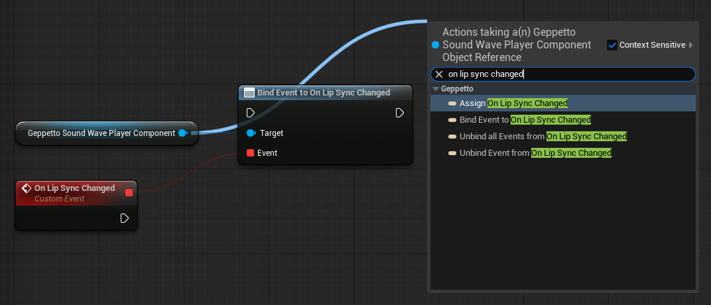

### Variables

| Property name | Type | Default value | Description |
|---------------|------|---------------|-------------|
| **Blend With Animation Morph Target Values** | `bool` | true | If true, blend the Geppetto Morph Target values with the already existing animation values |
| **Phoneme Data Table** | `UDataTable` | - | The Phoneme Data Table used to translate a phoneme like 'A' into a list of Morph Target values |
| **Emotion Data Table** | `UDataTable` | - | The Emotion Data table used to translate an emotion like 'Happy' into a list of Morph Target values |
| **Micro Expression Data Table** | `UDataTable` | - | The Micro Expression Data Table used to translate a micro expression like 'Blink' into a list of Morph Target values |
| **Headshift Data Table** | `UDataTable` | - | The headshift Data table used to translate a headshift pose like `generic` into a list of **bones** values. |
| **Headshift > Generic Headshift Movement** | `UCurveFloat` | - | The headshift generic movement curve override. |
| **Headshift > Headshift Blend Emotion Speed** | `float` | 3.0 | The time to blend from the current headshift to the emotion headshift |
| **Headshift > UseGenericHeadshift** | `bool` | false | Set it to true to have a generic headshift animation on your character. |
| **Headshift > UseEmotionHeadshift** | `bool` | true | Set it to true to perform a headshift animation when playing emotions. |

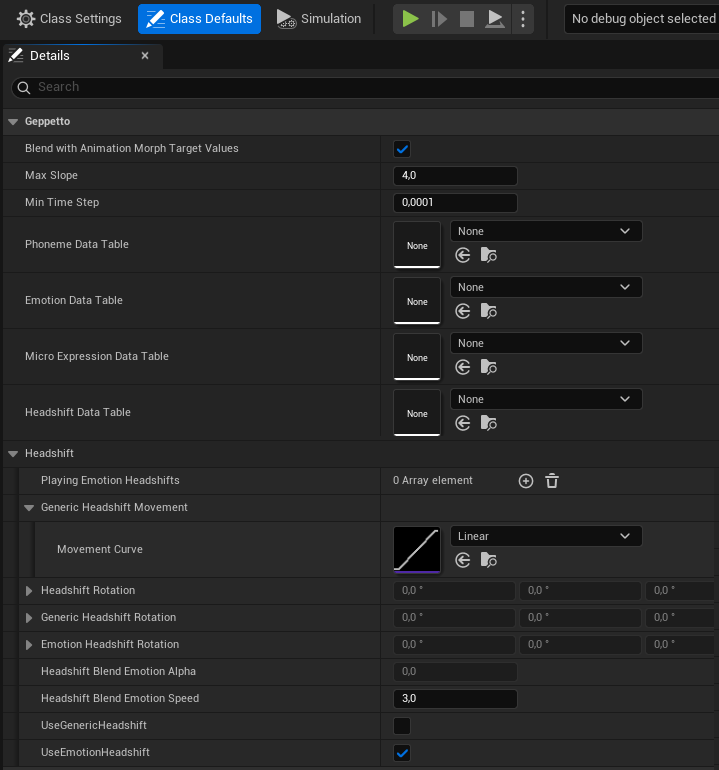

You can see in the component that there are a lot of other properties listed as read-only. These values are calculated and used internally and should **NOT** be set by the user. However, you can use this window to debug the animation.

### Functions

### 4.1.1 Set Lipsync and Play

Create the lipsync morph target curves from the given phonemes and emotions and play the animation. Compared to the node [Play From Arrays](#423-play-from-arrays), this function does **NOT** automatically sync the animation with the audio playback time.

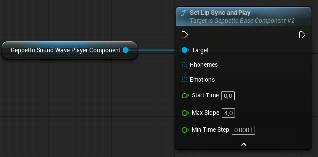

| Parameter name        | Type | Default value | Description |
|-----------------------|------|---------------|-------------|
| **Phonemes**          | Array of [Geppetto Phoneme](#4141-geppetto-phoneme) | - |The Phonemes list used to generate the lipsync. |
| **Emotions**          | *(optional)* Array of [Geppetto Emotion](#4142-geppetto-emotion) | *Empty array* | The emotions list used to animate during the lipsync. |
| **Start Time**        | `float` | 0.0 | Indicates the delay between calling this node and the beginning of this animation (`0.0f` = no wait time) |
| **Max Slope**         | `float` | 4.0 | The maximum slope value allowed between two Morph Target keys |
| **Min Time Step**     | `float` | 0.0001 | The minimum amount of time (in seconds) required between two Morph Target keys |

### 4.1.2 Set Lipsync 

Create the lipsync morph target curves from the given phonemes and emotions, but do not start playing the animation yet.

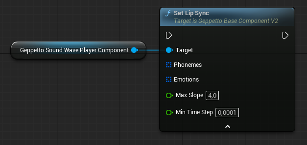

| Parameter name        | Type | Default value | Description |
|-----------------------|------|---------------|-------------|
| **Phonemes**          | Array of [Geppetto Phoneme](#4141-geppetto-phoneme) | - |The Phonemes list used to generate the lipsync. |
| **Emotions**          | *(optional)* Array of [Geppetto Emotion](#4142-geppetto-emotion) | *Empty array* | The emotions list used to animate during the lipsync. |
| **Max Slope**         | `float` | 4.0 | The maximum slope value allowed between two Morph Target keys |
| **Min Time Step**     | `float` | 0.0001 | The minimum amount of time (in seconds) required between two Morph Target keys |

### 4.1.3 Set Phonemes Curves

Directly give the Morph Target phonemes curves in order to play them. The Phonemes array is only used to trigger the [component Delegates](#events).

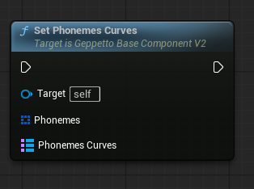

| Parameter name        | Type | Default value | Description |
|-----------------------|------|---------------|-------------|
| **Phonemes**          | *(optional)* Array of [Geppetto Phoneme](#4141-geppetto-phoneme) | *Empty array* | The Phonemes list used to trigger the components delegates |
| **Phoneme Curves**    | Map of <`Fname`, `UCurveFloat`> | - | A map of all morph target curves, where the `Key` is the Morph Target name and the `value` is the associated lipsync animation curve. |

### 4.1.4 Set Emotions Curves

Directly give the Morph Target emotions curves in order to play them. The emotion array is only used to trigger the [component Delegates](#events).

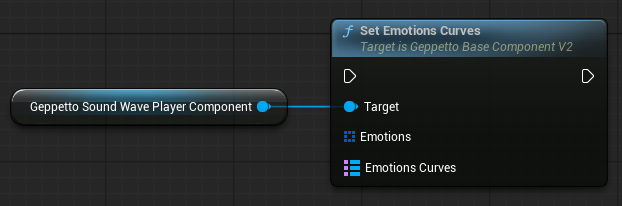

| Parameter name        | Type | Default value | Description |
|-----------------------|------|---------------|-------------|
| **Emotions**          | *(optional)* Array of [Geppetto Emotion](#4142-geppetto-emotion) | *Empty array* | The Emotions list used to trigger the components delegates |
| **Emotions Curves**   | Map of <`Fname`, `UCurveFloat`> | - | A map of all morph target curves, where the `Key` is the Morph Target name and the `value` is the associated emotion(s) animation curve. |

### 4.1.5 Play

Play the current stored lipsync animation.

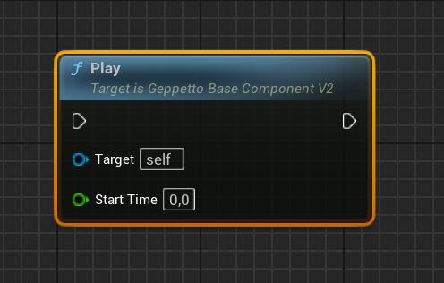

| Parameter name        | Type | Default value | Description |
|-----------------------|------|---------------|-------------|
| **Start Time**        | `float` | 0.0 | Indicates the delay between calling this node and the beginning of this animation (`0.0f` = no wait time) |

### 4.1.6 Change Emotion

Use this node to change the current emotion pose dynamically. [More information](GettingStarted.md#28-play-an-emotion-on-a-character)

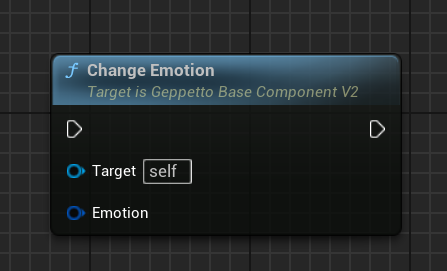

| Parameter name        | Type | Default value | Description |
|-----------------------|------|---------------|-------------|
| **Emotion** | [Geppetto Emotion](#4142-geppetto-emotion) | - | The emotion to animate (must be defined in the [Emotion Data Table](#45-geppetto-emotion-data-table)) |

### 4.1.7 Play Micro Expression

Use this node to play a micro expression one time. [More information](GettingStarted.md#29-play-a-micro-expression-on-a-character).

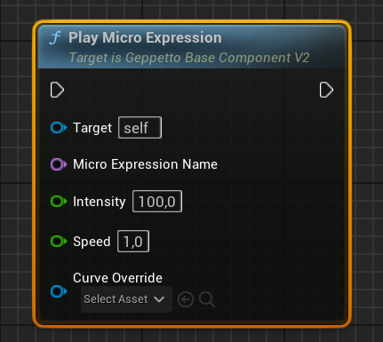

| Parameter name        | Type | Default value | Description |
|-----------------------|------|---------------|-------------|
| **Name**      | `FName` | - | The micro-expression name (must be defined in the [Micro Expressions Data Table](#46-geppetto-micro-expressions-data-table)). |
| **Intensity** | `float` | 100.0 | The micro-expression intensity value from 0 to 100. |
| **Speed**     | `float` | 1.0 | Playback speed of the micro-expression animation (must be greater than 0.0, 1.0 = default speed). |
| **Curve Override** | `UCurveFloat` | - | If provided, do not use the default curve provided in the Micro Expression Data Table, but use this one instead. |

### 4.1.8 Start Micro Expression Loop

Use this node to play a micro expression repeatedly.

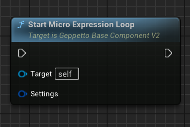

| Parameter name        | Type | Default value | Description |
|-----------------------|------|---------------|-------------|
| **Settings** | [Micro Expression Loop](#4143-geppetto-micro-expression-loop) | - | The loop settings. |

#### 4.1.9 Stop Micro Expression Loop

Use this node to stop looping a micro expression.

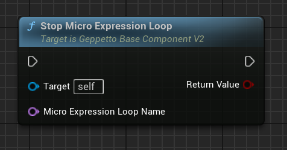

| Parameter name        | Type | Default value | Description |
|-----------------------|------|---------------|-------------|
| **Name**        | `FName` | - | The micro-expression loop name to stop. |

 

## 4.2 Geppetto SoundWave Player Component

The Geppetto SoundWave Player Component is a Blueprint Actor Component that inherits from the [Geppetto Base Component](#41-geppetto-base-component) and can be used to play Geppetto animation on a `Skeletal Mesh` using the function [USkeletalMeshComponent::SetMorphTarget](https://dev.epicgames.com/documentation/unreal-engine/API/Runtime/Engine/Components/USkeletalMeshComponent/SetMorphTarget), syncing it with a `USoundWave` played through an `Audio Component`. 

This Component uses **The first Skeletal Mesh Component and Audio Component** found in the owning actor. If you have multiple SkeletalMesh/Audio components attached to your Actor, or they are not directly attached to the owning Actor, or if you rely on another method to animate your Skeletal Mesh (such as an Animation Blueprint), we recommend you to create a new [Geppetto Component](#41-geppetto-base-component) that inherits from the Geppetto SoundWave Player Component and override the logic to put yours instead. More information in the chapter [Component Inheritance](#43-component-inheritance).

> [!IMPORTANT]
> Because Metahuman Blueprint Actor has multiple Skeletal Mesh Components and uses custom Controls to animate the face, you **must** create a new child Blueprint Component that inherits from this component, and do not use the Geppetto SoundWave Player Component directly. You can find more information in the chapters [Component Inheritance](#43-component-inheritance) and [Use Geppetto with Metahuman](#TODO).

When playing a lipsync, it generates Morph Target curves from the phonemes and emotions contained in the [DataAsset](#4121-geppetto-data-asset), the [Sequence](#4122-geppetto-sequence) or the [Phonemes](#4141-geppetto-phoneme) and [Emotions](#4142-geppetto-emotion) passed in parameters.
Then it updates each MorphTarget based on the current play time which can be synced with the component tick or the current audio playback time.

### Events

The Geppetto SoundWave Player Component inherits the [events](#events) declared in the [Geppetto Base Component](#41-geppetto-base-component).

The Unreal events `OnPhonemeChanged` and `OnEmotionChanged` are broadcasted each time a phoneme or an emotion needs to be animated.
The other events `OnLipsyncStarted`, `OnLipsyncChanged`, and `OnLipsyncFinished` are broadcasted each time a lipsync animation starts, changes or is finished. [More information](#events)

### Variables

The Geppetto SoundWave Player Component inherits the [variables](#variables) declared in the [Geppetto Base Component](#41-geppetto-base-component).

| Property name     | Type    | Default value | Description |
|-------------------|---------|---------------|-------------|
| **Max Slope**     | `float` | 4.0           | The maximum slope value allowed when creating Morph Target curves |
| **Min Time Step** | `float` | 0.0001        | The minimum amount of time (in seconds) required between two Morph Target keys |

### Internal variables

The following properties are used by the component internally and **should not be set by the user directly**. Child components may override them if necessary.

| Property name                 | Type    | Description |
|-------------------------------|---------|-------------|
| **Audio Component**           | `UAudioComponent` | The audio component to use to play the SoundWave and sync the animation with it | 
| **Update Duration From Audio Component** | `bool` | If true, sync animation with the audio play time. If false, sync with the tick delta time |
| **Audio Duration**            | `float` | Total duration of the current audio  |
| **Previous Playback Percent** | `float` | Previous progress percent of the audio |
| **Current Audio Play Time**   | `float` | Current time of the playback |

### Functions

The Geppetto SoundWave Player Component inherits the [functions](#functions) declared in the [Geppetto Base Component](#41-geppetto-base-component):
* [Set Lipsync and Play](#411-set-lipsync-and-play)
* [Set Lipsync](#412-set-lipsync)
* [Set Phonemes Curves](#413-set-phonemes-curves)
* [Set Emotions Curves](#414-set-emotions-curves)
* [Play](#415-play)
* [Change Emotion](#416-change-emotion)
* [Play Micro expression](#417-play-micro-expression)
* [Start Micro expression Loop](#418-start-micro-expression-loop)
* [Stop Micro expression Loop](#419-stop-micro-expression-loop)

### 4.2.1 Generate and Play

Generate Lipsync at runtime with the provided audio and sentence *(optional)* and play it. This will internally call [Generate phonemes (using SoundWave)](#481-generate-phonemes-using-soundwave)

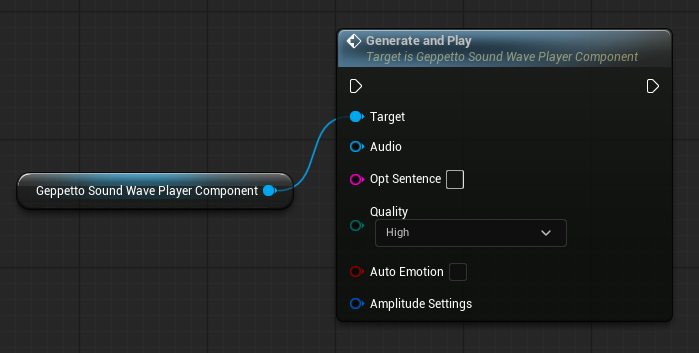

| Parameter name        | Type | Default value | Description |
|-----------------------|------|---------------|-------------|
| **Audio**             | `USoundWave` | - | The SoundWave used to generate the lipsync. |
| **Opt Sentence**      | `FString` | *Empty string* | Optional speech text in the audio. If empty, will perform STT on the audio to extract sentence |
| **Quality**           | [Geppetto Quality](#4134-geppetto-quality) | High | The lipsync generation quality. A higher quality will improve the results but may take longer to generate |
| **Auto Emotion**      | `bool` | false | If true, will automatically determine and add emotions to the text based on the speech |
| **Amplitude Settings** | [Geppetto Amplitude](#4148-geppetto-amplitude) | 30-70 | The min and max amplitudes used for phonemes generation (will impact the result animation) |

### 4.2.2 Play From DataAsset

Play a lipsync animation provided by a [Geppetto DataAsset](#4121-geppetto-data-asset)

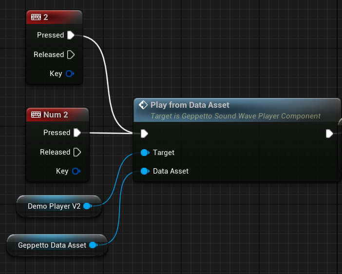

| Parameter name        | Type | Default value | Description |
|-----------------------|------|---------------|-------------|
| **Data Asset**        | [Geppetto DataAsset](#4121-geppetto-data-asset) | - | The saved lipsync phonemes and emotions (with time codes) |

### 4.2.3 Play From Arrays

Play a lipsync animation from the raw phonemes and emotions passed as parameters.

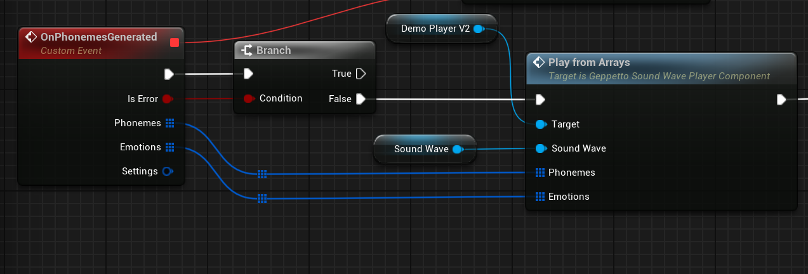

| Parameter name  | Type | Default value | Description |
|-----------------|------|---------------|-------------|
| **Sound Wave**  | `USoundWave` | - | The SoundWave to play |
| **Phonemes**    | Array of [Geppetto Phoneme](#4141-geppetto-phoneme) | - | The Phonemes to animate while playing the SoundWave (synced) |
| **Emotions**    | *(optional)* Array of [Geppetto Emotion](#4142-geppetto-emotion) | *Empty array* | The Emotions to animate while playing the SoundWave (synced) |

### 4.2.4 Play From Sequence

Play a lipsync animation provided by a [Geppetto Sequence](#4122-geppetto-sequence)

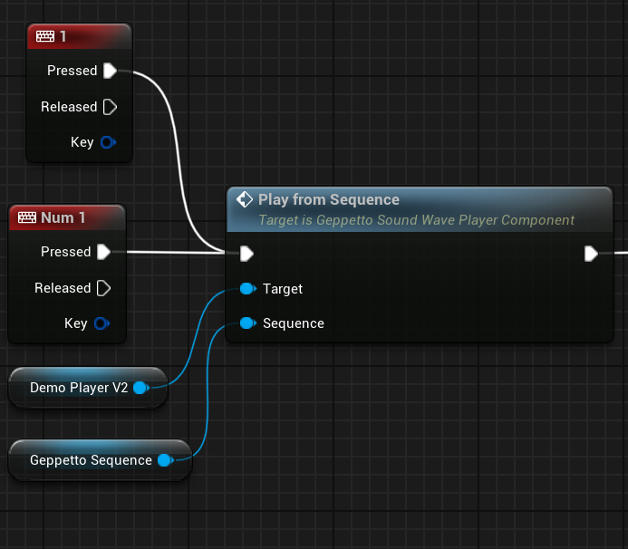

| Parameter name        | Type | Default value | Description |
|-----------------------|------|---------------|-------------|
| **Geppetto Sequence** | [Geppetto Sequence](#4122-geppetto-sequence) | - | The sequence that contains the lipsync animation. |

 

## 4.3 Component Inheritance

Sometimes, the provided [Geppetto SoundWave Player Component](#42-geppetto-soundwave-player-component) is not enough to animate the lipsync correctly. This will be the case if:
* You don't use the Audio Component attached to the owning Actor or you have multiple Audio Components
* You don't use Unreal Audio Mixer and/or Unreal SoundWave within your game
* You don't use the Skeletal Mesh Component attached to the owning Actor or you have multiple Skeletal Mesh Components (i.e.: Metahuman - has multiple Mesh Components)
* You do not rely on Morph Targets to animate your Skeletal Mesh (i.e.: Metahuman - uses the Animation Blueprint `Face_AnimBP` instead)
* You don't use Unreal Skeletal Mesh within your game

In these cases, you must create your own Geppetto Component. If you use the Unreal audio mixer and SoundWaves, you can select the [Geppetto SoundWave Player Component](#42-geppetto-soundwave-player-component) as the parent class. If not, you will need to select the [Geppetto Base Component](#41-geppetto-base-component) as the parent class. There are three Blueprint Implementable Events that **must be overridden by all child classes**:

> [!IMPORTANT]
> For Metahuman, you can download a pre-existing Geppetto Component from this repository and use them directly in your projects. Drag and drop the `.uasset` files **at the root of your project `Content` folder**:
> * **UE5.2 - UE5.5:** [Geppetto Metahuman Component](#TODO)
> * **UE5.6:** [Face_AnimBP](#TODO) and [Geppetto Metahuman Component](#TODO). [More information](#TODO)

### 4.3.1 Set Morph Target

Set the new value of a MorphTarget based on the current phoneme value, current emotion value and micro expressions value.   
In the default implementation, we add the three values together and check if the component should blend values with the current Animation value. If so, we also add it to the final value.
Then, we pass the final value to the `Set Morph Target` function of the `Skeletal Mesh Component`.  

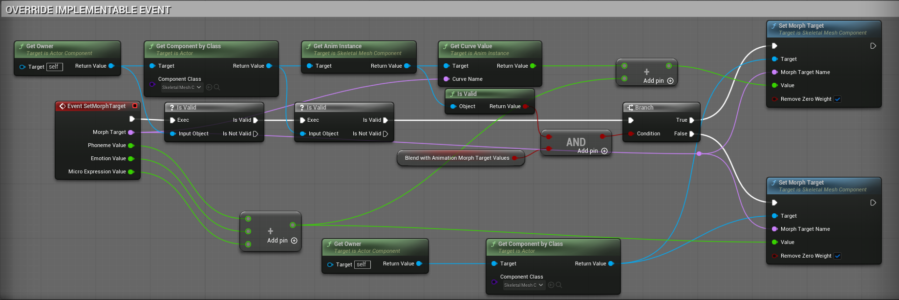

### 4.3.2 Should Sync Current Time With Audio

Defines if the current lipsync time is aligned to the audio play time or not.  

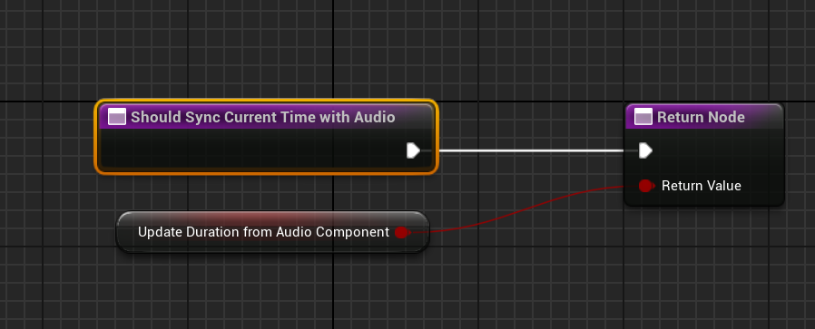

### 4.3.3 Get Audio Current Time

Get current play time of the audio.  

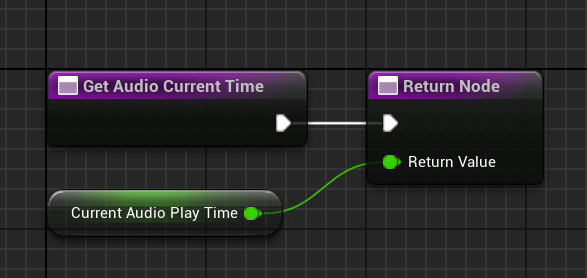
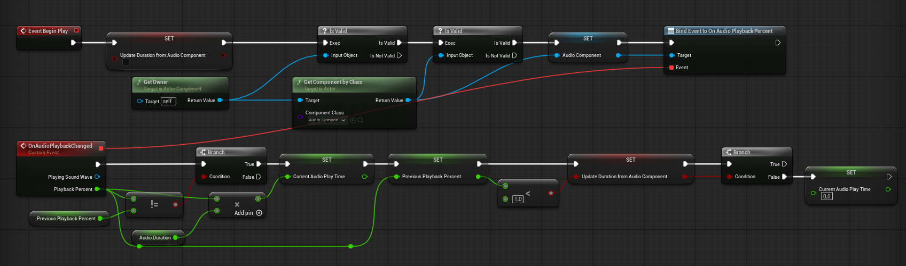

### Step-by-step guide

1. Create a new Blueprint Class that has `GeppettoSoundWavePlayerComponent` *(recommended)* or `GeppettoBaseComponentV2` as parent class

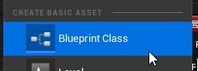

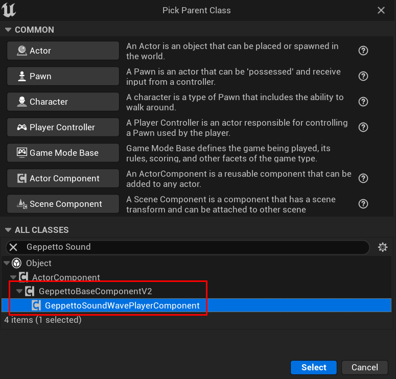

2. Open the created Blueprint class and override the function named [Set Morph Target](#431-set-morph-target)

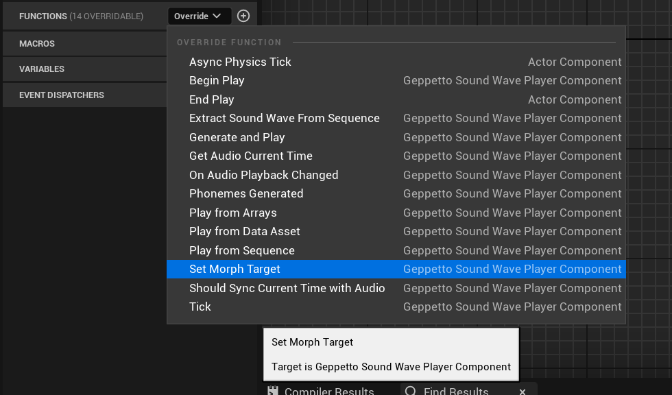

3. Put the nodes used to change the morph target values inside the function. You can delete the call to the parent node (`Parent: Set Morph Target`).

4. Here is an example working with **Metahumans**:

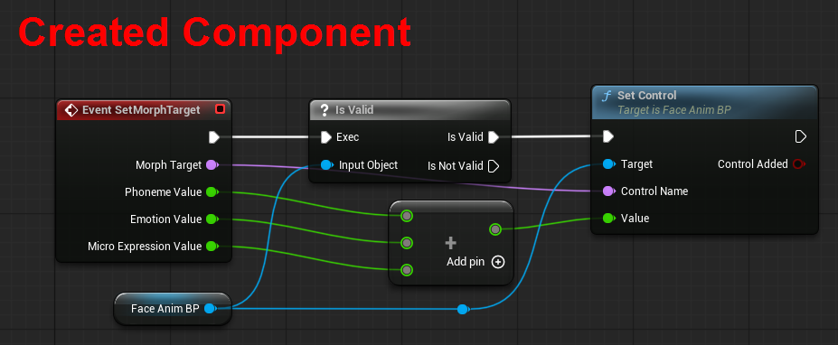

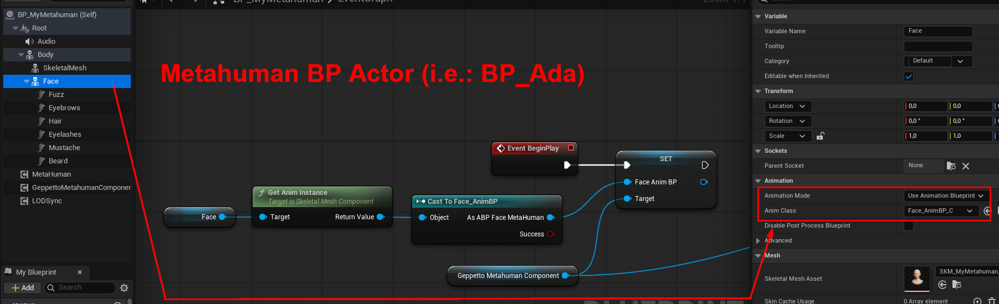

5. If the parent class is the `Geppetto Base Component V2`, please override functions [Should Sync Current Time With Audio](#432-should-sync-current-time-with-audio) and [Get Audio Current Time](#433-get-audio-current-time) too.

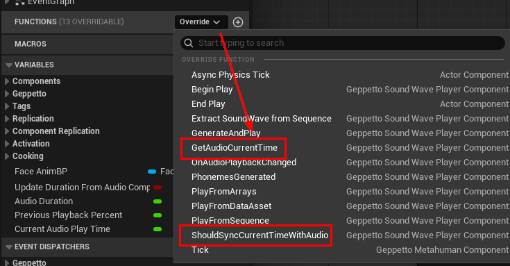

 

## 4.4 Geppetto Phoneme Data Table

The Geppetto Phoneme Data Table contains all information related to phoneme (lip sync) animation. Each phoneme is associated with a list of Morph Targets and their values. You can create your own Data Tables to animate any Skeletal Mesh with custom facial controls.

### 4.4.1 Create from scratch

1. In the Content Drawer (Ctrl+Space), right-click where you want to create the Data Table (under `Miscellaneous > Data Table`) :

2. On the Pick Row Structure window, select `GeppettoPhonemeTableRow` and click **OK**.

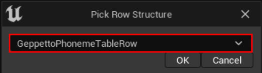

3. Name the Data Table and add a row for each phoneme. Rename each row name to match the phoneme name.  
   The default Metahuman phonemes are:  
   ***A, E, I, O, U, PP, FF, TH, DD, KK, CH, SS, NN, RR, HH*** (15 phonemes)

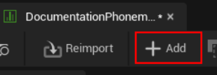
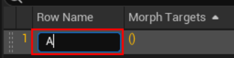
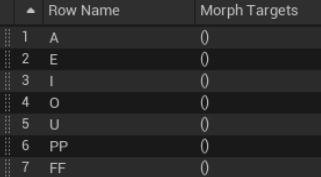
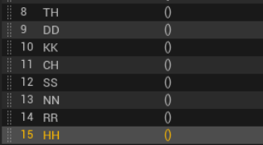

4. For each phoneme, add Morph Target values representing the pose at amplitude 100.

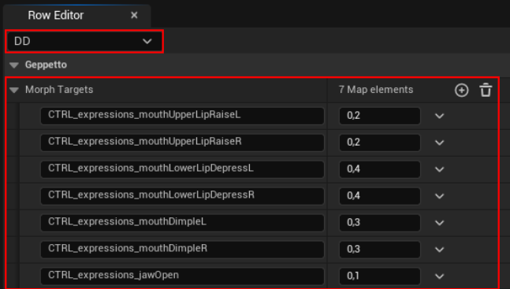

> [!NOTE]
> You can only have a visual preview of Morph Targets in the Geppetto Sequencer editor currently. To create a Geppetto Sequencer, please read [this section](GettingStarted.md#24-generate-phonemes-and-emotions-in-the-editor).

### 4.4.2 Add/Edit from existing

You can find pre-made Phoneme Data Tables for the Demo Scene and Metahuman characters under (`All > (Engine) > Plugins > Geppetto Content > Phonemes`).    
Feel free to duplicate and/or edit the existing Data Table in order to change the phonemes pose! 

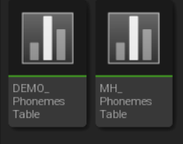

> *If the **Plugins** or the **Engine** folder is not showing, click on Settings at the top right of the window and ensure that “Show Plugin Content” and “Show Engine Content” is checked.*

### 4.4.3 Import from JSON/CSV

Unreal Data Tables can be imported from a JSON file or a CSV file. We highly recommend using JSON instead of CSV files. Create a new JSON file with the following structure:

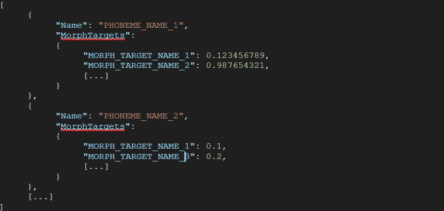

Create a new Geppetto Data Table or open an existing one from within the editor. On the Data Table Details tab, choose the JSON file created and click “Import/Reimport”. If the JSON format is valid, the JSON data will be imported to the Data Table.

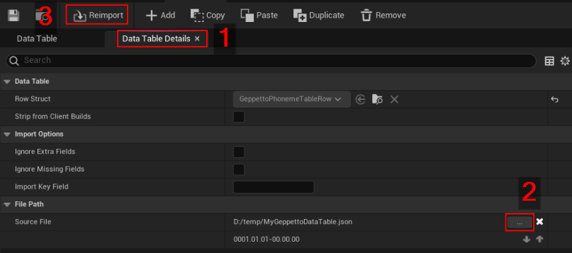

### 4.4.4 Export as JSON/CSV

Right-click the Data Table asset and choose **Export as JSON** or **Export as CSV**.

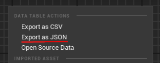

 

## 4.5 Geppetto Emotion Data Table

The Geppetto Emotion Data Table contains all information related to emotions animation. The Data Table associates each emotion with a list of Morph Targets and their values. The Geppetto plugin provides a way to create your own Data Tables in order to animate any Skeletal Mesh with custom facial controls (Morph Targets). The Emotion Data Table can be created directly within the inspector or imported from a JSON file.

*Morph Targets (or Blendshapes or Shapekeys) can be added in any 3D modeling software that you want. You can use an add-on in Blender or Maya for example. Or you can use iClone 8 to add the ARKit Shapekeys standard to your 3D model.*

### 4.5.1 Create from scratch

1. In Content Drawer, create new Data Table selecting `GeppettoEmotionTableRow`.

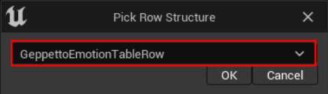

2. Each row on the Data Table defines an emotion. The row name is used to identify the emotion name, like “Happy” (double-click on the “Row Name” field or press F2 to rename it) : 

3. Use the Row Editor to set the Morph Targets values :

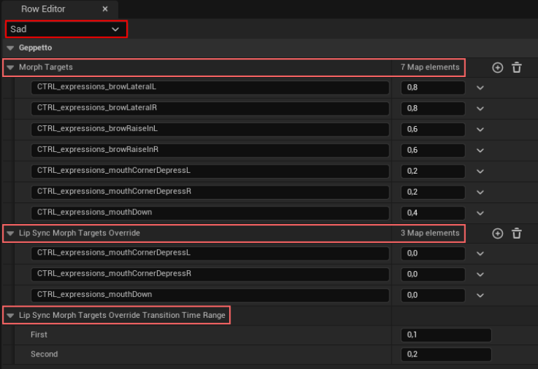

| Parameter                                           | Description |
|-----------------------------------------------------|-------------|
| **Morph Targets**                                   | The Morph Targets values that make the Skeletal mesh take on the emotion pose. The pose must be defined as if the emotion intensity were at its highest (100). |
| **Lip Sync Morph Targets Override**                 | *Optional.* The emotion Morph Targets values that will be overridden during lip sync animation. For example, if the emotion defined makes the character smile, use this to reduce the smile during speech to avoid an uncanny effect. |
| **Lip Sync Morph Targets Override Transition Time Range** | *Optional.* Transition time range between the standard emotion pose and the lip sync override pose. Randomly selected between "First" (min) and "Second" (max). Set both fields equal to fix the transition time. |

### 4.5.2 Add/Edit from existing

Pre-made tables under:  
`All > (Engine) > Plugins > Geppetto Content > Emotions`

Feel free to duplicate and/or edit the existing Data Table in order to change existing emotions or add new ones! 

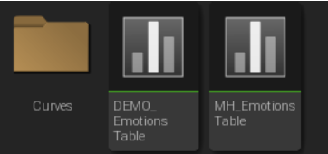

> *If the **Plugins** or the **Engine** folder is not showing, click on Settings at the top right of the window and ensure that “Show Plugin Content” and “Show Engine Content” is checked.*

### 4.5.3 Import/Export JSON

Like Phoneme Data Table, Emotion Data Table can be imported from a JSON file or a CSV file. We highly recommend using JSON instead of CSV files. The import and export steps are the same as the Phoneme Data Table.   
Please read the section [Import from JSON/CSV](#443-import-from-jsoncsv) and [Export as JSON/CSV](#444-export-as-jsoncsv) for more details.

 

## 4.6 Geppetto Micro Expressions Data Table

The Geppetto Micro Expressions Data Table contains all information related to micro expressions animation. The Data Table associates each micro expression with a list of Morph Targets and their values.    
The Geppetto plugin provides a way to create your own Data Tables in order to animate any Skeletal Mesh with custom facial controls (Morph Targets). The Micro Expressions Data Table can be created directly within the inspector or imported from a JSON file:

*Morph Target (or Blendshapes or Shapekeys) can be added on any 3D models software that you want. You can use an add-on on Blender or Maya for exemple. Or you can use Iclone 8 to add the Arkit Shapekeys standard to your 3D model.*

### 4.6.1 Create from scratch

1. In the Content Drawer (Ctrl+Space), right click at the desired location and create new Data Table (under *Miscellaneous > Data Table*).
In the Pick Row Structure window, select `GeppettoMicroExpressionTableRow`:

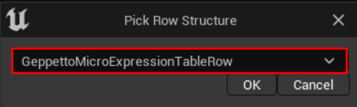

2. Each row on the Data Table defines a micro expression. The row name is used to identify the micro expression name, like “Blink”  (double-click on the “Row Name” field or press F2 to rename it).

3. Use the Row Editor to set the Morph Targets values :

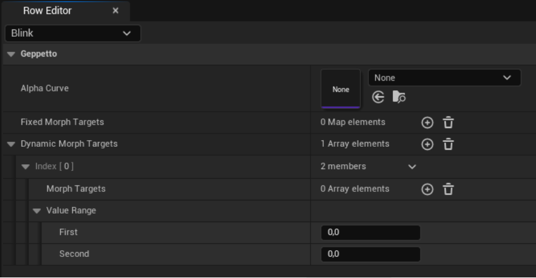

| Parameter                        | Description |
|----------------------------------|-------------|
| **Alpha Curve**                  | The curve used to determine the micro expression animation time and transition interpolation. Must be of type **Float**. Custom curves can be created for specific use cases. |
| **Fixed Morph Targets**          | *Optional.* The Morph Target values that define the pose for the micro expression, as if the intensity were at its maximum (100). |
| **Dynamic Morph Targets**        | *Optional.* Morph Targets configured with random value ranges. Useful for varying the expression each time it is triggered. |

#### 4.6.1.1 Micro Expression Dynamic Morph Targets

| Field            | Description |
|------------------|-------------|
| **Morph Targets**| The Morph Target names that will share a common randomly selected value. Allows grouped randomization. |
| **Value Range**  | The random range (min = "First", max = "Second") from which a new value will be chosen every time the micro expression is played. |

> *Please note that the same micro expression can have fixed and dynamic Morph Target values. If a Morph Target is defined in both lists, the value defined in Fixed Morph Targets will be ignored.    
**We recommend always playing dynamic micro expressions with the highest intensity (100), as the value is already chosen randomly between a min and a max.***

### 4.6.2 Add/Edit from existing

Pre-made tables under:  
`All > (Engine) > Plugins > Geppetto Content > MicroExpressions`

Feel free to duplicate and/or edit the existing Data Table in order to change existing emotions or add new ones! 

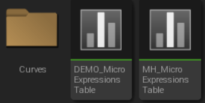

> *If the **Plugins** or the **Engine** folder is not showing, click on Settings at the top right of the window and ensure that “Show Plugin Content” and “Show Engine Content” is checked.*

### 4.6.3 Import/Export JSON like above.

Like Phoneme Data Table, Micro Expressions Data Table can be imported from a JSON file or a CSV file. We highly recommend using JSON instead of CSV files. 
The import and export steps are the same as the Phoneme Data Table.   
Please read the section [Import from JSON/CSV](#443-import-from-jsoncsv) and [Export as JSON/CSV](#444-export-as-jsoncsv) for more details.

 

## 4.7 Geppetto Headshift Data Table

The Geppetto Headshift Data Table contains all information related to headshift animation. The Data Table associates each emotion or procedural neck movement (called *Generic*) with a list of Morph Targets and their values.    
The Geppetto plugin provides a way to create your own Data Tables in order to animate any Skeletal Mesh with custom facial controls (Morph Targets). The Headshift Data Table can be created directly within the inspector or imported from a JSON file:

*Morph Target (or Blendshapes or Shapekeys) can be added on any 3D models software that you want. You can use an add-on on Blender or Maya for exemple. Or you can use Iclone 8 to add the Arkit Shapekeys standard to your 3D model.*

### 4.7.1 Create from scratch

1. In the Content Drawer (Ctrl+Space), right click at the desired location and create new Data Table (under *Miscellaneous > Data Table*).
In the Pick Row Structure window, select `GeppettoHeadshiftTableRow`:

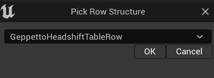

2. Each row on the Data Table defines a headshift. The row name is used to identify the headshift "action", like "Happy" for neck movements to play when character is happy (double-click on the “Row Name” field or press F2 to rename it).

> Please note that the row "Generic" represents procedural headshift animation.    
If you want to enable procedural, be sure that the used Headshift DataTable possesses a "Generic" row.

3. Use the Row Editor to set the Morph Target values:
  
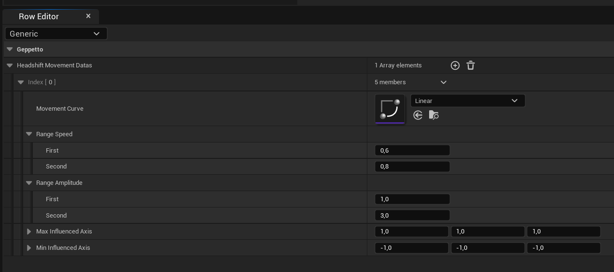

| Parameter                        | Description |
|----------------------------------|-------------|
| **Movement Curve**                  | The curve used to determine the headshift animation. Must be of type **Float**. Custom curves can be created for specific use cases. |
| **Range Speed**          | The range of speed available for this headshift. |
| **Range Amplitude**        | The range of amplitude available for this headshift. |
| **Max Influenced Axis**        | From -1 to 1. It represents the maximum scalar an axis can have for the headshift. |
| **Min Influenced Axis**        | From -1 to 1. It represents the minimum scalar an axis can have for the headshift. |

### 4.7.2 Add/Edit from existing

Pre-made tables under:  
`All > (Engine) > Plugins > Geppetto Content > MicroExpressions > Headshift`

Feel free to duplicate and/or edit the existing Data Table in order to change existing emotions or add new ones! 

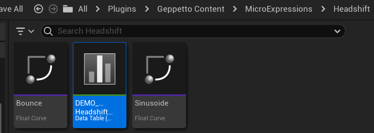

> *If the **Plugins** or the **Engine** folder is not showing, click on Settings at the top right of the window and ensure that “Show Plugin Content” and “Show Engine Content” is checked.*

### 4.7.3 Import/Export JSON like above.

Like Phoneme Data Table, Headshift Data Table can be imported from a JSON file or a CSV file. We highly recommend using JSON instead of CSV files. 
The import and export steps are the same as the Phoneme Data Table.   
Please read the section [Import from JSON/CSV](#443-import-from-jsoncsv) and [Export as JSON/CSV](#444-export-as-jsoncsv) for more details.

 

## 4.8 Geppetto Blueprint Library

The following functions can be used in both runtime and editor assets, such as Blueprint classes. Please note that the following functions are declared in C++.

### 4.8.1 Generate phonemes (using SoundWave)

C++ Function: `static void UGeppettoBPLibrary::GetPhonemesSoundWave(...)`

Generate the phonemes for the given SoundWave and sentence. Can be used in editor or at runtime.

> [!IMPORTANT]
> If you use the node at runtime in a packaged game with `USoundWave` assets, please make sure that the SoundWave asset has a Loading Behaviour Override set to `Force Inline`, otherwise Geppetto won't be able to get the audio data from the SoundWave. In editor, or for runtime generated SoundWave such as `UProceduralSoundWave` this is not required.
>
>  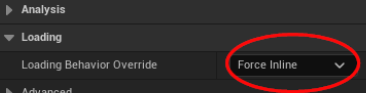

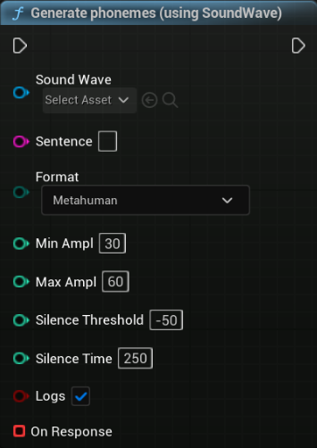

| Parameter               | Type         | Default value | Description |
|-------------------------|--------------|---------------|-------------|
| **SoundWave**           | `USoundWave` | - | The SoundWave used for phoneme generation |
| **Sentence**            | `FString`    | *Empty string* | The sentence spoken in the audio. If empty, perform STT to retrieve the text |
| **Language**            | [Geppetto Language](#4133-geppetto-language) | English | The speech language |
| **Format**              | [Geppetto Format](#4132-geppetto-format) | Metahuman | The output format of your phonemes. **Do not change unless you know exactly what you are doing** |
| **Quality**             | [Geppetto Quality](#4134-geppetto-quality) | Low | The phoneme generation quality |
| **Amplitude Settings**  | [Geppetto Amplitude](#4148-geppetto-amplitude) | 30 - 70 | The minimum and maximum phoneme amplitude values |
| **Silence Settings**    | [Geppetto Silence](#4149-geppetto-silence) | -50dB - 200ms | The threshold values used distinguish speech from silences parts |
| **Close Mouth at End**  | `bool` | false |  If true, will add a PAUSE phoneme at the very end of the list to ensure the lipsync ends with the mouth closed |
| **Auto Emotion**        | `bool` | false | If true, will use the speech to determine and automatically change the emotion during lipsync |
| **Remove Noise**        | `bool` | true | If true, perform noise removal to isolate the speech from the background noise |
| **Local** ❌ not available on Fab | `bool` | false | If true, do not use the Geppetto API to generate phonemes but use the local server instead (The local server is not available through Fab) |
| **Logs**                | `bool` | true | If true, print Geppetto logs to the console |
| **On Response**         | `FDelegate` | - | Delegate called when the generation is done (or an error occurred), with: - **Is Error:** Indicates if an error occurred during generation - **Phonemes:** The generated [Geppetto Phonemes](#4141-geppetto-phoneme) - **Emotions:** The generated [Geppetto Emotions](#4142-geppetto-emotion) (if any) - **Settings:** [Geppetto Response Settings](#41410-geppetto-response-settings), Contains the STT generated sentence (if not given as input) |

### 4.8.2 Generate phonemes (using PCM bytes)

C++ Function: `static void UGeppettoBPLibrary::GetPhonemesBytes(...)`

Generate the phonemes using a PCM raw byte buffer and sentence.

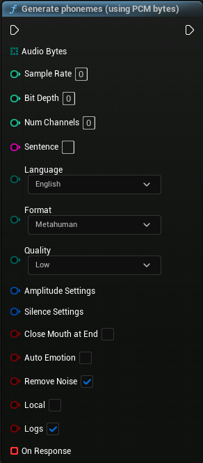

| Parameter         | Type  | Default value | Description |
|-------------------|-------|---------------|-------------|
| **Audio Bytes**   | Array of `uint8` | -  | The PCM waves data bytes. |
| **Sample Rate**   | `int` | 0 | The sample rate of the PCM waves (=frequency). Mostly 44100. |
| **Bit Depth**     | `int` | 0 | The bit depth of the PCM waves (=sample data length). Mostly 8, 16 or 24. |
| **Num Channels**  | `int` | 0 | The amount of channels of the PCM waves (mono=1, stereo=2, etc.). |
| **Other parameters** | -  | - | Please see [Generate phonemes (using SoundWave)](#481-generate-phonemes-using-soundwave). |

### 4.8.3 Generate phonemes (using file bytes)

C++ Function: `static void UGeppettoBPLibrary::GetPhonemesFile(...)`

Generate the phonemes using file bytes. The file can be in WAV structure (`.wav`) or MPEG structure (`.mp3`). Other audio structures such as `.flac`, `.ogg`, `.aac` might not work.

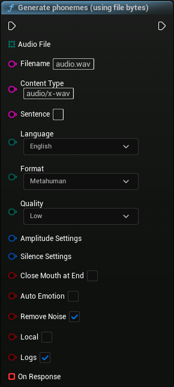

| Parameter             | Type  | Default value   | Description |
|-----------------------|-------|-----------------|-------------|
| **Audio File**        | Array of `uint8` | -    | The file bytes. Can be any type of file. |
| **Filename**          | `FString` | audio.wav   | The filename that will be sent and read by the API. No real impact. |
| **File Content Type** | `FString` | audio/x-wav | The HTTP MIME Content-Type of the file. Must match the file structure. |
| **Other parameters**  | -         | -           | Please see [Generate phonemes (using SoundWave)](#481-generate-phonemes-using-soundwave). |

### 4.8.4 Apply Delay (Phonemes)

C++ Function: `static void UGeppettoBPLibrary::ApplyDelayPhonemes(TArray<FGeppettoPhoneme>& Phonemes, const float Delay)`

Applies a delay to the list of phonemes returned by the API.

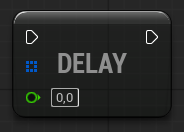

| Parameter     | Type  | Default value   | Description |
|---------------|-------|-----------------|-------------|
| **Phonemes**  | Array of [Geppetto Phoneme](#4141-geppetto-phoneme) | - | The phonemes to apply delay to (by reference) |  
| **Delay**     | `float` | 0.0 | The delay to apply. Can be positive or negative |

### 4.8.5 Apply Delay (Emotions)

C++ Function: `static void UGeppettoBPLibrary::ApplyDelayEmotions(TArray<FGeppettoEmotion>& Emotions, const float Delay)`

Applies a delay to the list of emotions returned by the API.

| Parameter     | Type  | Default value   | Description |
|---------------|-------|-----------------|-------------|
| **Emotions**  | Array of [Geppetto Emotion](#4142-geppetto-emotion) | - | The emotions to apply delay to (by reference) |  
| **Delay**     | `float` | 0.0 | The delay to apply. Can be positive or negative |

### 4.8.6 Get Morph Targets for Phoneme

C++ Function: `static TMap<FName, float> UGeppettoBPLibrary::GetPhonemeMorphTargets(const FName& Phoneme, const UDataTable* PhonemeTable);`

Returns the Morph Targets and corresponding values for a phoneme name from a given Phoneme Table.

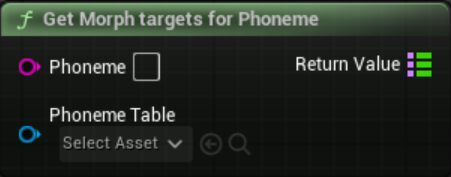

| Parameter         | Type  | Default value   | Description |
|-------------------|-------|-----------------|-------------|
| **Phoneme**       | `FName` | - | The phoneme name |
| **Phoneme Table** | [Phoneme Data Table](#44-geppetto-phoneme-data-table) | - | The Phoneme Data Table used to retrieve Morph Targets values |
| ***Return Value***  | Map of <`Fname`, `float`> | - | The list of all Morph Targets used for the phoneme and their values at max amplitude (100) |

### 4.8.7 Get Morph Targets for Emotion

C++ Function: `static TMap<FName, float> UGeppettoBPLibrary::GetEmotionMorphTargets(const FName& Emotion, const UDataTable* EmotionTable);`

Returns the Morph Targets and corresponding values for an emotion name from a given Emotion Table.

| Parameter         | Type  | Default value   | Description |
|-------------------|-------|-----------------|-------------|
| **Emotion**       | `FName` | - | The emotion name |
| **Phoneme Table** | [Emotion Data Table](#45-geppetto-emotion-data-table) | - | The Emotion Data Table used to retrieve Morph Target values |
| ***Return Value***  | Map of <`Fname`, `float`> | - | The list of all Morph Targets used for the emotion and their values at max intensity (100) |

### 4.8.8 Safe Lerp

C++ Function: `static float UGeppettoBPLibrary::SafeLerp(const float A, const float B, const float Alpha)`

Safe linear interpolation with clamping. Used internally to blend values without exceeding limits.

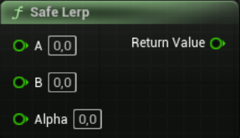

| Parameter         | Type  | Default value   | Description |
|-------------------|-------|-----------------|-------------|
| **A**             | `float` | 0.0 | The minimum value, returned when Alpha <= 0.0 |
| **B**             | `float` | 0.0 | The maximum value, returned when Alpha >= 1.0 |
| **Alpha**         | `float` | 0.0 | The alpha value used to interpolate between A and B |
| ***Return Value***  | `float` | -   | The safe linear interpolation result (either A, B, or a standard interpolation) |

 

## 4.9 Geppetto Curve Generator Blueprint Library

The following functions can be used to translate [Geppetto Phonemes](#4141-geppetto-phoneme) and [Geppetto Emotions](#4142-geppetto-emotion) into animation curves.

### 4.9.1 Create Phoneme Curves

C++ Function: `static TMap<FName, UCurveFloat*> UGeppettoCurveGenerator::CreatePhonemeCurves(...)`

Create the phoneme Morph Target curves for lipsync animation.

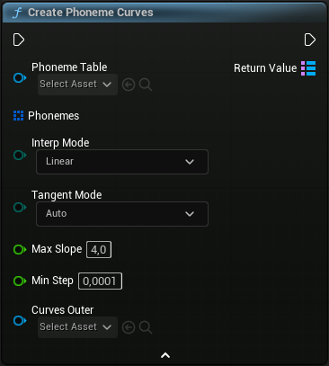

| Parameter         | Type  | Default value   | Description |
|-------------------|-------|-----------------|-------------|
| **Phoneme Table** | [Phoneme Data Table](#44-geppetto-phoneme-data-table) | - | The Phoneme Table used  |
| **Phonemes**      | Array of [Geppetto Phoneme](#4141-geppetto-phoneme) | - | The lipsync phonemes list |
| **Interp Mode**   | `ERichCurveInterpMode` | Linear | The curve keys interpolation mode |
| **Tangent Mode**  | `ERichCurveTangentMode` | Auto | The curve keys tangent mode if interpolation=Cubic (Auto=will compute and set tangents value automatically) |
| **Max Slope**     | `float` | 4.0 | The maximum float value allowed between two morph target keys. If the slope is higher, one key value will be changed to match the max slope | 
| **Min Step**      | `float` | 0.0001 | The minimum time (in seconds) between two morph target keys. If the time is lower, the two keys will be merged together |
| **Curves Outer**  | `UObject` | - | *(optional)* The outer of the created curves. If not set, the curves can be garbage collected on next GC collect |
| ***Return Value*** | Map of <`FName`, `UCurveFloat`> | - | A map of all Morph Target animation curves used for lipsync |

### 4.9.2 Create Emotion Curves

C++ Function: `static TMap<FName, UCurveFloat*> UGeppettoCurveGenerator::CreateEmotionCurves(...)`

Create the emotion Morph Target curves for lipsync animation.

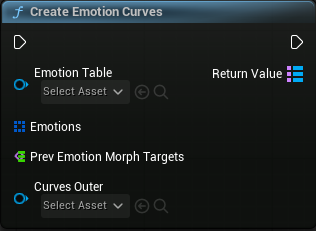

| Parameter         | Type  | Default value   | Description |
|-------------------|-------|-----------------|-------------|
| **Emotion Table** | [Emotion Data Table](#45-geppetto-emotion-data-table) | - | The Emotion Table used  |
| **Emotions**      | Array of [Geppetto Emotion](#4142-geppetto-emotion) | - | The lipsync emotions list |
| **Prev Emotion Morph Targets** | Map of <`FName`, `float`> | *Empty map* | *(optional )* The current emotion Morph Target values. This will be used to start the emotion animation with the given values, allowing a smooth blend between the currently active emotion and the created one |
| **Curves Outer**  | `UObject` | - | *(optional)* The outer of the created curves. If not set, the curves can be garbage collected on next GC collect |
| ***Return Value*** | Map of <`FName`, `UCurveFloat`> | - | A map of all Morph Target animation curves used for emotions animation |

### 4.9.3 Create All Curves

C++ Function: `static void UGeppettoCurveGenerator::CreateAllCurves(...)`

Create the phonemes and emotions Morph Target curves for lipsync animation.

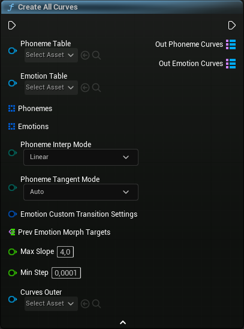

| Parameter         | Type  | Default value   | Description |
|-------------------|-------|-----------------|-------------|
| **Phoneme Table** | [Phoneme Data Table](#44-geppetto-phoneme-data-table) | - | The Phoneme Table used  |
| **Emotion Table** | [Emotion Data Table](#45-geppetto-emotion-data-table) | - | The Emotion Table used  |
| **Phonemes**      | Array of [Geppetto Phoneme](#4141-geppetto-phoneme) | - | The lipsync phonemes list |
| **Emotions**      | Array of [Geppetto Emotion](#4142-geppetto-emotion) | - | The lipsync emotions list |
| **Interp Mode**   | `ERichCurveInterpMode` | Linear | The curve keys interpolation mode |
| **Tangent Mode**  | `ERichCurveTangentMode` | Auto | The curve keys tangent mode if interpolation=Cubic (Auto=will compute and set tangents value automatically) |
| **Custom Transition Settings**  | ❌ not available | - | Unused |
| **Prev Emotion Morph Targets** | Map of <`FName`, `float`> | *Empty map* | *(optional )* The current emotion Morph Target values. This will be used to start the emotion animation with the given values, allowing a smooth blend between the currently active emotion and the created one |
| **Max Slope**     | `float` | 4.0 | The maximum float value allowed between two morph target keys. If the slope is higher, one key value will be changed to match the max slope | 
| **Min Step**      | `float` | 0.0001 | The minimum time (in seconds) between two morph target keys. If the time is lower, the two keys will be merged together |
| **Curves Outer**  | `UObject` | - | *(optional)* The outer of the created curves. If not set, the curves can be garbage collected on next GC collect |
| ***Out Phonemes Curves*** | Map of <`FName`, `UCurveFloat`> | - | A map of all Morph Target animation curves used for lipsync |
| ***Out Emotion Curves*** | Map of <`FName`, `UCurveFloat`> | - | A map of all Morph Target animation curves used for emotions animation |

### 4.9.4 Extract Phonemes and Emotions from Sequence

C++ Function: `static void UGeppettoCurveGenerator::ExtractPhonemesAndEmotionsFromSequence(...)`

Retrieve the [Phonemes](#4141-geppetto-phoneme) and [Emotions](#4142-geppetto-emotion) list from a [Sequence](#4122-geppetto-sequence).

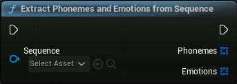

| Parameter         | Type  | Default value   | Description |
|-------------------|-------|-----------------|-------------|
| **Sequence**      | [Geppetto Sequence](#4122-geppetto-sequence) | - | The sequence to extract phonemes and emotions |
| ***Phonemes***    | Array of [Geppetto Phoneme](#4141-geppetto-phoneme) | - | The extracted phoneme list |
| ***Emotions***    | Array of [Geppetto Emotion](#4142-geppetto-emotion) | - | The extracted emotion list |

### 4.9.5 Get Curves Max Time

C++ Function: `static float UGeppettoCurveGenerator::GetCurvesMaxTime(const TMap<FName, UCurveFloat*>& Curves)`

Retrieves the maximum time value across all specified Morph Target curves.

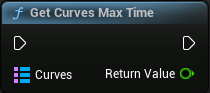

| Parameter         | Type  | Default value   | Description |
|-------------------|-------|-----------------|-------------|
| **Curves**        | Map of <`FName`, `UCurveFloat`> | - | The curves to look for max time |
| ***Return Value***    | `float` | - | The maximum time (in sec) |

 

## 4.10 Geppetto Headshift Blueprint Library

The following functions can be used to help perform Headshift animations.

### 4.10.1 Initialize New Movement

C++ Function: `static bool UGeppettoHeadshiftBPLibrary::InitializeNewMovement(...)`

Calculate the values for a new headshift movement

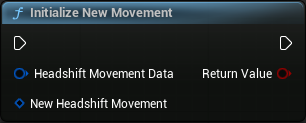

| Parameter                   | Type  | Default value   | Description |
|-----------------------------|-------|-----------------|-------------|
| **Headshift Movement Data** | [Geppetto Headshift Data](#4146-geppetto-headshift-data) | *Default* | The new headshift movement parameters |
| **New Headshift Movement**  | [Geppetto Headshift Movement](#4145-geppetto-headshift-movement) | - | (in-out) The resulting headshift movement, beginning at where the actual headshift movement was |
| ***Return Value***          | `bool` | - | True if the new headshift movement can be done, false otherwise |

### 4.10.2 Update Generic Movement

C++ Function: `static bool UGeppettoHeadshiftBPLibrary::UpdateGenericMovement(...)`

Calculate the new values for the given headshift movement

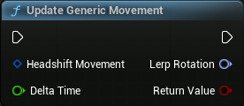

| Parameter         | Type  | Default value   | Description |
|-------------------|-------|-----------------|-------------|
| **Headshift Movement**  | [Geppetto Headshift Movement](#4145-geppetto-headshift-movement) | - | (in-out) the headshift movement |
| **Delta Time**          | `float` | - | The current tick delta time |
| **Lerp Rotation**       | `FRotator` | - | The headshift lerp rotation |
| ***Return Value***      | `bool` | - | True if the headshift movement has reached completion (alpha >= 1.0), false otherwise. |

### 4.10.3 Blend Emotion Headshift

C++ Function: `static FRotator UGeppettoHeadshiftBPLibrary::BlendEmotionHeadshift(...)`

Blends between two emotion headshift rotations over time based on a transition alpha value.

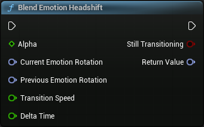

| Parameter                     | Type        | Default value   | Description |
|-------------------------------|-------------|-----------------|-------------|
| **Alpha**                     | `float`     | - | (in-out) A reference to the current transition alpha value, incremented over time until it reaches 1.0. |
| **Current Emotion Rotation**  | `FRotator`  | - | The target emotion rotation to blend towards. |
| **Previous Emotion Rotation** | `FRotator`  | - | The starting emotion rotation to blend from. |
| **Transition Speed**          | `float`     | - | The speed at which the transition occurs. |
| **Delta Time**                | `float`     | - | The time elapsed since the last frame, used to calculate the incremental change in alpha. |
| ***Still Transitioning***     | `bool`      | - | A boolean indicating whether the blend is still in progress (true) or complete (false). |
| ***Return Value***            | `FRotator`  | - | The resulting blended rotation between the previous and current emotion rotations. |

 

## 4.11 Geppetto Blueprint Library (Editor only)

The following functions can only be used in **Editor-only assets**, such as Editor Utility Widget or Editor Utility Blueprint. Please note that the following functions are declared in C++.

### 4.11.1 Save Geppetto Phonemes (as Data Asset)

C++ Function: `static UGeppettoDataAsset* UGeppettoEditorLibrary::SaveGeppettoPhonemes(...)`

Save the generated lipsync phonemes as a [Geppetto Data Asset](#4121-geppetto-data-asset)

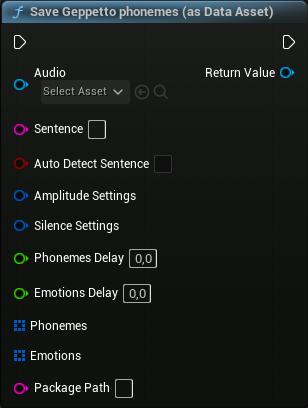

| Parameter                 | Type          | Default value   | Description |
|---------------------------|---------------|-----------------|-------------|
| **Audio**                 | `USoundWave`  | - |  A reference to the SoundWave object used to generate the Phonemes |
| **Sentence**              | `FString`     | *Empty string* | The Sentence used to generate the Phonemes, or the STT sentence in response |
| **Auto Detect Sentence**  | `bool`        | false | Was the sentence automatically generated (STT) or sent with the API request |
| **Amplitude Settings**    | [Geppetto Amplitude](#4148-geppetto-amplitude) | 30 - 70 | The minimum and maximum amplitudes used to generate the Phonemes |
| **Silence Settings**      | [Geppetto Silence](#4149-geppetto-silence) | -50dB - 200ms | The silence threshold and time used to generate the Phonemes |
| **Phonemes Delay**        | `float`       | 0.0 | The delay (in seconds) applied to the time codes of the generated Phonemes |
| **Emotions Delay**        | `float`       | 0.0 | The delay (in seconds) applied to the time codes of the generated Emotions |
| **Phonemes**              | [Geppetto Phoneme](#4141-geppetto-phoneme) | *Empty array* | The Phonemes generated by the API |
| **Emotions**              | [Geppetto Emotion](#4142-geppetto-emotion) | *Empty array* | The Emotions generated by the API or given in the sentence |
| **Package Path**          | `FString`     | *Empty string* | The file save location, in UE package path format |
| ***Return Value***        | [Geppetto Data Asset](#4121-geppetto-data-asset) | - | The created asset, or null if an error occurred |

### 4.11.2 Save as Sequence 

C++ Function: `static UGeppettoSequenceAsset* UGeppettoEditorLibrary::SaveAsSequence(...)`

Saves the provided audio and animation data as a Geppetto sequence asset at the specified package path.

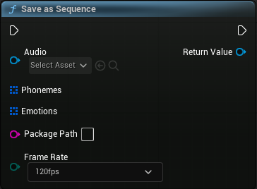

| Parameter                 | Type          | Default value   | Description |
|---------------------------|---------------|-----------------|-------------|
| **Audio**                 | `USoundWave`  | - | A reference to the SoundWave object used to generate the Phonemes |
| **Phonemes**              | [Geppetto Phoneme](#4141-geppetto-phoneme) | *Empty array* | The Phonemes generated by the API |
| **Emotions**              | [Geppetto Emotion](#4142-geppetto-emotion) | *Empty array* | The Emotions generated by the API or given in the sentence |
| **Package Path**          | `FString`     | *Empty string* | The file save location, in UE package path format |
| **Frame Rate**            | [Geppetto Sequence FPS](#4135-geppetto-sequence-fps) | 120fps | The desired frame rate for the created sequence asset. |
| ***Return Value***        | [Geppetto Data Asset](#4121-geppetto-data-asset) | - | The created asset, or null if an error occurred |

### 4.11.3 Convert Geppetto Sequence Into Animation

C++ Function: `static UAnimSequence* UGeppettoEditorLibrary::ConvertGeppettoSequenceIntoAnimation(UGeppettoSequenceAsset* Sequence, const FString PackagePath)`

Converts a Geppetto sequence asset into an Unreal Engine animation asset and saves it to the specified package path.

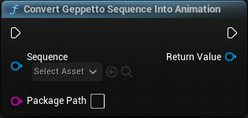

| Parameter           | Type          | Default value   | Description |
|---------------------|---------------|-----------------|-------------|
| **Sequence**        | [Geppetto Sequence](#4122-geppetto-sequence) | - | The Geppetto sequence asset to convert into an animation |
| **Package Path**    | `FString` | *Empty string* | The UE package path where the generated animation asset will be saved |
| ***Return Value***  | `UAnimSequence` | - | A pointer to the created animation sequence asset, or nullptr if the conversion process fails |

### 4.11.4 Create Editor Data Preset

C++ Function: `static UGeppettoEditorPresetDataAsset* UGeppettoEditorLibrary::CreateEditorDataPreset(const FString PackagePath, const FString PresetName)`

Creates a new [Geppetto Preset DataAsset](#4123-geppetto-preset-data-asset-editor-only) at the specified package path with the given preset name.

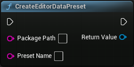

| Parameter           | Type          | Default value   | Description |
|---------------------|---------------|-----------------|-------------|
| **Package Path**    | `FString` | *Empty string* | The UE package path where the new preset data asset will be created |
| **Preset Name**     | `FString` | *Empty string* | The desired name for the new preset data asset |
| ***Return Value***  | [Geppetto Preset DataAsset](#4123-geppetto-preset-data-asset-editor-only) | - | A pointer to the created Geppetto editor preset data asset, or nullptr if the operation fails |

### 4.11.5 Show save file selection dialog

Show the operating system save file selection dialog for a Geppetto Data Asset.    
**Please note that the whole engine is frozen while the OS file selection window is opened.**

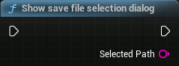

| Parameter           | Type      | Default value   | Description |
|---------------------|-----------|-----------------|-------------|
| ***Selected Path*** | `FString` | - | The file path selected by the user, relative to the project's `Content` folder. Returns `"INVALID PATH"` or an empty string if no path was selected or if the path is invalid. |

### 4.11.6 Get Documentation URL

Get the plugin documentation URL.

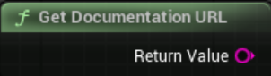

| Parameter           | Type      | Default value   | Description |
|---------------------|-----------|-----------------|-------------|
| ***Return Value***  | `FString` | https://github.com/X-Immersion/Geppetto_Unreal_documentation/tree/geppetto-update | This documentation URL |

### 4.11.7 Is PIE Mode Active

Check if the Unreal Engine Editor is in play mode (PIE).

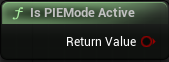

| Parameter           | Type      | Default value   | Description |
|---------------------|-----------|-----------------|-------------|
| ***Return Value***  | `bool` | - | True if the editor is in play mode, false otherwise |

 

## 4.12 Geppetto Assets

The Geppetto Plugin use custom Assets, such as custom DataAsset or LevelSequence. You can find more information about all custom Assets declared in C++.

### 4.12.1 Geppetto Data Asset

Geppetto Data Assets are used to store and save the [Phonemes](#4141-geppetto-phoneme) and [Emotions](#4142-geppetto-emotion) generated from the API in order to use them later. You can use any BP inherited [Geppetto Component](#41-geppetto-base-component) such as the [Geppetto SoundWave Player Component](#42-geppetto-soundwave-player-component) to animate the data contained in the Data Asset. 

All fields are Blueprint Read-Only, but you can use the Editor-only node [Save Geppetto Phonemes](#4111-save-geppetto-phonemes-as-data-asset) to create a new DataAsset in Blueprint.

> [!TIP]
> Once saved, the properties `Phonemes` and `Emotions` can still be edited by double-clicking on the DataAsset!

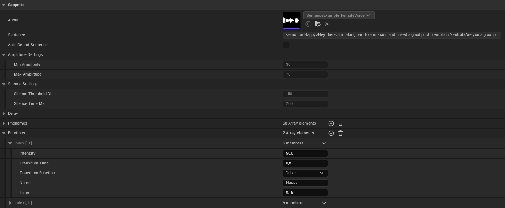

| Parameter           | Type      | Default value   | Description |
|---------------------|-----------|-----------------|-------------|
| **Audio**                 | `USoundWave`  | -               | The audio associated with the lip sync. |
| **Sentence**              | `FString`     | *Empty string*  | (Info only) The sentence used for generation. |
| **Auto Detect Sentence**  | `bool`        | false           | (Info only) The minimum amplitude value used for generation. |
| **Amplitude Settings**    | [Geppetto Amplitude](#4148-geppetto-amplitude) | 30 - 70 | (Info only) The minimum and maximum amplitude value used for generation. |
| **Silence Settings**      | [Geppetto Silence](#4149-geppetto-silence) | -50dB - 200ms |(Info only) The silence time (in milliseconds) used for generation. |
| **Delay**                 | [Tuple Float](#41411-tuple-float) | 0 - 0 | (Info only) The delay applied to phonemes and emotions after generation. |
| **Phonemes**              | Array of [Geppetto Phoneme](#4141-geppetto-phoneme) | *Empty array* | The phonemes list generated by the API, used to animate lip sync. |
| **Emotions**              | Array of [Geppetto Emotion](#4142-geppetto-emotion) | *Empty array* | The emotions list generated by the API, used to animate emotions. |

### 4.12.2 Geppetto Sequence

A `GeppettoSequence` is a custom asset that contains all the assets and logic to play a lip-sync animation in one file. This asset contains a `LevelSequence` with a timeline for the audio file, a timeline for all [Phonemes](#4141-geppetto-phoneme) used and a timeline for all [Emotions](#4142-geppetto-emotion) used. That is the main element of this asset as it handles all the logic of the lip-sync animation to play on a character.

> [!TIP]
> Use the Editor-only node [Save as Sequence](#4112-save-as-sequence) to create a new Sequence in Blueprint.

The `GeppettoSequence` asset can be edited inside a custom editor which allows you to see the render of the lip-sync animation in a preview scene with the selected mesh. Simply double click on the Sequence in the *Content Browser*. Here is an overview:

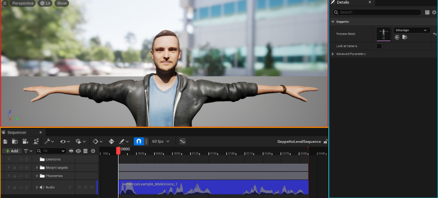

- The red box is the viewport. It gives you a preview of what the lip-sync animation will look like in-game.
- The orange box is the sequencer editor. Here you can edit each phoneme/emotion keys or even create new keys. **Althrough the keys are displayed as a curve, the curve itself have no real meaning and is not used**. The only thing that matters is the time code of the key, and the key value (=amplitude for phonemes, intensity for emotions).
- The blue box is the Detail Panel, where you can edit the Sequence properties.

| Parameter           | Type      | Default value   | Description |
|---------------------|-----------|-----------------|-------------|
| **Player Component** | [Geppetto Base Component](#41-geppetto-base-component) | Geppetto SoundWave Player Component | The component used to preview the animation. Use a component that match your Skeletal Mesh. |
| **Preview Mesh**    | `USkeletalMesh` | - | The Skeletal Mesh shown in the preview and used to perform lipsync animation. |
| **Phoneme Table**   | [Phoneme Data Table](#44-geppetto-phoneme-data-table) | - | The phoneme table used to perform phonemes lipsync animation. |
| **Emotion Table**   | [Emotion Data Table](#45-geppetto-emotion-data-table) | - | The emotion table used to perform emotion animation. |
| **Face Animation**  | `UAnimBlueprint` | - | This is an optional parameter to use when your character is not animated through Morph Targets but with an Anim Instance instead (such as for Metahuman with the `Face_AnimBP`). You should select the AnimationBlueprint of your character in order to properly preview the lip-sync animation. |
| **Max Slope**       | `float` | 4.0 | The max slope value allowed between two Morph target curve keys in preview animation |
| **Min Time Step**   | `float` | 0.0001 | The min time allowed between two Morph target curve keys in the preview animation |

### 4.12.3 Geppetto Preset Data Asset (Editor only)

A Geppetto Editor Preset DataAsset can be used to save all fields in the Geppetto Editor Window for next usage. You can select the preset to use in the [Geppetto Editor Window](GettingStarted.md#24-generate-phonemes-and-emotions-in-the-editor). You can save the preset using the node [Create Editor Data Preset](#4114-create-editor-data-preset).

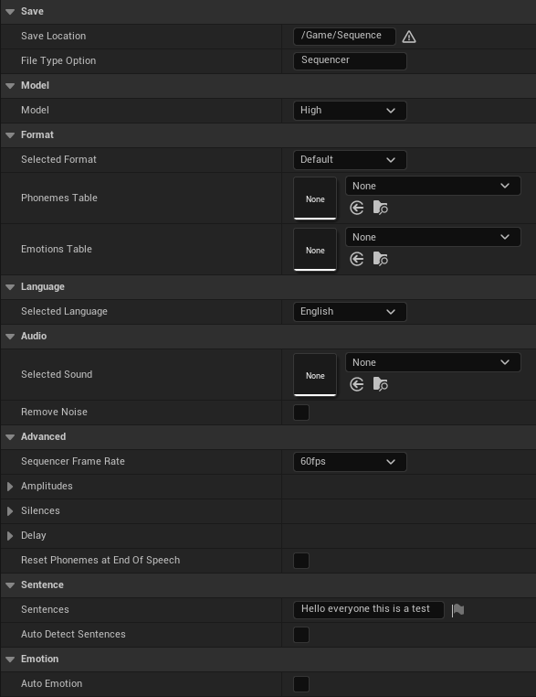

> [!NOTE]
> Some properties might be outdated and not used anymore in the Geppetto Editor Window

 

## 4.13 Enums

Here you can find the list and values of all enums defined by the Geppetto Plugin.

### 4.13.1 Geppetto Emotion Transition

This enum is used to choose the emotion transition each time the emotion pose changes. Used in [Geppetto Emotion](#4142-geppetto-emotion).

| Interpolation Type | Description                                  |
|--------------------|----------------------------------------------|
| **Linear**             | Use linear interpolation.                     |
| **Ease**               | Easing interpolation.                         |
| **Ease-In**            | Easing in only interpolation.                 |
| **Ease-Out**           | Easing out only interpolation.                |
| **Ease-In-Out**        | Easing in and out interpolation. Similar to Ease. |
| **Cubic**              | Cubic interpolation. Similar to Ease-In-Out and Ease. |
| **CUSTOM 1-10**        | Custom interpolation. *Not implemented yet* |

### 4.13.2 Geppetto Format

The Phoneme format used by the API during generation.

> [!CRITICAL]
> Unless very specific behaviour, you should always use **MetaHuman**

| Format Type | Description                                  |
|-------------|----------------------------------------------|
| **Default** | HH, AY, M, N, EY, IH, Z, ... |
| **RPM**     | VISEME_AA, VISEME_O, VISEME_E, VISEME_PP, VISEME_CH, VISEME_DD, VISEME_TH, ... |
| **Maya**    | GK_ctrl, AA_ctrl, MPB_ctrl, N_ctrl, EE_ctrl, ... |
| **MetaHuman** | A, U, I, PP, CH, DD, TH, E, ... |

### 4.13.3 Geppetto Language

The language used in the speech. 

| Language    |
|-------------|
| **English** |
| **French**  |
| **Spanish** |
| **German**  |
| **Italian** |
| **Portuguese** |

> [!TIP]
> When using `Beta` [Geppetto Quality](#4134-geppetto-quality), you have way more available languages: English, French, Spanish, German, Italian, Portuguese, Afrikaans, Albanian, Armenian, Bengali, Bosnian, Bulgarian, Catalan, Croatian, Czech, Danish, Dutch, Estonian, Persian, Finnish, Georgian, Greek, Gujarati, Hindi, Hungarian, Icelandic, Indonesian, Kannada, Latin, Latvian, Lithuanian, Macedonian, Malayalam, Malay, Nepali, Punjabi, Polish, Romanian, Russian, Serbian, Slovak, Swahili, Swedish, Tamil, Telugu, Turkish, Vietnamese, Welsh

### 4.13.4 Geppetto Quality

The phoneme quality returned by the API.

| Quality     | Description                                  |
|-------------|----------------------------------------------|
| **Low**     | Use the fastest model for phonemes generation and alignment with audio. The results can sometimes be inaccurate |
| **Normal**  | Use a more precise model for phonemes generation. Use a slightly better model for phonemes alignment with audio |
| **High**    | Use the same model as 'Normal' for phonemes generation, but use a better model for alignment |
| **Highest** | Use the same model as 'Normal' and 'High' for phonemes generation. Use the best model for alignment |
| **Beta**    | Use the best model for phonemes generation (still in beta) and phoneme alignment |

### 4.13.5 Geppetto Sequence FPS

The FPS Used in the [Geppetto Sequence](#4122-geppetto-sequence)

| FPS        |
|------------|
| **24fps**  |
| **30fps**  |
| **60fps**  |
| **120fps** |

 

## 4.14 Structs

Here you can find the list and details of all structs defined by the Geppetto Plugin.

### 4.14.1 Geppetto Phoneme

A struct containing all parameters to play a Geppetto Phoneme. All variables are Blueprint read-write:

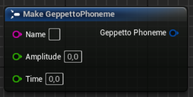

| Parameter     | Type      | Default value   | Description |
|---------------|-----------|-----------------|-------------|
| **Name**      | `FName`   | *Empty name*    | The phoneme name. |
| **Amplitude** | `float`   | 0.0             | The phoneme amplitude, range 0 - 100. |
| **Time**      | `float`   | 0.0             | The phoneme animation play time, matching the audio for synchronization. |

### 4.14.2 Geppetto Emotion

A struct containing all parameters to play a Geppetto Emotion. All variables are Blueprint read-write:

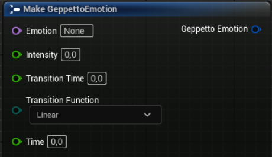

| Parameter               | Type      | Default value   | Description |
|-------------------------|-----------|-----------------|-------------|
| **Name**                | `FName`   | *Empty name*    | The emotion name. |
| **Intensity**           | `float`   | 0.0             | The emotion intensity, range 0 - 100. |
| **Transition time**     | `float`   | 0.0             | The emotion transition time, in seconds. |
| **Transition function** | [Geppetto Emotion Transition](#4131-geppetto-emotion-transition) | Linear | The emotion animation transition function. |
| **Time**                | `float`   | 0.0             | The emotion animation play time, matching the sentence tag for sync. |

### 4.14.3 Geppetto Micro Expression

A struct containing all parameters to play a Geppetto Micro Expression. All variables are Blueprint read-write:

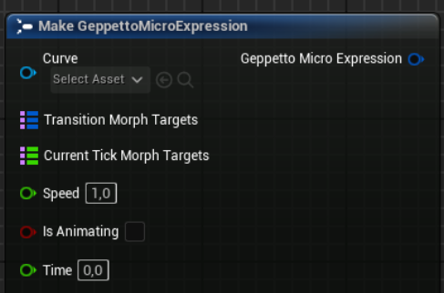

| Parameter               | Type      | Default value   | Description |
|-------------------------|-----------|-----------------|-------------|
| **Name**                | `FName`   | *Empty name* | The micro expression name. |
| **Curve**               | `UCurveFloat` | - | The curve used to determine the micro expression animation time and transition interpolation. Must be a “Float” type curve. |
| **Transition Morph Targets** | Map of <`FName`, [Tuple Float](#41411-tuple-float)> | *Empty map* | The micro expression Morph Targets and their values used for animation.                          |
| **Current Tick Morph Targets** | Map of <`FName`, `float`> | *Empty map* | The current tick Morph Targets values used by the micro expression, managed by the Geppetto Player Component. |
| **Speed**               | `float` | 1.0 | The animation speed of the micro expression. Must be greater than 0.                             |
| **Is Animating**        | `bool`  | false | Indicates whether the micro expression is currently animating (not started, finished). Managed by the Geppetto Player. |
| **Time**                | `float` | 0.0 | The micro expression animation play time. *(Currently unused)*                                   |

### 4.14.3 Geppetto Micro Expression Loop

A struct containing all parameters to play a Geppetto Micro Expression Loop. All variables are Blueprint read-write:

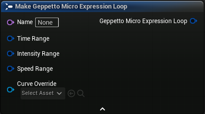

| Parameter               | Type      | Default value   | Description |
|-------------------------|-----------|-----------------|-------------|
| **Name**                | `FName`   | *Empty name* | The micro expression name. |
| **Time Range**          | [Tuple Float](#41411-tuple-float) | 0 - 0 | The min and max wait time between two micro expressions loops |
| **Intensity Range**     | [Tuple Float](#41411-tuple-float) | 0 - 100 | The min and max intensity for the micro expression loops |
| **Speed Range**         | [Tuple Float](#41411-tuple-float) | 1 - 1 | The min and max speed for the micro expression loops |
| **Curve Override**      | `UCurveFloat` | - | *(Optional)* Provide a custom micro expression curve to use instead of the one defined in the [Micro Expression Data Table](#46-geppetto-micro-expressions-data-table) |

### 4.14.4 Dynamic Micro Expression

A struct containing all values related to dynamic Micro Expression Morph Targets. Used in [Micro Expression Data Table](#46-geppetto-micro-expressions-data-table).

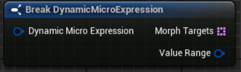

| Parameter         | Type      | Default value   | Description |
|-------------------|-----------|-----------------|-------------|
| **Morph Targets** | Array of `FName` | *Empty array* | The dynamic Morph Targets names. |
| **Value Range**   | [Tuple Float](#41411-tuple-float) | 0 - 0 | The dynamic Morph Target min and max values. |

### 4.14.5 Geppetto Headshift Movement

A struct containing all parameters to perform a Headshift Movement. All variables are Blueprint read-write.

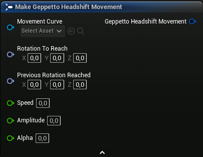

| Parameter         | Type      | Default value   | Description |
|-------------------|-----------|-----------------|-------------|
| **Movement Curve** | `UCurveFloat` | - |  The headshift movement curve |
| **Rotation To Reach** | `FRotator` | - | |
| **Previous Rotation Reached** | `FRotator` | - | |
| **Speed** | `float` | 0.0 | |
| **Amplitude** | `float` | 0.0 | |
| **Alpha** | `float` | 0.0 | |

### 4.14.6 Geppetto Headshift Data

A struct containing all parameters to perform a Headshift Movement on Skeletal Mesh bone. All variables are Blueprint read-write.

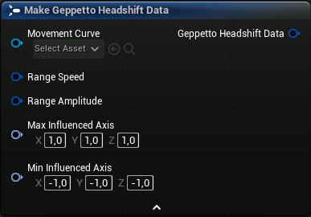

| Parameter         | Type      | Default value   | Description |
|-------------------|-----------|-----------------|-------------|
| **Movement Curve** | `UCurveFloat` | - |  The headshift movement curve |
| **Range Speed** | [Tuple Float](#41411-tuple-float) | - | |
| **Range Amplitude** | [Tuple Float](#41411-tuple-float) | - | |
| **Max Influenced Axis** | `FRotator` | - | |
| **Min Influenced Axis** | `FRotator` | - | |

### 4.14.7 Geppetto Emotion Headshift

A struct containing all Headshift data related to an emotion. All variables are Blueprint read-write.

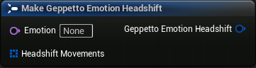

| Parameter         | Type      | Default value   | Description |
|-------------------|-----------|-----------------|-------------|
| **Emotion**       | `FName`   | *Empty name*    | The emotion name |
| **Headshift Movements** | Array of [Headshift Movement](#4145-geppetto-headshift-movement) | *Empty array* | The emotion headshift movements |

### 4.14.8 Geppetto Amplitude

A struct containing information about Geppetto amplitudes for phoneme generation.

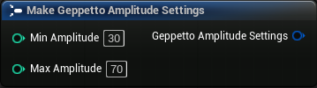

| Parameter         | Type      | Default value   | Description |
|-------------------|-----------|-----------------|-------------|
| **Min Amplitude** | `int`     | 30 | The minimum amplitude |
| **Max Amplitude** | `int`     | 70 | The maximum amplitude |

### 4.14.9 Geppetto Silence

A struct containing information about Geppetto silence detection for phoneme generation.

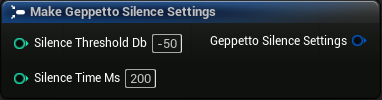

| Parameter         | Type      | Default value   | Description |
|-------------------|-----------|-----------------|-------------|
| **Silence Threshold dB**  | `int`     | -50 | The silence detection threshold, in dB  |
| **Silence Time ms**       | `int`     | 200 | The silence detection time, in ms |

### 4.14.10 Geppetto Response Settings

A struct containing all information about the Geppetto API response.

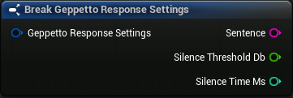

| Parameter         | Type      | Default value   | Description |
|-------------------|-----------|-----------------|-------------|
| **Sentence**              | `FString`   | - | The speech sentence (given or TTS) |
| **Silence Threshold dB**  | `float`     | - | The silence detection threshold, in dB  |
| **Silence Time ms**       | `float`     | - | The silence detection time, in ms |

### 4.14.11 Tuple Float

Since Unreal `FTuple<float>` is not supported in Blueprint yet, this struct is used instead.

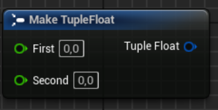

| Parameter | Description                              |
|-----------|------------------------------------------|
| **First**     | The tuple first value, i.e. the min value or the begin time. |
| **Second**    | The tuple second value, i.e. the max value or the end time.   |

