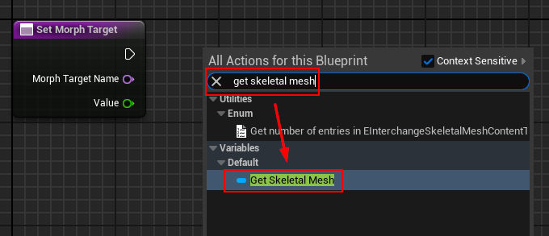
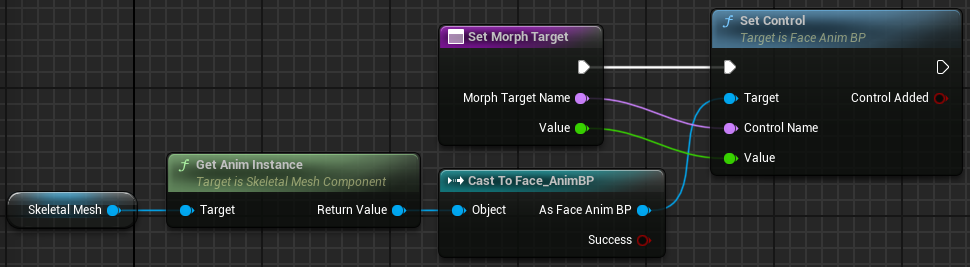
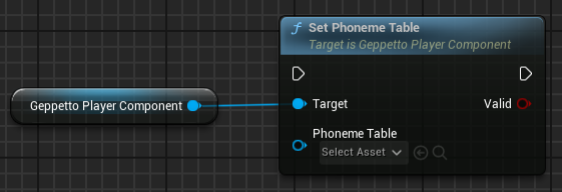
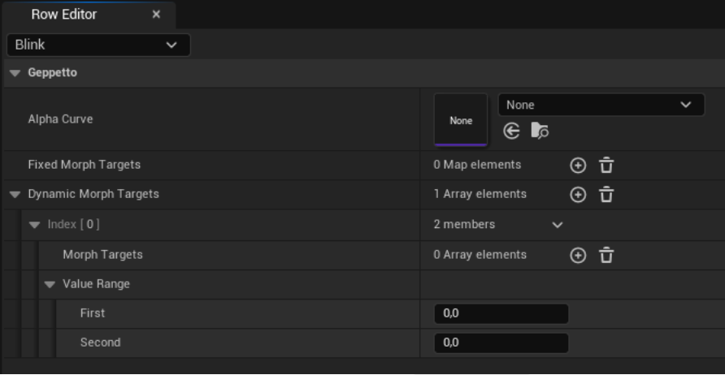
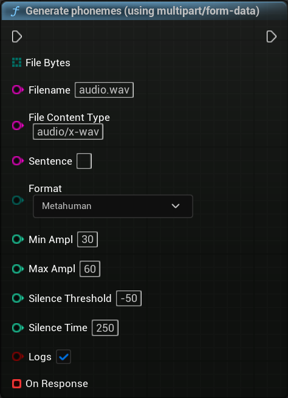

# Geppetto UE 2.0.0 – API Reference

This chapter documents all the components, nodes, structures, enums, and tools provided by the Geppetto plugin.

**[← Table of contents](../README.md#table-of-contents)**

---

### On this page

- **[Geppetto Base Component](#41-geppetto-base-component)**
- **[Geppetto SoundWave Player](#42-geppetto-soundwave-player)**
- **[Geppetto Player Component](#43-geppetto-player-component)**
- **[Geppetto Sequencer Component](#44-geppetto-sequencer-component)**
- **[Geppetto Phoneme Data Table](#45-geppetto-phoneme-data-table)**
- **[Geppetto Emotion Data Table](#46-geppetto-emotion-data-table)**
- **[Geppetto Micro Expressions Data Table](#47-geppetto-micro-expressions-data-table)**
- **[Geppetto Blueprint Library (Editor only)](#48-geppetto-blueprint-library-editor-only)**
- **[Geppetto Blueprint Library](#49-geppetto-blueprint-library)**
- **[Data Assets](#410-data-assets)**
- **[Geppetto Sequence](#411-geppetto-sequence)**
- **[Enums](#412-enums)**
- **[Structs](#413-structs)**

---

## 4.1 Geppetto Base Component

The abstract component inherited by other Players (SoundWave, URL). 
It checks on every tick if a phoneme or an emotion should be played based on the current play time.    
The Unreal events `OnPhonemeChanged` and `OnEmotionChanged` are broadcasted each time a phoneme or an emotion needs to be animated. 
> ⚠️ **Please note that the current play time is not updated by the base component itself and should be updated by the subclass component based on the audio playback !**

### `Set Remaining`

Assign a new phonemes and emotions list to the component.
Please note that both lists can be empty.    
The current play time is reseted to 0.0 when the node is called. **The node should not be called by anything other than the child component subclasses.**

| Field    | Description                                                                                                                                                         |
|----------|---------------------------------------------------------------------------------------------------------------------------------------------------------------------|
| Phonemes | The new phonemes list that will be processed by the component. If there were already phonemes remaining, the previous value will be overwritten.                   |
| Emotions | The new emotions list that will be processed by the component. If there were already emotions remaining, the previous value will be overwritten.                   |

### Variables

| Field               | Description                                                                                                                                                                                                                           |
|---------------------|---------------------------------------------------------------------------------------------------------------------------------------------------------------------------------------------------------------------------------------|
| `Is Processing`       | Set this to true when the base component should start checking if a phoneme or emotion needs to be animated in tick. Will be automatically set to false (in C++) when there are no remaining phonemes and emotions.                |
| `Is Initialized`      | Unused by the Geppetto Base component itself, but can be useful for inherited subclasses.                                                                                                                                            |
| `Remaining Phonemes`  | Read-only variable containing the remaining phonemes for the current speech.                                                                                                                                                         |
| `Remaining Emotions`  | Read-only variable containing the remaining emotions for the current speech.                                                                                                                                                         |
| `Current play time`   | Update this variable according to the audio playback time in order to synchronize the phoneme animation with the audio speech. The variable is not updated by the component itself. Subclasses must update the value. Will be automatically set to 0.0 (in C++) when there are no remaining phonemes and emotions. |

### Events

| Event                  | Description                                                                                                                                                                                                                                                                      |
|---------------------------|----------------------------------------------------------------------------------------------------------------------------------------------------------------------------------------------------------------------------------------------------------------------------------|
| `On Phoneme List Changed`   | This event is broadcasted each time the phoneme list has changed, meaning each time the node SetRemaining is called.                                                                                                                     |
| `On Phoneme Changed`        | This event is broadcasted each time a new phoneme needs to be processed with the following phoneme information: - The current Phoneme (with name and amplitude) - The next Phoneme (with name and amplitude) - The current Phoneme play time, in seconds             |
| `On Emotion Changed`        | This event is broadcasted each time a new phoneme needs to be processed with the following emotion information: - The emotion name - The emotion Intensity - The emotion Transition time - The emotion Transition function - The emotion play time, in seconds |

---

## 4.2 Geppetto SoundWave Player

The Geppetto SoundWave Player is a child of the [Geppetto Base Component](#41-geppetto-base-component) class. This component is used to synchronize phonemes/emotions animation from a [Geppetto Data Asset](#410-data-assets) with a SoundWave audio.

**Please note that the Geppetto SoundWave Player does not animate the phonemes and emotions itself, it only does the synchronization between the phonemes and the audio.**    
In order to completely animate phonemes and emotion, please use a Geppetto Player Component in addition. See section [3.1.2 - Play Animation with SoundWave](./Features.md#312-play-a-geppetto-data-asset-with-soundwave) for more details.

### 4.2.1 `Initialize`

It should be called in ypur Blueprint *BeginPlay* event. Pass in the `Audio Component`.

| Parameter       | Description                                                                                       |
|-----------------|---------------------------------------------------------------------------------------------------|
| Audio Component | The audio component that will be used by the SoundWave player to play the audio file.            |

### 4.2.2 `Play Data Asset`

Call this function to perform the lip sync coming from a [Geppetto Data Asset](#4101-geppetto-data-asset). The Data Asset can be be selected directly from within the node or through a variable:

| Parameter   | Description                                                                    |
|-------------|--------------------------------------------------------------------------------|
| Data Asset  | The Geppetto Data Asset that will be played by the SoundWave Player.          |

### 4.2.3 `Play`

You can use the `Play` node to pass all parameters one by one.    
For example, this node can be useful if you want to edit the phonemes /emotions list (i.e.: Apply Delay) or if you want to use a different SoundWave than the one used (i.e.: add some audio effects) above:

| Parameter | Description                                                              |
|-----------|--------------------------------------------------------------------------|
| Audio     | The SoundWave file that will be played by the component.                 |
| Phonemes  | The phonemes list that will be processed by the component. Can be empty. |
| Emotions  | The emotions list that will be processed by the component. Can be empty. |

### 4.2.4 Variables

| Parameter                    | Description                                                                                                           |
|-----------------------------|-----------------------------------------------------------------------------------------------------------------------|
| Audio Component             | The audio component reference passed to the SoundWave Player when initializing. Internal use only.                   |
| Current Data                | The DataAsset reference passed to the SoundWave Player when playing lip sync. Internal use only.                     |
| Previous Playback Percent   | The previous audio component playback percent value. Internal use only.                                              |
| Update duration with Tick   | If the audio playback is at 100% but there are remaining phonemes or emotions, the component will use the tick delta seconds to play the remaining ones. |

---

## 4.3 Geppetto Player Component

This component is used to animate the Geppetto Phoneme, Emotions and Micro-Expressions used with your character(s).    
The Geppetto Player component uses [Geppetto Data Tables](#45-geppetto-phoneme-data-table) provided in the component initialization to perform animations. 

If the Skeletal Mesh or the Skeletal Anim Instance does not use the usual node Set Morph Target to update the Morph Target values, like Metahuman, it is required to create a new component that inherit the Geppetto Player Component and override the nodes to get and set a Morph Target. Please read the section [4.3.1 - Component Inheritance](#431-component-inheritance) below for more details.

### 4.3.1 Component Inheritance

When using Metahumans characters or a custom node to get and/or set the Morph Targets values to the Skeletal Mesh Asset used, it is required to create a new component class that will inherit from the Geppetto Player Component class and override the nodes [`Set Morph Target`](#4413-set-morph-target-override) and [`Morph Target Exist`](#4414-morph-target-exist-override).    
Follow these steps to create a new component :

1. Create a new Blueprint Class that have `GeppettoPlayerComponent` as parent class

2. Open the created Blueprint class and override the function named `Set Morph Target`

3. Put the nodes used to change the morph target values inside the function. You can delete the call to the parent node (`Parent: Set Morph Target`).

4. You can type `Get Skeletal Mesh` in the action selection to access the Skeletal Mesh Asset

> → *If required, you can also override the function `Morph Target Exist`.This function must return true when the input morph target name does exist, false otherwise.    
For Metahuman, it is not required to override it, unless for UE 5.4. Please watch [this video](https://www.youtube.com/watch?v=wGrN9uW1Bx0) for more details.*

### 4.3.2 Initialize

This node is used to initialize the component and should be called in your Blueprint `BeginPlay` event. The following elements can be specified in the node parameters:

#### Parameters

| Parameter                    | Description |
|-----------------------------|-------------|
| **Geppetto SoundWave / URL Player** | The Geppetto Player used to synchronize animations with the audio. This can either be a `GeppettoSoundWavePlayer`, a `GeppettoURLPlayer`, or any subclass of `GeppettoBaseComponent`. |
| **Mesh** | The `Skeletal Mesh Asset` that the component will use to change morph target values and perform phonemes, emotions, and micro expressions animations. |
| **Phoneme Table** | The Geppetto Phoneme Table used by the component.    ➤ For Metahuman, please use the included Data Table named `MH_PhonemesTable`. |
| **Emotion Table** | The Geppetto Emotion Table used by the component.    ➤ For Metahuman, use `MH_EmotionsTable`. |
| **Micro Expressions Table** | The Geppetto Micro Expressions Table used by the component.    ➤ For Metahuman, use `MH_MicroExpressionsTable`. |
| **Override Animation** | If **unchecked**, the Morph Target values used by the Geppetto plugin will be blended with those coming from animations.   ➤ For Metahuman, this option **must be checked**. |

> 💡 If you cannot see the included Geppetto Data Tables, click the settings icon (top-right in the Asset browser) and ensure that:
> - “Show Plugin Content”
> - “Show Engine Content”  
> are **both checked**.

## 4.3.3 Set Mesh with Morph Targets

Use this node to change the Skeletal Mesh used by the Geppetto Player Component after initialization :

| Parameter       | Description |
|-----------------|-------------|
| **Mesh**        | The Skeletal Mesh Asset that the component will use to change morph target values and perform lip sync, emotions, and micro expressions animations. |
| **Return value**| Returns `true` if the mesh was successfully updated, `false` otherwise. |

---

## 4.3.4 Set Geppetto Player

Use this node to change the Geppetto Player used by the component after initialization. It can be a `GeppettoSoundWavePlayer` or any subclass of `GeppettoBaseComponent`.

| Parameter                         | Description                                  |
|----------------------------------|----------------------------------------------|
| Geppetto SoundWave/URL Player    | The Geppetto Player attached to the component. |

---

## 4.3.5 Set Phoneme Table

Use this node to change the Geppetto Phoneme Data Table used by the Geppetto Player Component after initialization :

| Parameter       | Description                                               |
|-----------------|-----------------------------------------------------------|
| **Phoneme Table**| The Geppetto Phoneme Table used by the component.         |
| **Return value** | Returns `true` if the table has been updated, `false` otherwise. |

---

## 4.3.6 Set Emotion Table

Use this node to change the Geppetto Emotion Data Table used by the Geppetto Player Component after initialization :

| Parameter       | Description                                               |
|-----------------|-----------------------------------------------------------|
| **Emotion Table**| The Geppetto Emotion Table used by the component.         |
| **Return value** | Returns `true` if the table has been updated, `false` otherwise. |

---

## 4.3.7 Set Micro Expressions Table

Use this node to change the Geppetto Micro Expressions Data Table used by the Geppetto Player Component after initialization :

| Parameter                | Description                                               |
|--------------------------|-----------------------------------------------------------|
| **Micro Expressions Table** | The Geppetto Micro Expressions Table used by the component. |
| **Return value**          | Returns `true` if the table has been updated, `false` otherwise. |

---

## 4.3.8 Set Emotion Custom Curve

Use this node to set the custom emotion transition function behavior when used by the Geppetto Player Component :

| Parameter  | Description                                                                       |
|------------|-----------------------------------------------------------------------------------|
| **Function** | The function name to set the behavior.                                           |
| **Curve**    | The function evaluation curve. Must be in the range 0–1 for both time and value (X and Y axis). |

> Note: The behavior for the following functions is already defined and cannot be changed: Linear, Ease, Ease-in, Ease-out, Ease-in-out, and Cubic.

## 4.3.9 Change Emotion

Use this node to change the current emotion pose dynamically. For more details, see section [3.3 - Change Emotions](./Features.md#33-change-emotions) :

| Parameter | Description                     |
|-----------|---------------------------------|
| **Emotion** | Use the `GeppettoEmotion` structure. |

---

## 4.3.10 Play Micro Expression

Use this node to play a micro expression one time. For more info, see section [3.4 - Play or Loop Micro Expressions](./Features.md#34-play-or-loop-micro-expressions).

| Parameter  | Description                                                        |
|------------|--------------------------------------------------------------------|
| **Name**     | The micro-expression name (must exist in the Micro Expressions Data Table). |
| **Intensity**| Intensity value from 0 to 100.                                    |
| **Speed**    | Playback speed of the micro-expression animation (must be greater than 0). |

---

## 4.3.11 Start Micro Expression Loop

Use this node to play a micro expression repeatedly.

| Parameter       | Description                                                                                     |
|-----------------|-------------------------------------------------------------------------------------------------|
| **Name**        | The micro-expression name.                                                                      |
| **Time range**  | The time range between the execution of two micro-expressions. After each play, a random time between min and max is selected. |
| **Intensity range** | The random intensity range for each play (min to max).                                      |
| **Speed range** | The random playback speed range for each play (min to max).                                    |

---

## 4.3.12 Stop Micro Expression Loop

Use this node to stop looping a micro expression.

| Parameter | Description                     |
|-----------|---------------------------------|
| **Name**  | The micro-expression name.      |

---

## 4.3.13 Set Morph Target (override)

This node is used by the Geppetto Player Component to change Skeletal Mesh Morph Target values. If your mesh does not use the standard `Set Morph Target` node, override this node.

| Parameter           | Description                                                                                 |
|---------------------|---------------------------------------------------------------------------------------------|
| **Morph Target Name** | The morph target to modify.                                                                 |
| **Value**           | The new morph target value (including values from animation if Override Animation was unchecked). |

---

## 4.3.14 Morph Target Exist (override)

This node checks if a morph target exists on the Skeletal Mesh. If the mesh does not use standard nodes for getting morph targets, override this node.

| Parameter             | Description                                                     |
|-----------------------|-----------------------------------------------------------------|
| **Morph Target Name**  | The morph target to check.                                      |
| **Return Node - Exist**| Return `true` if the morph target exists and can be updated, else `false`. |

## 4.4 Geppetto Sequencer Component

The **Geppetto Sequencer Component** is used to synchronize a facial animation sequence and an audio source (SoundWave or Media Sound) with Unreal's Level Sequencer.

You can use this component in place of real-time playback nodes when you want to:

- Preview and keyframe the animation in the editor
- Export pre-defined lip sync + emotion animations for cinematic use
- Bake facial animation for render/export

> **⚠️ Note: This component does not handle micro-expressions or emotional states, it is solely responsible for managing the Geppetto Sequence itself.
 If you want to use micro-expressions or emotions without lip-sync playback, consider using the [Geppetto Player Component](#43-geppetto-player-component) instead.**

### 4.4.1 Required setup

Your Blueprint actor must include:

- A Skeletal Mesh Component
- A Geppetto Sequencer Component

### 4.4.2 `Initialize`

This node is used to initialize the component and should be called in your Blueprint BeginPlay event.

| Parameter             | Description                                                    |
|-----------------------|----------------------------------------------------------------|
| SkeletalMeshComponent | The component that contains the SkeletalMesh of your character. |

### 4.4.3 Play

This node is used to play a Geppetto Sequence. Precisely, it creates a new LevelSequencePlayer from the LevelSequence contained inside the GeppettoSequence. This LevelSequencePlayer is then stored in the component as long as the lip-sync is playing.

| Parameter                    | Description                                                                                         |
|-----------------------------|-----------------------------------------------------------------------------------------------------|
| **GeppettoSequence**           | The GeppettoSequence to play. It should contain several timelines, one for each MorphTarget and one for the audio file to play. |
| **Reset Facial Expression at End** | Should the component reset any facial expression that is still active on the character (eg. a smile) ? |
| **Reset Delay**                 | Delay before starting to reset the facial expression.                                               |
| **Reset Duration**              | Duration of the reset, used to add a smooth effect on the reset.                                   |

## 4.4.4 Variables

| Parameter | Description |
|-----------|-------------|
| **Alpha**     | Alpha of the reset curve. Used to create an interpolation between character’s facial animation at the end of the Geppetto Sequence, and the default face. |

## 4.4.5 Events

| Event                 | Description |
|---------------------------|-------------|
| **On Sequencer Start Playing** | This event is broadcasted each time a GeppettoSequence starts playing. |

## 4.5 Geppetto Phoneme Data Table

The Geppetto Phoneme Data Table contains all information related to phoneme (lip sync) animation. Each phoneme associates with a list of Morph Targets and their values. You can create your own Data Tables to animate any Skeletal Mesh with custom facial controls.

### Create from scratch

1. In the Content Drawer (Ctrl+Space), right-click where you want to create the Data Table (under `Miscellaneous > Data Table`) :

2. On the Pick Row Structure window, select `GeppettoPhonemeTableRow` and click **OK**.

3. Name the Data Table and add a row for each phoneme. Rename each row name to match the phoneme name.  
   The default Metahuman phonemes are:  
   ***A, E, I, O, U, PP, FF, TH, DD, KK, CH, SS, NN, RR, HH*** (15 phonemes)

4. For each phoneme, add Morph Target values representing the pose at amplitude 100.

> Note: You can only have a visual preview of Morph Targets in the Geppetto Sequencer editor currently. To create a Geppetto Sequencer, please read [this section.](#4102-geppetto-sequence) 

### Add/Edit from existing

You can find pre-made Phoneme Data Tables for the Demo Scene and Metahuman characters under (`All > (Engine) > Plugins > Geppetto Content > Phonemes`).    
Feel free to duplicate and/or edit the existing Data Table in order to change the phonemes pose ! 

> *If the **Plugins** or the **Engine** folder is not showing, click on Settings at the top right of the window and ensure that “Show Plugin Content” and “Show Engine Content” is checked.*

### Import from JSON/CSV

Unreal Data Table can be imported from a JSON file or a CSV file. We highly recommend using JSON instead of CSV files. Create a new JSON file with the following structure :

Create a new Geppetto Data Table or open an existing one from within the editor. On the Data Table Details tab, choose the JSON file created and click “Import/Reimport”. If the JSON format is valid, the JSON data will be imported to the Data Table.

### Export as JSON/CSV

Right-click the Data Table asset and choose **Export as JSON** or **Export as CSV**.

---

## 4.6 Geppetto Emotion Data Table

The Geppetto Emotion Data Table contains all information related to the emotions animation. The Data Table associates each emotion with a list of Morph Targets and their values. The Geppetto plugin provides a way to create your own Data Tables in order to animate any Skeletal Mesh with custom facial controls (Morph Targets). The Emotion Data Table can be created directly within the inspector or imported from a JSON file.

*Morph Target (or Blendshapes or Shapekeys) can be added on any 3D models software that you want. You can use an add-on on Blender or Maya for exemple. Or you can use Iclone 8 to add the Arkit Shapekeys standard to your 3D model.*

### 4.6.1 Create from scratch

1. In Content Drawer, create new Data Table selecting `GeppettoEmotionTableRow`.

2. Each row on the Data Table defines an emotion. The row name is used to identify the emotion name, like “Happy” (double-click on the “Row Name” field or press F2 to rename it) : 

3. Use the Row Editor to set the Morph Targets values :

| Parameter                                           | Description |
|-----------------------------------------------------|-------------|
| **Morph Targets**                                   | The Morph Targets values that make the Skeletal mesh take on the emotion pose. The pose must be defined as if the emotion intensity were at its highest (100). |
| **Lip Sync Morph Targets Override**                 | *Optional.* The emotion Morph Targets values that will be overridden during lip sync animation. For example, if the emotion defined makes the character smile, use this to reduce the smile during speech to avoid an uncanny effect. |
| **Lip Sync Morph Targets Override Transition Time Range** | *Optional.* Transition time range between the standard emotion pose and the lip sync override pose. Randomly selected between "First" (min) and "Second" (max). Set both fields equal to fix the transition time. |

### 4.6.2 Add/Edit from existing

Pre-made tables under:  
`All > (Engine) > Plugins > Geppetto Content > Emotions`

Feel free to duplicate and/or edit the existing Data Table in order to change existing emotions or add new ones ! 

> *If the **Plugins** or the **Engine** folder is not showing, click on Settings at the top right of the window and ensure that “Show Plugin Content” and “Show Engine Content” is checked.*

### 4.6.3 Import/Export JSON same as phonemes.

Like Phoneme Data Table, Emotion Data Table can be imported from a JSON file or a CSV file. We highly recommend using JSON instead of CSV files. The import and export steps are the same as Phoneme Data Table.   
Please read the section [Import from JSON/CSV](#import-from-jsoncsv) and [Export as JSON/CSV](#export-as-jsoncsv) for more details.

---

## 4.7 Geppetto Micro Expressions Data Table

The Geppetto Micro Expressions Data Table contains all information related to the micro expressions animation. The Data Table associates each micro expression with a list of Morph Targets and their values.    
The Geppetto plugin provides a way to create your own Data Tables in order to animate any Skeletal Mesh with custom facial controls (Morph Targets). The Micro Expressions Data Table can be created directly within the inspector or imported from a JSON file :

*Morph Target (or Blendshapes or Shapekeys) can be added on any 3D models software that you want. You can use an add-on on Blender or Maya for exemple. Or you can use Iclone 8 to add the Arkit Shapekeys standard to your 3D model.*

### 4.7.1 Create from scratch

1. On the Content Drawer (Ctrl+Space), right click at the desired location and create new Data Table (under *Miscellaneous > Data Table*).
On the Pick Row Structure window, select `GeppettoMicroExpressionTableRow` :

2. Each row on the Data Table defines a micro expression. The row name is used to identify the micro expression name, like “Blink”  (double-click on the “Row Name” field or press F2 to rename it).

3. Use the Row Editor to set the Morph Targets values :

| Parameter                        | Description |
|----------------------------------|-------------|
| **Alpha Curve**                  | The curve used to determine the micro expression animation time and transition interpolation. Must be of type **Float**. Custom curves can be created for specific use cases. |
| **Fixed Morph Targets**          | *Optional.* The Morph Target values that define the pose for the micro expression, as if the intensity were at its maximum (100). |
| **Dynamic Morph Targets**        | *Optional.* Morph Targets configured with random value ranges. Useful for varying the expression each time it is triggered. |

### Détails des Dynamic Morph Targets

| Field            | Description |
|------------------|-------------|
| **Morph Targets**| The Morph Target names that will share a common randomly selected value. Allows grouped randomization. |
| **Value Range**  | The random range (min = "First", max = "Second") from which a new value will be chosen every time the micro expression is played. |

> *Please note that the same micro expression can have fixed and dynamic Morph Targets values. If a Morph Target is defined in both lists, the value defined in Fixed Morph Targets will be ignored.    
**We recommend to always plays dynamic micro expressions with the highest intensity (100), as the value is already chosen randomly between a min and a max.***

### 4.7.2 Add/Edit from existing

Pre-made tables under:  
`All > (Engine) > Plugins > Geppetto Content > MicroExpressions`

Feel free to duplicate and/or edit the existing Data Table in order to change existing emotions or add new ones ! 

> *If the **Plugins** or the **Engine** folder is not showing, click on Settings at the top right of the window and ensure that “Show Plugin Content” and “Show Engine Content” is checked.*

### 4.7.3 Import/Export JSON like above.

Like Phoneme Data Table, Micro Expressions Data Table can be imported from a JSON file or a CSV file. We highly recommend using JSON instead of CSV files. 
The import and export steps are the same as Phoneme Data Table.   
Please read the section [Import from JSON/CSV](#import-from-jsoncsv) and [Export as JSON/CSV](#export-as-jsoncsv) for more details.

---

## 4.8. Geppetto Blueprint Library (Editor only)

The following functions can only be used in Editor-only assets, such as Editor Utility Widget or Editor Utility Blueprint. Please note that the following functions are declared in C++.

---

### 4.8.1. Generate phonemes (using SoundWave)

Generate the phonemes for the given audio and sentence.  
👉 THIS IS THE EDITOR-ONLY FUNCTION. FOR RUNTIME, SEE: [Generate phonemes (using SoundWave) ](#481-generate-phonemes-using-soundwave) in section 4.9.

#### Parameters

### Audio Input Configuration

| **Parameter**         | **Description** |
|-----------------------|-----------------|
| **Audio**             | The `SoundWave` asset used as input audio. See [section 3.1.1](./Features.md#311-audio-import) for more details. |
| **Sentence**          | The sentence spoken in the audio. You can include emotion tags (see [section 3.3](./Features.md#33-emotion-tags)). |
| **Format**            | Audio file format. Supported formats include `WAV`, `MP3`, etc. |
| **Amplitude range**   | The minimum and maximum values used to determine the intensity of phoneme animations. |
| **Silence threshold** | The minimum decibel (dB) level considered as silence. Helps in ignoring background noise or breathing sounds. |
| **Emotion detection** | If enabled, a deep learning model will automatically analyze the audio and extract the emotion content. |

---

### 4.8.2. Save Geppetto Phonemes

Save the generated phonemes as a `Geppetto Data Asset` or as a Sequencer track.

#### Parameters

| **Parameter**     | **Description** |
|-------------------|-----------------|
| **Save file as**  | Choose the output format: `DataAsset` (for playback using the `SoundWavePlayer`) or `Sequencer` (for timeline-based facial animation using `GeppettoSequence`). |
| **Save file at**  | The directory path where the generated `.uasset` will be saved in your project. |

---

### 4.8.3. Show save file selection dialog

Show the operating system save file selection dialog for a Geppetto Data Asset.    
**Please note that the whole engine is freezed while the OS file selection window is opened.**

| **Parameter**      | **Description** |
|--------------------|-----------------|
| **Selected Path**  | The file path selected by the user, relative to the project's `Content` folder. Returns `"INVALID PATH"` or an empty string if no path was selected or if the path is invalid. |

### 4.8.4. Get Documentation URL

Open the plugin's documentation link in your web browser.

## 4.9. Geppetto Blueprint Library

The following functions can be used in both runtime and editor assets, such as Blueprint classes. Please note that the following functions are declared in C++.

### 4.9.1. Generate phonemes (using URL) (deprecated)

Generate the phonemes for the given audio and sentence. The audio file is available through a publicly accessible URL. The audio must be in wav format (PCM16 recommended) :

| **Parameter**         | **Description** |
|------------------------|-----------------|
| **URL**                | The audio URL. See section 3.2 for more details. |
| **Sentence**           | The sentence spoken in the audio. Can include emotion tags. Please see section 3.3 for more details. |
| **Format**             | The phoneme format returned by the API. Default is `"Metahuman"`. |
| **Min Ampl**           | The minimum amplitude value (range 0–100). Default is `30`. |
| **Max Ampl**           | The maximum amplitude value (range 0–100). Must be greater than or equal to `Min Ampl`. Default is `60`. |
| **Silence Threshold**  | The threshold used to identify audio silences. Default is `-50 dB`. |
| **Silence Time**       | The minimum silence duration to be considered as a pause, in milliseconds. Default is `250 ms`. |
| **Logs**               | Whether logs should be printed to the console. Default is `true`. |
| **On Response**        | The delegate event called when a response is received from the API. |

### 4.9.2. Generate phonemes (using SoundWave)

Generate the phonemes for the given SoundWave and sentence.

**SoundWave detail Window** :

| **Parameter**           | **Description** |
|--------------------------|-----------------|
| **Audio**                | The SoundWave used for phoneme generation. |
| **Sentence**             | The sentence spoken in the audio. |
| **Format**               | The output format of your phonemes. You should not change it. Default is `Metahuman` |
| **Min Ampl**, **Max Ampl** | Range of phoneme amplitude (0–100). |
| **Silence Threshold**, **Silence Time** | Silence detection parameters. |

### 4.9.3. Generate phonemes (using PCM bytes)

Generate the phonemes using a PCM raw byte buffer and sentence.

| **Parameter**      | **Description** |
|--------------------|-----------------|
| **PCM Bytes**      | The PCM waves data bytes. |
| **Sample Rate**    | The sample rate of the PCM waves (=frequency). Mostly 44100. |
| **Bit Depth**      | The bit depth of the PCM waves (=sample data length). Mostly 16 or 24. |
| **Num Channels**   | The amount of channels of the PCM waves (mono=1, stereo=2, etc.). |
| **Other parameters** | See Generate phonemes (using SoundWave). |

### 4.9.4. Generate phonemes (using multipart/form-data)

Same as the other phoneme generation nodes, but uses the `multipart/form-data` format required by some APIs.

| **Parameter**        | **Description** |
|----------------------|-----------------|
| **File Bytes**       | The file bytes. Can be all type of files. |
| **Filename**         | The filename that will be sent and read by the API. No real impact. |
| **File Content Type**| The HTTP MIME Content-Type of the file. Must match the file structure. |
| **Other parameters** | See Generate phonemes (using SoundWave). |

### 4.9.5. Apply Delay (Phonemes)

Applies a delay to the list of phonemes returned by the API.

| **Parameter**        | **Description** |
|----------------------|-----------------|
| **File Bytes**       | The file bytes. Can be all type of files. |
| **Filename**         | The filename that will be sent and read by the API. No real impact. |
| **File Content Type**| The HTTP MIME Content-Type of the file. Must match the file structure. |
| **Other parameters** | See Generate phonemes (using SoundWave). |

---

### 4.9.6. Apply Delay (Emotions)

Applies a delay to the list of emotions returned by the API.

| **Parameter**   | **Description**                                               |
|-----------------|---------------------------------------------------------------|
| **Delay**       | The delay that will be applied, in milliseconds. Can be positive or negative. |
| **Emotions**    | The emotions list to apply the delay to.                      |
| **Return Value**| The emotions list with the delay applied.                     |

---

### 4.9.7. Get Morph Targets for Phoneme

Returns the Morph Targets and corresponding values for a phoneme name from a given Phoneme Table.

| **Parameter**     | **Description**                                              |
|-------------------|--------------------------------------------------------------|
| **Phoneme**       | The phoneme name.                                            |
| **Phoneme Table** | The Phoneme Data Table used to retrieve Morph Targets values.|
| **Return Value**  | The list of all Morph Targets used for the phoneme and their values. |

---

### 4.9.8. Safe Lerp

Safe linear interpolation with clamping. Used internally to blend values without exceeding limits.

| **Parameter**   | **Description**                                                          |
|-----------------|--------------------------------------------------------------------------|
| **A**           | The minimum value, returned when Alpha <= 0.0                           |
| **B**           | The maximum value, returned when Alpha >= 1.0                           |
| **Alpha**       | The alpha value used to interpolate between A and B                     |
| **Return Value**| The safe linear interpolation result (either A, B, or a standard interpolation) |

---

## 4.10. Data Assets

A Data Asset is an Unreal Asset used to store Data. The Geppetto Plugin uses custom defined Data Assets written in C++.

---

### 4.10.1. Geppetto Data Asset

Geppetto Data Assets are used to store and save the generated phonemes and emotions generated from the API within the Editor in order to use them in the game later. You can use the Geppetto SoundWave Player node `Play Data Asset` to animate the data contained in the Data Asset. All fields are Blueprint Read-Only, but you can use the node `Save Geppetto Phonemes (as Asset)` to create a new Data Asset with Blueprint. Please note that the node is only available within the Editor.

| Audio               | The audio associated with the lip sync.                                  |
|---------------------|-------------------------------------------------------------------------|
| **Sentence**            | (Info only) The sentence used for generation.                           |
| **Min Ampl**            | (Info only) The minimum amplitude value used for generation.            |
| **Max Ampl**            | (Info only) The maximum amplitude value used for generation.            |
| **Silence Threshold**   | (Info only) The silence threshold value (dB) used for generation.       |
| **Silence Time**        | (Info only) The silence time (in milliseconds) used for generation.     |
| **Delay**              | (Info only) The delay applied to phonemes and emotions after generation.|
| **Phonemes**            | The phonemes list generated by the API, used to animate lip sync.       |
| **Emotions**            | The emotions list generated by the API, used to animate emotions.       |

---

### 4.11 Geppetto Sequence

A `GeppettoSequence` is a custom asset that contains all the assets and logic to play a lip-sync animation in one file. This asset contains a `LevelSequence` with a timeline for the audio file and a timeline for each `Morph Target` with their amplitude represented as a curve. That is the main element of this asset as it handles all the logic of the lip-sync animation to play on a character.

The `GeppettoSequence` asset can also be edited inside a custom editor which allows you to see the render of the lip-sync animation in a preview scene with the selected mesh. Here is an overview:

- The red box is the viewport. It gives you a preview of what the lip-sync animation will look like in-game.

- The orange box is the sequencer editor. Here you can edit each Morph Target amplitude and the frame when the amplitude plays. You can also add or remove any timeline if you want.

- The blue box is the Detail Panel, here you have a few settings :
  - Preview Mesh : You can select the skeletal mesh to preview.
  - Advanced Parameters :
    - Face Animation : This is an optional parameter to use when your character does not contain Morph Targets but instead Controls (another kind of blendshapes used by some characters such as MetaHumans). 
    You should select the AnimationBlueprint of your character in order to properly preview the lip-sync animation.

## 4.12. Enums

Here you can find the list and values of all enums defined by the Geppetto Plugin.

---

### 4.12.1. Geppetto Emotion Transition

This enum is used to choose the emotion transition each time the emotion pose changes. Users can use their own defined function behavior by using the Geppetto Player Component node `Set Emotion Custom Curve`.

| Interpolation Type | Description                                  |
|--------------------|----------------------------------------------|
| **Linear**             | Use linear interpolation.                     |
| **Ease**               | Easing interpolation.                         |
| **Ease-In**            | Easing in only interpolation.                 |
| **Ease-Out**           | Easing out only interpolation.                |
| **Ease-In-Out**        | Easing in and out interpolation. Similar to Ease. |
| **Cubic**              | Cubic interpolation. Similar to Ease-In-Out and Ease. |
| **CUSTOM 1-10**        | Custom interpolation. See `Set Emotion Custom Curve`. |

---

## 4.13. Structs

Here you can find the list and details of all structs defined by the Geppetto Plugin.

---

### 4.13.1. Geppetto Phoneme

A struct containing all parameters to play a Geppetto Phoneme. All variables are Blueprint read-write:

| Name      | Description                                                      |
|-----------|------------------------------------------------------------------|
| **Name**      | The phoneme name.                                                |
| **Amplitude** | The phoneme amplitude, range 0 - 100.                           |
| **Time**      | The phoneme animation play time, matching the audio for synchronization. |

---

### 4.13.2. Geppetto Emotion

A struct containing all parameters to play a Geppetto Emotion. All variables are Blueprint read-write:

| Name               | Description                                                    |
|--------------------|----------------------------------------------------------------|
| **Name**               | The emotion name.                                              |
| **Intensity**          | The emotion intensity, range 0 - 100.                         |
| **Transition time**    | The emotion transition time, in seconds.                      |
| **Transition function**| See Geppetto Emotion Transition.                              |
| **Time**               | The emotion animation play time, matching the sentence tag for sync. |

---

### 4.13.3. Geppetto Micro Expression

A struct containing all parameters to play a Geppetto Micro Expression. All variables are Blueprint read-write:

| Parameter              | Description                                                                                      |
|-----------------------|--------------------------------------------------------------------------------------------------|
| **Curve**                 | The curve used to determine the micro expression animation time and transition interpolation. Must be a “Float” type curve. |
| **Transition Morph Targets** | The micro expression Morph Targets and their values used for animation.                          |
| **Current Tick Morph Targets** | The current tick Morph Targets values used by the micro expression, managed by the Geppetto Player Component. |
| **Speed**                 | The animation speed of the micro expression. Must be greater than 0.                             |
| **Is Animating**          | Indicates whether the micro expression is currently animating (not started, finished). Managed by the Geppetto Player. |
| **Time**                 | The micro expression animation play time. *(Currently unused)*                                   |

---

### 4.13.4. Dynamic Micro Expression

A struct containing all values related to dynamic Micro Expression Morph Targets. Used in Micro Expression Data Table:

| Parameter     | Description                       |
|---------------|---------------------------------|
| **Morph Targets** | The dynamic Morph Targets names.|
| **Value Range**   | The dynamic Morph Target min and max values. |

---

### 4.13.5. Tuple Float

Since Unreal `FTuple<float>` is not supported in Blueprint yet, this struct is used instead.

| Parameter | Description                              |
|-----------|------------------------------------------|
| **First**     | The tuple first value, i.e. the min value or the begin time. |
| **Second**    | The tuple second value, i.e. the max value or the end time.   |