# Geppetto UE 2.0.0 – Demo

**[← Table of contents](../README.md#table-of-contents)**

---

### On this page

- **[How to Open the Demo Level](#21-how-to-open-the-demo-level)**
- **[Play with the Demo Level](#22-play-with-the-demo-level)**
- **[Understand the Demo Level](#23-understand-the-demo-level)**

---

The Geppetto plugin comes with a demo level and a skeletal mesh with morph targets, thanks to [Rigged T-Pose Human Male w 50 Face Blendshapes](https://sketchfab.com/3d-models/rigged-t-pose-human-male-w-50-face-blendshapes-cc7e4596bcd145208a6992c757854c07) by Mike Alger, licensed under [Creative Commons Attribution](https://creativecommons.org/licenses/by/4.0/).

 

## 2.1 How to Open the Demo Level

1. 🎮 Open or create a project with the Geppetto plugin installed.
2. 🧰 Open the **Content Drawer** (`Ctrl + Space`) and go to **Settings** (top-right corner).
3. ✅ Ensure the following options are enabled:
   - “Show Plugin Content”
   - “Show Engine Content”

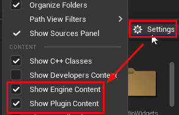

4. 📂 Navigate to the appropriate folder:
   - **Marketplace (Fab) install**: `All > Engine > Plugins > Geppetto Content > GeppettoDemoScene`
   - **Source install**: `All > Plugins > Geppetto Content > GeppettoDemoScene`

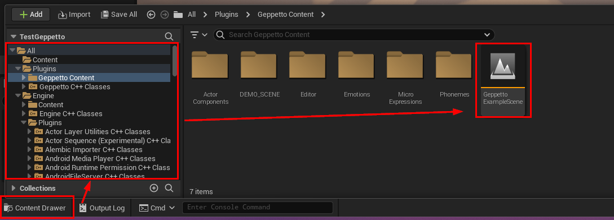

5. ▶️ Open the level and press **Play**.

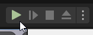

 

## 2.2 Play with the Demo Level

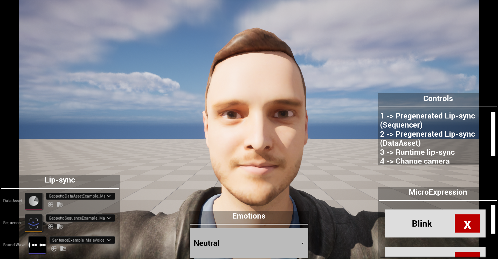

<!-- TODO: Add colored box to the image and the text to be clearer, like for Ariel: https://github.com/X-Immersion/Ariel_Unreal_documentation/blob/main/doc/Quickstart.md#-editor-pre-generation -->

There are a few things you can do in the demo scene:

* On the *middle right*, you can see the **Controls** that can be used to interact with the demo level. Use the keyboard key 1-5 (or numpad key) to perform actions:

| Key | Action                                                                 |
|-----|------------------------------------------------------------------------|
| 1   | Play the selected pre-generated Geppetto Sequence                     |
| 2   | Play the selected pre-generated Geppetto Data Asset                     |
| 3   | Use the selected SoundWave to generate lipsync at runtime and play it |
| 4   | Change the camera angle |
| 5   | Toggle UI |

* On the *bottom right*, you can see the **Micro Expression** loops currently played. You can click on the (X) button to toggle them (on/off).

* On the *bottom center*, you can see the **Emotions** dropdown. If you change the emotion, the emotion transition animation will be played.

* On the *bottom left*, you can see the **Lip-sync** settings. Use them with the keys 1-3 to play various DataAsset/Sequence/SoundWave.

 

## 2.3 Understand the Demo Level

Open `BP_GeppettoExampleActor > Event Graph` to start exploring how the
Geppetto plugin works.

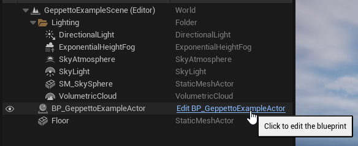

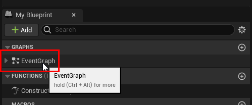

You’ll see a block for each key event and `BeginPlay`.

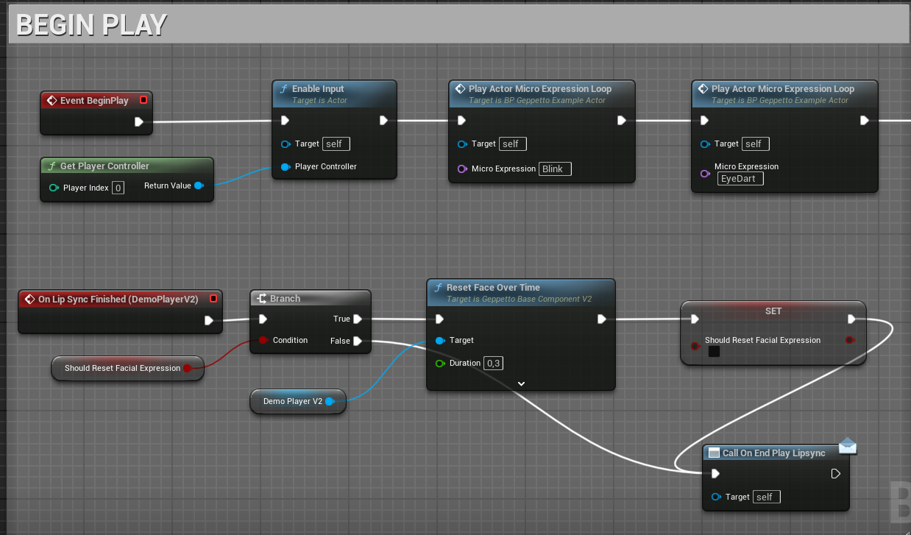

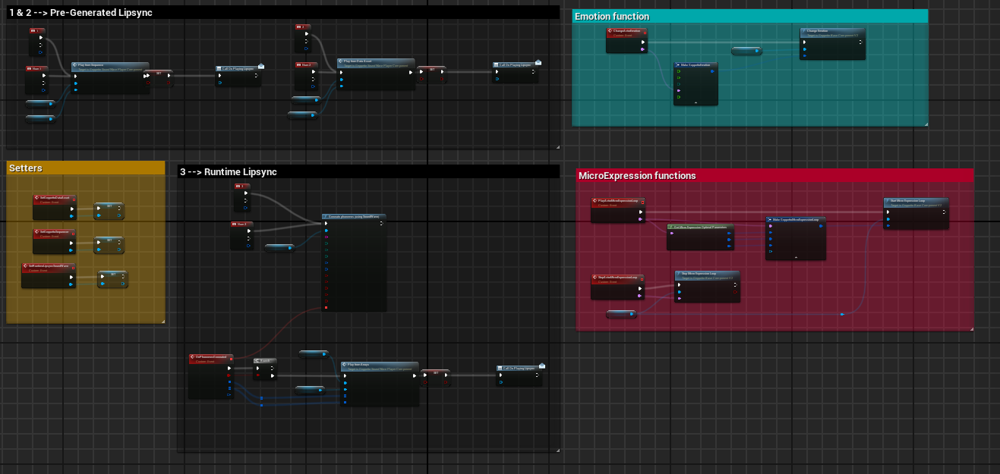

### 2.3.1 Components Required

Every actor using the plugin must have these 3 components:

- ✅ A Skeletal Mesh with Morph Targets
- 🔊 An Audio Component
- 🧠 A [Geppetto Sound Wave Component](./API.md#42-geppetto-soundwave-player-component) or any component that [inherits](API.md#43-component-inheritance) from [Geppetto Base Component](API.md#41-geppetto-base-component) *(e.g., DemoPlayerV2)*

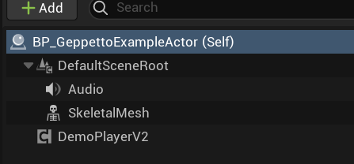

You can see on the [Geppetto Sound Wave Component](./API.md#42-geppetto-soundwave-player-component) detail panel the Data Tables used for phonemes, emotions, micro expressions and headshift.

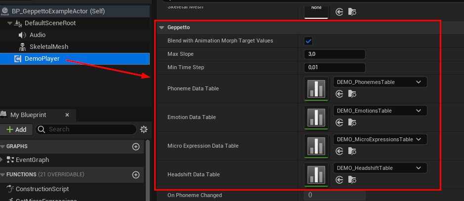

### 2.3.2 Begin Play

In the BeginPlay Event, there is no need to initialize anything. Instead, we use this event to start some common micro expressions.

- Blink
- EyeDart

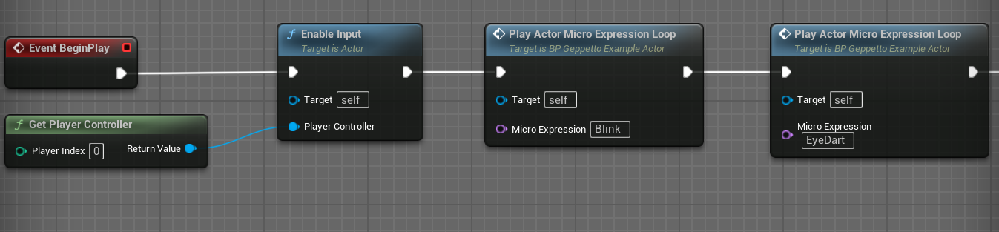

A MicroExpression DataTable with the two micro expressions is needed to play them. You can check this by clicking on the Geppetto Sound Wave Player and looking at the MicroExpression DataTable value.   
> You can create your own table in order to animate characters with custom Morph Targets.    
Please read section [Phoneme Table](./API.md#44-geppetto-phoneme-data-table), [Emotion Table](./API.md#45-geppetto-emotion-data-table), [Micro expression Table](./API.md#46-geppetto-micro-expressions-data-table) and [Headshift Table](./API.md#47-geppetto-headshift-data-table) for more details.

### 2.3.3 Phonemes / Lipsync

The **keyboard 1 and 2** events are related to pre-generated phonemes.

- Please read section [Generate Phonemes and Emotions in the Editor](GettingStarted.md#24-generate-phonemes-and-emotions-in-the-editor) of the documentation for more information on how to pre-generate phonemes in a Geppetto Sequence or a Data Asset using the Geppetto Editor Interface.

- Please read section [Play Editor Lipsync Assets on a Character](GettingStarted.md#25-play-editor-lip-sync-assets-on-a-character) of the documentation for more information on how to play the Geppetto phonemes from a Geppetto Sequence

- Please read section [Geppetto Sequence](./API.md#4122-geppetto-sequence) of the documentation for more information about the Geppetto Sequence asset

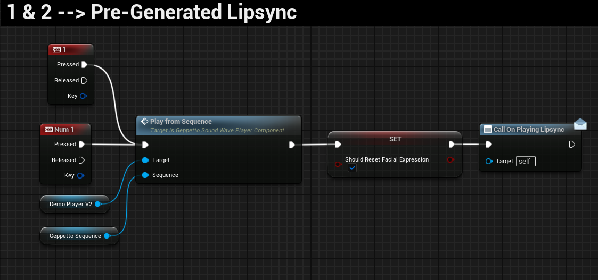

> Note that this is also possible to play the Geppetto phonemes from a Data Asset. For more information, please refer to the section [Play Editor Lipsync Assets on a Character](GettingStarted.md#25-play-editor-lip-sync-assets-on-a-character).

The **keyboard 3 event** is related to runtime phonemes.

- Please read section [Generate Phonemes and Emotions on Runtime](GettingStarted.md#27-generate-phonemes-and-emotions-on-runtime) of the documentation for more information on how to generate and play runtime generated phonemes.
- Please read section [Generate phonemes (using SoundWave)](./API.md#481-generate-phonemes-using-soundwave) for more information on how to generate phonemes from a local audio file ([SoundWave](API.md#481-generate-phonemes-using-soundwave), [PCM](API.md#482-generate-phonemes-using-pcm-bytes) or [file](API.md#483-generate-phonemes-using-file-bytes))

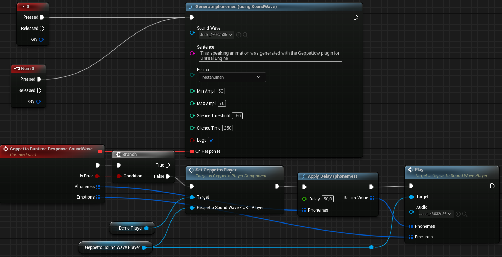

The plugin uses a [Geppetto Phoneme Data Table](./API.md#44-geppetto-phoneme-data-table) to know all Morph Target values for each phoneme. If the skeletal mesh of your characters has different Morph Targets, it is required to create a new [Geppetto Phoneme Data Table](./API.md#44-geppetto-phoneme-data-table) with the Morph Targets used in your characters.     
**Please note that Data Tables for Metahuman are included in this plugin!**   
The Data Table used by the plugin is passed through the [Geppetto Sound Wave Player Component](./API.md#42-geppetto-soundwave-player-component) variables.

### 2.3.4 Emotions

The **Emotion combo box in the scene** is related to emotions.

- Please read section [Change Emotions](GettingStarted.md#28-play-an-emotion-on-a-character) for more information on how to change emotions in Blueprints.
- Please read section [Emotion Tag System](Others.md#6-adding-emotion-tags) for more information on how to change emotions with tags.
- Please read section [Geppetto Emotion](./API.md#4142-geppetto-emotion) of the documentation for more information about the Geppetto emotion structure.

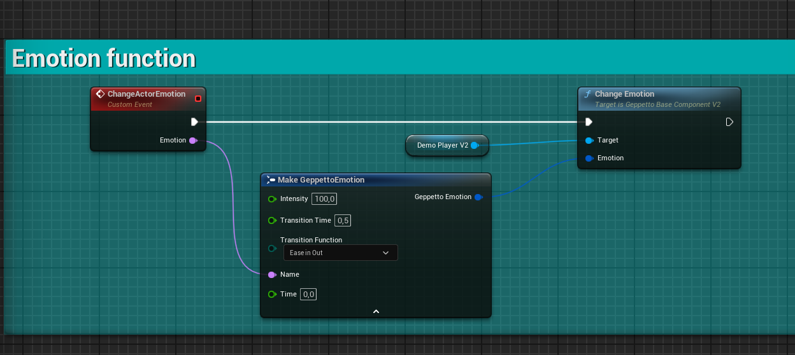

In the same way as phonemes, emotions use a [Geppetto Emotion Data Table](./API.md#45-geppetto-emotion-data-table) to determine the Morph Target values for each emotion.

### 2.3.5 Micro Expressions

The **micro expressions scrollbox in the scene** is related to micro expressions.

- Please read section [Play or Loop Micro Expressions](GettingStarted.md#29-play-a-micro-expression-on-a-character) of the documentation for more information on how to use micro expressions.
- Please read section [Play Micro Expression](./API.md#417-play-micro-expression) of the documentation for more information about the node.
- Please read section [Start Micro Expression Loop](./API.md#418-start-micro-expression-loop) and [Stop Micro Expression Loop](./API.md#419-stop-micro-expression-loop) of the documentation for more information about the nodes.

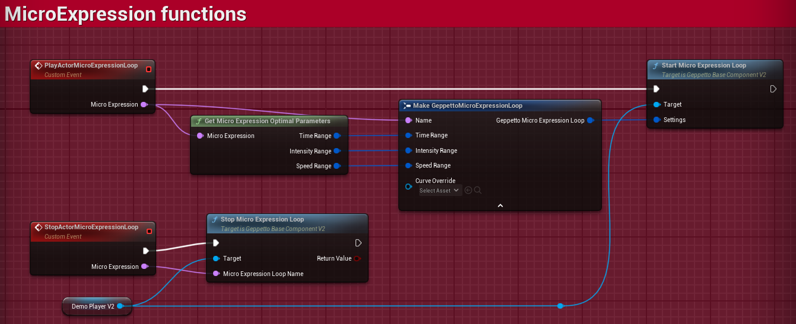

Like phonemes and emotions, micro expressions use a [Geppetto Micro Expressions Data Table](./API.md#46-geppetto-micro-expressions-data-table) to retrieve the Morph Target values.   
This time, however, the values can be **static** (like phonemes or emotions Morph Target values) or **dynamic** (the Morph Target values will change each time the Micro Expression is played).    
Please read section [Geppetto Micro Expressions Data Table](./API.md#46-geppetto-micro-expressions-data-table) of the documentation for more information.