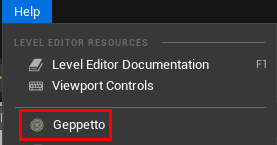
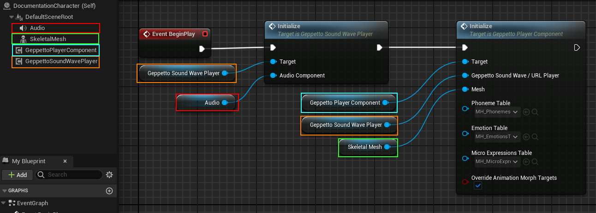
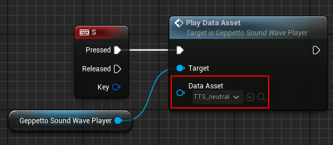
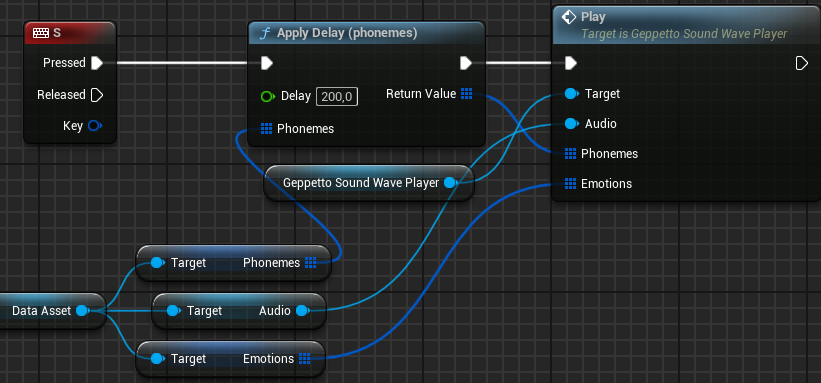
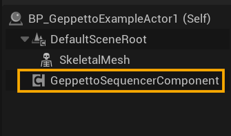
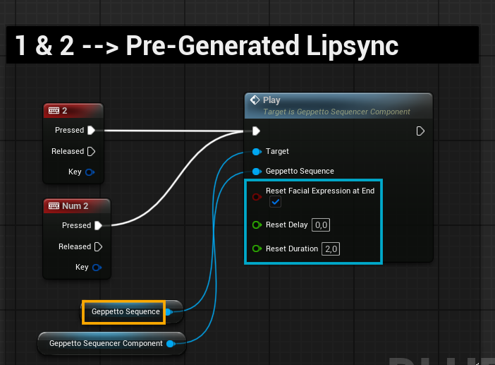
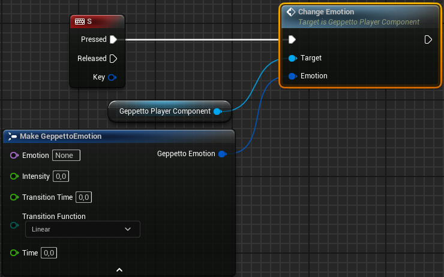
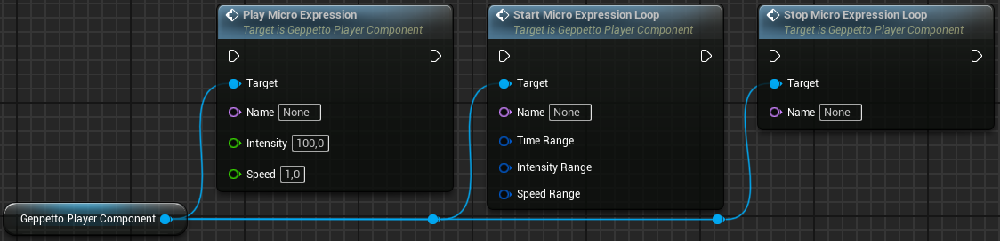

# Geppetto UE 2.0.0 – Features

This chapter provides a complete tour of the Geppetto plugin features available in the Unreal Editor and at runtime.

**[← Table of contents](../README.md#table-of-contents)**

---

### On this page

- **[Pre-generated Data Asset (Editor)](#31-pre-generated-data-asset-editor)**
- **[Runtime Phonemes Generation and Animation (Blueprint)](#32-runtime-phonemes-generation-and-animation-blueprint)**
- **[Change Emotions](#33-change-emotions)**
- **[Play or Loop Micro Expressions](#34-play-or-loop-micro-expressions)**
- **[Emotion Tag System](#35-emotion-tag-system)**

---

## 3.1 Pre-generated Data Asset (Editor)

### 3.1.1 Pre-Generate Phonemes as a Geppetto Data Asset

If you want to pre-generate phonemes that will be saved as a [Geppetto Data Asset](./API.md#4101-geppetto-data-asset), you can use the Editor Utility Widget included in the plugin.     
You can open the Window by clicking on the Geppetto icon button or in the menu **Help > Geppetto**:

The interface will open. Please see the table on the next page to find more information about all fields.

| Icon | Element                                   | Description                                                                 |
|-------|-------------------------------------------|-----------------------------------------------------------------------------|
| 📘    | **Documentation button**                  | Opens this manual in your browser.                                          |
| 🧠    | **Local model**                           | Define the phoneme generation model (local only).                           |
| 🔊    | **Audio**                                 | The speech SoundWave asset (compatible with Ariel plugin).                  |
| 🔇    | **Remove noise**                          | Helps silence detection and phoneme precision.                              |
| 🧏    | **Use speech recognition**                | Phonemes based only on audio.                                               |
| 🌐    | **Language**                              | Improve accuracy based on speech language.                                  |
| 🗣️    | **Sentence**                              | The sentence being spoken (can include emotion tags).                       |
| 🏷️    | **Add tags to sentence**                 | Insert tags like `<emotion happy>`.                                         |
| 🎭    | **Phonemes & Emotions settings**          | Link to the corresponding Data Tables.                                      |
| 📈    | **Amplitude & sinus steps**               | Control mouth animation intensity.                                          |
| 🕑    | **Silences**                              | Use tools like Audacity to find appropriate silence thresholds.             |
| ⏱️    | **Delay**                                 | Sync delay between audio and animation.                                     |
| 🎞️    | **Sequencer Frame Rate**                 | Higher FPS = better edit control.                                           |
| 👄    | **Close Mouth At End Of Speech**          | Enables auto-mouth closing.                                                |
| 💾    | **Save as**                               | Choose between `Data Asset` or `Sequencer`.                                 |

The Editor Utility Widget uses the nodes [Generate Phonemes](./API.md#481-generate-phonemes-using-soundwave) and [Save Geppetto Phonemes](./API.md#482-save-geppetto-phonemes) to generate the phonemes and store them for further use.

➡️ Finally, hit the **“Generate Phonemes”** button to generate your .uasset file. **This may take a while according to the
audio duration !**

---

### 3.1.2 Play a Geppetto Data Asset with SoundWave

To play the generated lip-sync and sound :

1. Create a Blueprint class. **If you use Metahuman, you
can use the generated Blueprint class instead** (i.e: *BP_Ada* for the Metahuman named Ada).

2. Add the following components :
   - Skeletal Mesh Component
   - Audio Component
   - [Geppetto SoundWave Player](./API.md#42-geppetto-soundwave-player)
   - [Geppetto Player Component](./API.md#43-geppetto-player-component) (or custom version for Metahuman*)

*If your Skeleton doesn’t use the traditional node “Set Morph Target” to update Morph Target values, like Metahuman characters, you need to override some functions from the Geppetto Player Component, otherwise animation will not work.    
Please read section [4.4.1 - Component Inheritance](./API.md#441-component-inheritance) for more information.*

3. Use `BeginPlay` to initialize with:
   - `Geppetto SoundWave Player Initialize`
   - `Geppetto Player Component Initialize`

   

4. Use `Play Data Asset` to start playback.
5. Use `Play` node (advanced) if you want to override audio or delay.

You can use the node *Play Data Asset* from the [Geppetto SoundWave Player](./API.md#42-geppetto-soundwave-player) whenever you want in your game in order to play the lip sync animation. 
In the example below, the lip sync starts when the user presses the ‘s’ key (do not forget to enable input on this actor if you plan to do the same). 
*You must provide the Data Asset that you want to play*

  

If you want to [Apply Delay](./API.md#495-apply-delay-phonemes) to the phonemes or emotions before playing the animation, please use the Geppetto SoundWave Player Play node instead. This node can also be used to change the audio SoundWave played with the Geppetto animation (*not recommended*) :

  

---

### 3.1.3 Play a Geppetto Sequence

Same idea as before, but with the **[Geppetto Sequencer Component](./API.md#45-geppetto-sequencer-component)** and the generated **[Geppetto Sequence](./API.md#4102-geppetto-sequence)** :

1. Create a Blueprint class. **If you use Metahuman, you
can use the generated Blueprint class instead** (i.e: *BP_Ada* for the Metahuman named Ada).

2. Add the following components :
   - Skeletal Mesh Component
   - [Geppetto Sequencer Component](./API.md#45-geppetto-sequencer-component)

*If your Skeleton doesn’t use the traditional node “Set Morph Target” to update Morph Target values, like Metahuman characters, you need to override some functions from the Geppetto Player Component, otherwise animation will not work.    
Please read section [4.4.1 - Component Inheritance](./API.md#441-component-inheritance) for more information.*

3. Use `BeginPlay` to initialize the [Geppetto Sequencer Component](./API.md#45-geppetto-sequencer-component) with `Initialize`.

   

5. Use `Play` node to start the lip-sync animation. **You must provide the [Geppetto Sequence](./API.md#4102-geppetto-sequence) that you want to play.**

  

---

## 3.2 Runtime Phonemes Generation and Animation (Blueprint)

This setup is used for audio generated during gameplay, such as:
- 🎤 Player microphone input
- 🧠 [Ariel TTS plugin](https://www.fab.com/listings/7a3354f0-44c7-43ea-8656-23814c9f393d)

### Components

1. Skeletal Mesh Component (with Morph Targets)
2. [Geppetto SoundWave Player](./API.md#42-geppetto-soundwave-player)
3. Audio Component
4. [Geppetto Player Component](./API.md#43-geppetto-player-component) (or custom one for Metahuman)

If you want to have audio spatialization, check the “Allow Spatialization” box and set a sound attenuation in the Audio Component (you can create a new one if needed) :

### Initialization

Use `BeginPlay` to call:
- `SoundWave Player Initialize`
- `Geppetto Player Component Initialize`

### Phoneme Generation

Whenever you want in your blueprint, i.e: right after the audio file has been generated, call one of the `Generate Phonemes` nodes.    
Trigger one of the following nodes during gameplay:
- `Generate Phonemes (SoundWave)`
- `Generate Phonemes (PCM bytes)`
- `Generate Phonemes (multipart/form-data)`

Please note that **it could take up to 15 seconds to generate the phonemes, depending on your audio size and length !**    
For a small file and short sentence (10s or less, <100Kb), the generation should take less than a second.

Once the API returns phonemes and emotions:
- Use `Play` on the corresponding Player
- Optionally apply delay

→ If you use our Ariel plugin to generate the audio files at runtime, please see this example.

| Field                | Description                                                                                                                                                                                                                                  |
|----------------------|----------------------------------------------------------------------------------------------------------------------------------------------------------------------------------------------------------------------------------------------|
| **URL**              | The audio URL of the speech, in wav format.                                                                                                                                                                                                 |
| **Sound Wave**       | The audio SoundWave. It can be a SoundWave procedural.   ⚠️ **WARNING**: If the SoundWave is an asset, double click on it from the Content Drawer to open it and set the Loading Behavior to **Force Inline** !!!                    |
| **File Bytes**       | The audio wav file bytes data. It must have the wave header bytes as well.   If you only have the PCM bytes, please use **Generate phonemes (using PCM bytes)** instead.                                                                |
| **Filename**         | The name of the file that will be sent through the form POST request.                                                                                                                                                                       |
| **File Content Type**| The MIME content-type of the audio file. [More information here](https://developer.mozilla.org/en-US/docs/Web/HTTP/Guides/MIME_types/Common_types).                                                                                                                 |
| **Sentence**         | The sentence(s) spoken in the audio file, including the emotion tags.  Refer to section **3.2 - Emotion Tag System** for more info.                                                                                                      |
| **Format**           | Select the phoneme format returned by the API.  ⚠️ Use **Metahuman** format unless you have a custom Data Table. Even if you don’t use Metahuman characters. See section **4.5 - Geppetto Phoneme Data Table** for details.             |
| **Amplitude**        | Choose the amplitude range for the animation.  Higher values = more mouth articulation; Lower values = whisper effect.                                                                                                                   |
| **Silences Detection**| Parameters depending on your recording setup.  Use tools like **Audacity** to determine:  - **Threshold**: max dB recorded when you're silent.  - **Time**: min duration (ms) to count as a silence between phonemes.             |
| **Logs**             | Toggle whether Geppetto logs will be printed to console and/or screen (Debug only).                                                                                                                                                        |
| **Event Binding**    | From the **“On Response”** pin, drag to your Event Graph and select **Add Custom Event** or **Create Event**. You can name the event freely.                                                                                                 |

Drag the mouse from the “On Response” pin and drop it on your Event Graph. You can then select Add Custom Event or Create Event actions, and name the event as you want:

---

## 3.3 Change Emotions

The Geppetto plugin also allows you to animate emotion to your character. All emotions must have been defined in the [Emotion Data Table](./API.md#46-geppetto-emotion-data-table) used by the [Geppetto Player](./API.md#43-geppetto-player-component).   
Please read section [4.6 - Geppetto Emotion Data Table](./API.md#46-geppetto-emotion-data-table) for more details about how to create emotion Data Tables.   
**If you use Metahuman characters, you can use the existing Data Table named “MH_Emotions”.**

Emotions can be changed when a sentence is pronounced by using tags. Please read section [3.5 - Emotion Tag System](./API.md#35-emotion-tag-system) for more information on how to use tags.    
You can also use the Geppetto Player node `Change Emotion` to change your character emotion at any time you want.

| Field               | Description                                                                                                                                                                                                                         |
|---------------------|-------------------------------------------------------------------------------------------------------------------------------------------------------------------------------------------------------------------------------------|
| Emotion             | The emotion name. The emotion must be defined in the Emotion Data Table.                                                                                                                     |
| Intensity           | The emotion intensity percentage, range 0 - 100.                                                                                                                                               |
| Transition Time     | The switching emotion transition time, in seconds. For example, if the current character emotion is ‘Neutral’, the new emotion passed is ‘Happy’ and the transition time is 0.2s, then the character face will bend from neutral pose to happy pose in 0.2 seconds (200ms). |
| Transition Function | The transition interpolation function used to bend between emotions.                                                                                                                          |
| Time                | This parameter is used for internal purposes and should not be edited. This parameter will be hidden in the future version of the plugin.                                                    |

---

## 3.4 Play or Loop Micro Expressions

All micro-expressions must have been defined in the Micro Expressions Data Table used by the Geppetto Player. For more information about this, please read section [4.7 - Geppetto Micro Expressions Data Table](./API.md#47-geppetto-micro-expressions-data-table) of the documentation.    
**If you use Metahuman characters, you can use the existing Data Table named “MH_Emotions”.**

Micro-Expressions can be played in two ways : 

- An **unique** micro-expression
- A micro-expression **loop**. 

For example, you can decide to play a unique blink animation or decide to play a blink animation loop. You can use the Geppetto Player nodes [Play Micro Expression](./API.md#4410-play-micro-expression) and [Start Micro Expression Loop](./API.md#4411-start-micro-expression-loop) to animate micro-expression on your character.

### Nodes

- `Play Micro Expression`

| Field    | Description                                                                                                                                                                                                                                                                                   |
|----------|-----------------------------------------------------------------------------------------------------------------------------------------------------------------------------------------------------------------------------------------------------------------------------------------------|
| Name     | The micro-expression name. The micro-expression must have been defined in the Micro Expressions Data Table.                                                                                                                                             |
| Intensity| The micro-expression intensity. Range 0 - 100. For dynamic micro-expressions (i.e: EyeDart), we recommend always setting the intensity to 100.                                                                                                          |
| Speed    | The micro-expression animation playback speed. Must be greater than 0. The speed is related to the micro-expression curve duration defined in the Data Table. See Micro Expressions Data Table “Curve” parameter for more details.                     |

- `Start Micro Expression Loop`

| Field            | Description                                                                                                                                                                                                                                                                                                                                                                                                     |
|------------------|-----------------------------------------------------------------------------------------------------------------------------------------------------------------------------------------------------------------------------------------------------------------------------------------------------------------------------------------------------------------------------------------------------------------|
| Name             | The micro-expression name. The micro-expression must have been defined in the Micro Expressions Data Table.                                                                                                                                                                                                                                                              |
| Time range       | The waiting time ranges between the execution of two micro-expressions. The waiting time will be randomly selected after each time the micro-expression is played, between the specified min and max value (set the min and max fields to the same value in order to always have the exact same waiting time).                                                           |
| Intensity range  | The randomly selected intensity that will be used for the execution of each micro-expression. The value will be randomly selected after each time the micro-expression is played, between min and max value (set the min and max fields to the same value in order to always have the exact same intensity).                                                              |
| Speed range      | The randomly selected speed that will be used for the execution of each micro-expression. The value will be randomly selected after each time the micro-expression is played, between min and max value (set the min and max fields to the same value in order to always have the exact same playback speed).                                                            |

- `Stop Micro Expression Loop`

| Field | Description                     |
|-------|---------------------------------|
| Name  | The micro-expression name.      |

🔁 Use randomness to make expressions more lifelike!

---

## 3.5 Emotion Tag System

The emotion tag system allows you to change the character emotion at a specific point of the sentence. Its base syntax is the following :

### Syntax

`<emotion name intensity 80 transition 300 function_type linear>`

### Parameters

| Parameter         | Description                               | Default      |
|---------------|-------------------------------------------|--------------|
| emotion       | Name of the emotion                       | (required)   |
| intensity     | Intensity (0-100)                         | 50           |
| transition    | Transition time in ms                     | 200          |
| function_type | Interpolation function (linear, cubic…)  | cubic        |

### Example

You can mix tags with runtime Blueprint emotion changes for full control.
Please read section [3.3 - Change Emotions](#33-change-emotions) of the documentation for more details on how to change an emotion at Runtime using Blueprints.

---