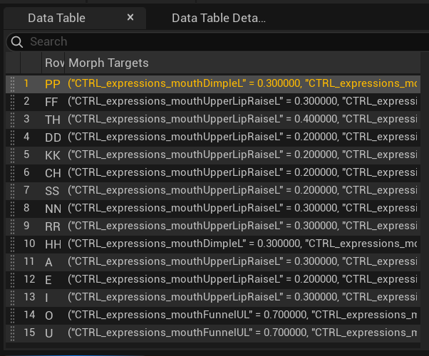
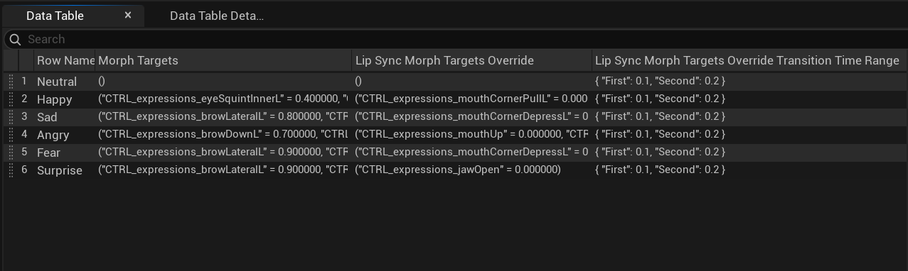

# Geppetto UE 2.0.0 – Getting Started

**[← Table of contents](../README.md#table-of-contents)**

---

### On this page

- **[What is Geppetto ?](#21-what-is-geppetto)**
- **[Character setup](#22-character-setup)**
- **[Geppetto Data Tables](#23-geppetto-data-tables)**
- **[Generate phonemes and emotions in the editor](#24-generate-phonemes-and-emotions-in-the-editor)**
- **[Generate phonemes and emotions on runtime](#245-generate-phonemes-and-emotions-on-runtime)**
- **[Play lip-sync on a character](#25-play-lip-sync-on-a-character)**
- **[Play an emotion or a micro expression on a character](#255-play-an-emotion-or-a-micro-expression-on-a-character)**

---

## 2.1 What is Geppetto ?

**Geppetto is a facial animation and lip-sync plugin for Unreal Engine, designed to automatically generate lip-sync animations from audio or text files.**

**The latest version (2.0.1) introduces the Geppetto Sequence Editor, enabling advanced customization of lip-sync animations with precise timing and amplitude adjustments for morph targets. This version also includes new features like automatic emotion detection and improved voice recognition.**

## 2.2 Character setup

For this example, we will use this  [rigged character](https://sketchfab.com/3d-models/rigged-t-pose-human-male-w-50-face-blendshapes-cc7e4596bcd145208a6992c757854c07) made by [Mike Alger](https://mikealger.com/).    
This character possess 50 face blendshapes that we will use to create a lip-sync animation.

Here are the steps to set up the character in Unreal :

1. Download the character in FBX format from sketchfab with the link given above.
2. Unzip the character archive wherever you want.
3. Create a new Unreal project or open an existing one.
4. Drag and drop the fbx file of the character in the wanted folder. Here we will place it inside the "Example" folder.
5. **Do not forget to import the MorphTarget by checking the appropriate boxes and click on "Import".**

6. To ensure the character was correctly imported, open the skeletal mesh asset and go into the "MorphTargets" tab. Here you should have the 50 blendshapes.

**Well done ! Your character is now setup and can be used with Geppetto !**    
Check the next steps to learn how to bind Geppetto to your character and play a lip-sync animation.

## 2.3 Geppetto Data Tables

### 2.3.1 Phoneme Data Table

**The Geppetto Phoneme Data Table in Unreal Engine is designed to drive facial animation through phoneme-based lip sync.**    
Each row represents a phoneme (like A, E, U, etc.) and contains values for Morph Targets, which are specific facial poses. This allows for detailed, expressive character dialogue.

You can either create a new Phoneme DataTable in Unreal or import an existing one from a csv or json file.    
Predefined tables are available under Plugins > Geppetto Content > Phonemes, and you’re free to duplicate or customize them.    
For more information, please see [4.5 Geppetto Phoneme Data Table](./API.md#45-geppetto-phoneme-data-table).

### 2.3.2 Emotion Data Table

The Geppetto Emotion Data Table is used to animate facial expressions tied to emotions. Each row corresponds to an emotion (like Happy, Sad, Angry, etc.) and specifies Morph Target values that sculpt the facial mesh into an expressive pose. This is ideal for customizing character emotion systems in Unreal Engine.

You can either create a new Emotion DataTable in Unreal or import an existing one from a csv or json file. 
Predefined tables are available under Plugins > Geppetto Content > Emotions, and you’re free to duplicate or customize them.
For more details, see [4.6 Geppetto Emotion Data Table](./API.md#46-geppetto-emotion-data-table).

### 2.3.3 Micro-expression Data Table

The Geppetto Micro Expressions Data Table defines subtle facial movements like blinks or eyebrow twitches. Each row maps a micro expression to Morph Target values, either fixed or dynamic.     
Dynamic targets introduce random variation to keep animations lively and natural.

You can either create a new Micro Expression DataTable in Unreal or import an existing one from a csv or json file.   
For more information, see [4.7 Geppetto Micro Expressions Data Table](./API.md#47-geppetto-micro-expressions-data-table).

## 2.4 Generate phonemes and emotions in the editor

## 2.5 Generate phonemes and emotions on runtime

## 2.6 Play lip-sync on a character

## 2.7 Play an emotion or a micro expression on a character