# Geppetto UE 2.0.0 – Getting Started

This chapter provides a complete flow of the Geppetto plugin to crate a pre-generated or a runtime lipsync in the Unreal Editor.

**[← Table of contents](../README.md#table-of-contents)**

---

### On this page

- **[What is Geppetto ?](#21-what-is-geppetto)**
- **[Character setup](#22-character-setup)**
- **[Geppetto Data Tables](#23-geppetto-data-tables)**
- **[Generate phonemes and emotions in the editor](#24-generate-phonemes-and-emotions-in-the-editor)**
- **[Generate phonemes and emotions on runtime](#25-generate-phonemes-and-emotions-on-runtime)**
- **[Play lip-sync on a character](#26-play-lip-sync-on-a-character)**
- **[Export lipsync as an animation](#27-export-lipsync-as-an-animation)**
- **[Play an emotion on a character](#28-play-an-emotion-on-a-character)**
- **[Play micro expression on a character](#29-play-a-micro-expression-on-a-character)**

---

## 2.1 What is Geppetto ?

**Geppetto is a facial animation and lip-sync plugin for Unreal Engine, designed to automatically generate lip-sync animations from audio or text files.**

**The latest version (2.1.0) introduces a better lipsync render and the ability to export yoour Geppetto sequence as an animation asset, enabling versatility and an increased customisation. This version also includes new features like headshift.**

## 2.2 Character setup

For this example, we will use this  [rigged character](https://sketchfab.com/3d-models/rigged-t-pose-human-male-w-50-face-blendshapes-cc7e4596bcd145208a6992c757854c07) made by [Mike Alger](https://mikealger.com/).    
This character possess 50 face blendshapes that we will use to create a lip-sync animation.

Here are the steps to set up the character in Unreal :

1. Download the character in FBX format from sketchfab with the link given above.
2. Unzip the character archive wherever you want.
3. Create a new Unreal project or open an existing one.
4. Drag and drop the fbx file of the character in the wanted folder. Here we will place it inside the "Example" folder.
5. **Do not forget to import the MorphTarget by checking the appropriate boxes and click on "Import".**

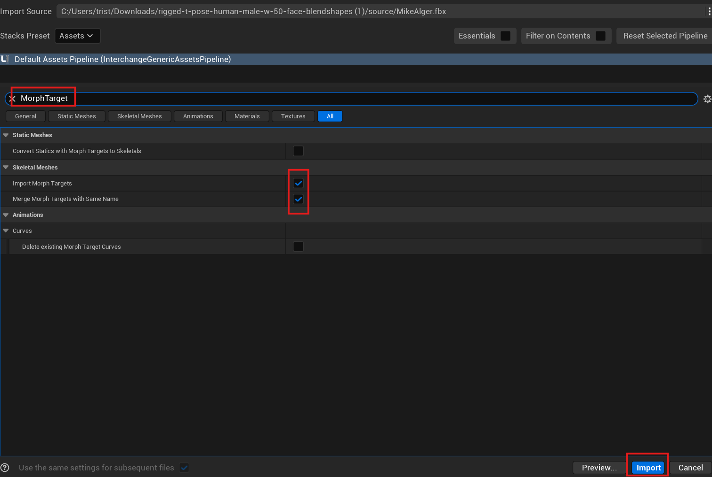

6. To ensure the character was correctly imported, open the skeletal mesh asset and go into the "MorphTargets" tab. Here you should have the 50 blendshapes.

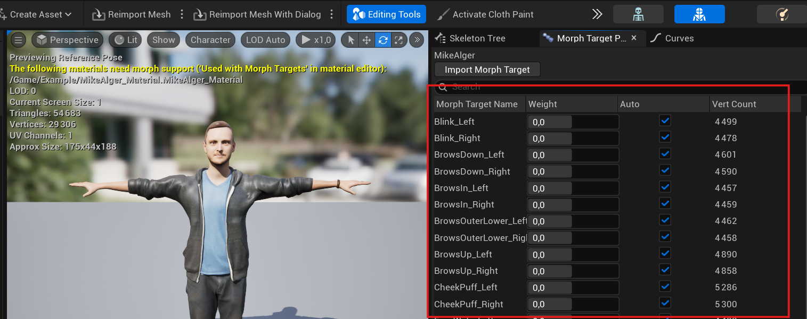

> [!NOTE]  
> The "MorphTargets" tab may vary a bit depending of your version of the engine but the content still remains the same. 

**Well done ! Your character is now setup and can be used with Geppetto !**    
Check the next steps to learn how to bind Geppetto to your character and play a lip-sync animation.

## 2.3 Geppetto Data Tables

### 2.3.1 Phoneme Data Table

**The Geppetto Phoneme Data Table in Unreal Engine is designed to drive facial animation through phoneme-based lip sync.**    
Each row represents a phoneme (like A, E, U, etc.) and contains values for Morph Targets, which are specific facial poses. This allows for detailed, expressive character dialogue.    
Here is an example with the **DEMO_PhonemesTable** that convert phonemes into the blendshapes of the rigged character we just imported :

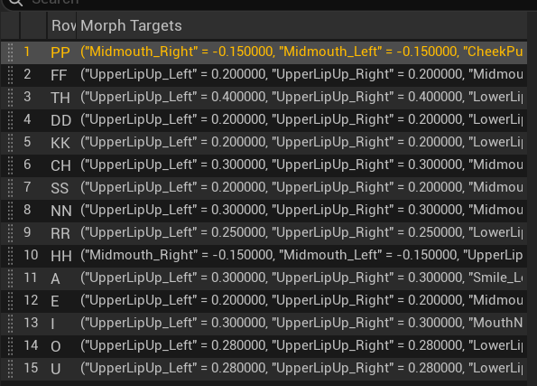

You can either create a new Phoneme DataTable in Unreal or import an existing one from a csv or json file.    
Predefined tables are available under Plugins > Geppetto Content > Phonemes, and you’re free to duplicate or customize them.    
For more information, please see [4.2 Geppetto Phoneme Data Table](./API.md#42-geppetto-phoneme-data-table).

> [!NOTE]  
> If you do not see the **Plugins** folder or the **Geppetto Content** folder, click on **"Settings"** in the **Content Browser** and tick **"Show Plugin Content"**.     
>If the Geppetto is installed within the Engine and not the project, you also have to tick **"Show Engine Content"**. 
>
>

### 2.3.2 Emotion Data Table

The Geppetto Emotion Data Table is used to animate facial expressions tied to emotions. Each row corresponds to an emotion (like Happy, Sad, Angry, etc.) and specifies Morph Target values that sculpt the facial mesh into an expressive pose. This is ideal for customizing character emotion systems in Unreal Engine.    
Here is an example with the **DEMO_EmotionsTable** that convert emotions into the blendshapes of the rigged character we just imported :

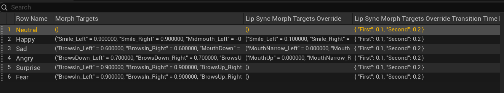

You can either create a new Emotion DataTable in Unreal or import an existing one from a csv or json file. 
Predefined tables are available under Plugins > Geppetto Content > Emotions, and you’re free to duplicate or customize them.
For more details, see [4.3 Geppetto Emotion Data Table](./API.md#43-geppetto-emotion-data-table).

### 2.3.3 Micro-expression Data Table

The Geppetto Micro Expressions Data Table defines subtle facial movements like blinks or eyebrow twitches. Each row maps a micro expression to Morph Target values, either fixed or dynamic.     
Dynamic targets introduce random variation to keep animations lively and natural.

You can either create a new Micro Expression DataTable in Unreal or import an existing one from a csv or json file.   
For more information, see [4.4 Geppetto Micro Expressions Data Table](./API.md#44-geppetto-micro-expressions-data-table).

### 2.3.4 Headshift Data Table

The Geppetto Headshift Data Table defines neck movements. Each row represents one or several neck movements to play procedurally or when an emotion is played.     
Each neck movement is composed of a curve, a speed, an amplitude, and influenced axis.

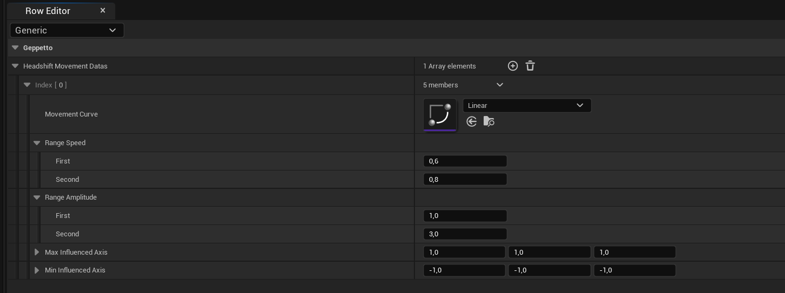

You can either create a new Headshift DataTable in Unreal or import an existing one from a csv or json file.   
For more information, see [4.5 Geppetto Headshift Data Table](./API.md#45-geppetto-headshift-data-table).

## 2.4 Generate phonemes and emotions in the editor

To pre-generate phonemes, you can use the Editor Utility Widget included in the plugin.     
You can open the Window by clicking on the Geppetto icon button or in the menu **Help > Geppetto**:

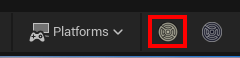
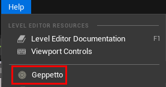

The interface will open. It contains several parameters to customize your phonemes and emotions generation.     

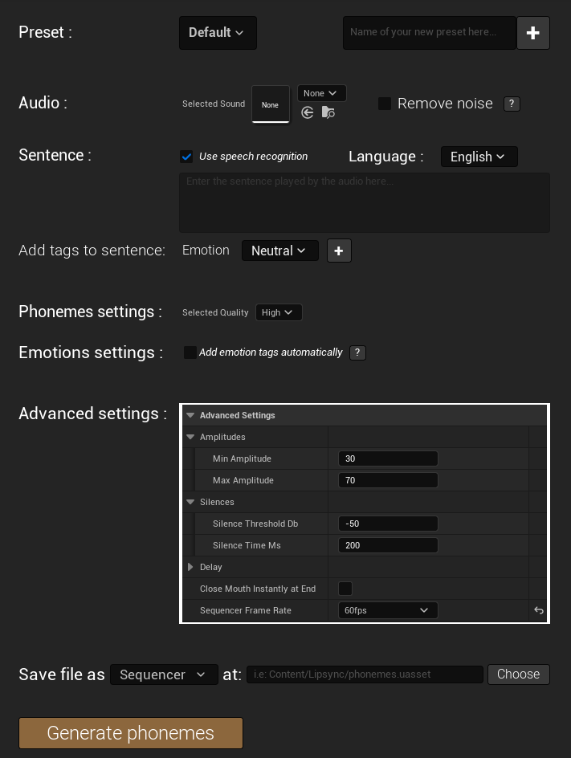

Here a the following steps to generate a basic lip-sync animation :

1. Pass your audio file in the `Audio` parameter.    
For this example, we will use **SentenceExample_MaleVoice_1** which is available in the plugin folder if you want to use it.

2. We will check the checkbox `Use speech recognition` to tell Geppetto to only use the audio file to create the lipsync animation.

3. Enable `Use auto emotions` checkbox to allow Geppetto to automatically detect emotions in your audio file.

4. Then, choose in which asset store your generated phonemes with the `Save file as` parameter.    
There is two types of asset : [Geppetto DataAsset](./API.md#48-data-assets) and [Geppetto Sequence](./API.md#49-geppetto-sequence). Each of them has different use case.   
[Below](#26-play-lip-sync-on-a-character), you will find an example on how to use both assets.

5. Finally, hit the `Generate Phonemes` button to generate your .uasset file.     
**This may take a while according to the audio duration and other parameters.**

If you want to start the customization of your generated phonemes now, here are some parameters that might be useful :

- `Quality` : As the name suggests, you can define the overall quality of your pre generated lip-sync.  
Better quality also means higher generation time.    
**We recommend that your audio does not last more than 10 seconds.**

- `Language`: If your audio is not in English, select your language from this dropdown.    
**Adjusting this setting helps Geppetto better capture the unique characteristics of the chosen language.**

- `Emotion` : Click on this setting to add an emotion tag in your sentence. Emotion tag are used to specify a particular emotion at a chosen moment.  
For more information about this feature, please see chapter [4.12 Emotion Tag System](./API.md#412-emotion-tag-system)

 

<strong>Complete list of parameters is available here.</strong>

| Icon | Element                                   | Description                                                                 |
|-------|-------------------------------------------|-----------------------------------------------------------------------------|
| 📘    | **Documentation button**                  | Opens this manual in your browser.                                          |
| 🧠    | **Local model**                           | Define the phoneme generation model (local only).                           |
| 🔊    | **Audio**                                 | The speech SoundWave asset (compatible with Ariel plugin).                  |
| 🔇    | **Remove noise**                          | Helps silence detection and phoneme precision.                              |
| 🧏    | **Use speech recognition**                | Phonemes based only on audio.                                               |
| 🌐    | **Language**                              | Improve accuracy based on speech language.                                  |
| 🗣️    | **Sentence**                              | The sentence being spoken (can include emotion tags).                       |
| 🏷️    | **Add tags to sentence**                 | Insert tags like `<emotion happy>`.                                         |
| 🎭    | **Phonemes & Emotions settings**          | Link to the corresponding Data Tables.                                      |
| 📈    | **Amplitude & sinus steps**               | Control mouth animation intensity.                                          |
| 🕑    | **Silences**                              | Use tools like Audacity to find appropriate silence thresholds.             |
| ⏱️    | **Delay**                                 | Sync delay between audio and animation.                                     |
| 🎞️    | **Sequencer Frame Rate**                 | Higher FPS = better edit control.                                           |
| 👄    | **Close Mouth At End Of Speech**          | Enables auto-mouth closing.                                                |
| 💾    | **Save as**                               | Choose between `Data Asset` or `Sequencer`.                                 |

 

**Once done**, choose a destination to save the generation. You can either save the generation as a [Data Asset](API.md#481-geppetto-data-asset) or as a [Sequence](API.md#49-geppetto-sequence). Geppetto Sequence can then be converted to Unreal Animation Asset. [See more](API.md#TODO)

> [!TIP]
> See chapter [Play lip-sync on a character](#26-play-lip-sync-on-a-character) below to use and play your saved geppetto assets at runtime!

## 2.5 Generate phonemes and emotions on runtime

To generate and play lip-sync at runtime—such as from microphone input or a TTS system, you will need to follow these steps :

1. Create a new Blueprint or open an existing one.

2. Add a `Skeletal Mesh Component`, an `Audio Component`, and the `GeppettoSoundWavePlayerComponent`.
> [!NOTE]
> If your Skeletal Mesh Component uses an Animation Blueprint or a custom function to set Morph Targets (such as Metahumans). You must create a new child component that inherit from `GeppettoSoundWavePlayerComponent` and override the function 'Set Morph Target'.    
You can see on the `GeppettoDemoPlayerComponent` how this is done for the Demo player Actor. [More information](API.md#component-inheritance)

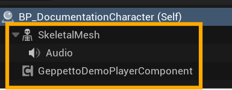 

>If you want to have audio spatialization, check the “Allow Spatialization” box and set a sound attenuation in the Audio Component (you can create a new one if needed) :

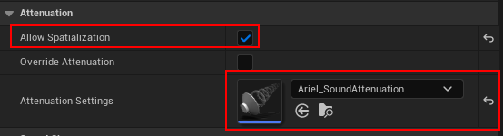
 
 

3. Click on the **Skeletal Mesh Component** and assign the previously imported Mike Alger to it.

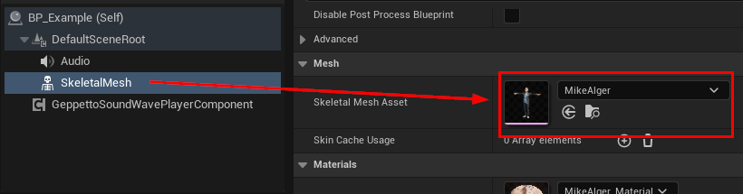

3. Click on the **Geppetto Component** and assign the corresponding Data Table for phonemes, emotions and micro expressions (use your own Data tables or use the predefined ones, like `DEMO_PhonemeTable`)

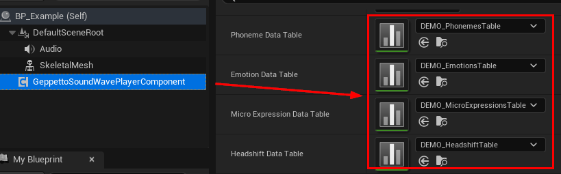

4. Add a new variable of type SoundWave to your Blueprint and set **SentenceExample_MaleVoice_1** as default value.

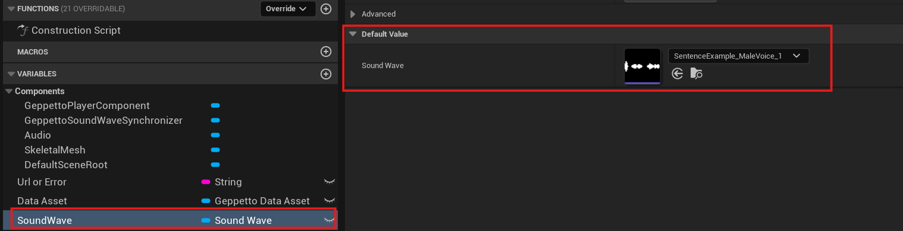 

> [!IMPORTANT]  
> Make sure to set the `Loading Behaviour Override` parameter to `Force Inline` to enable runtime lip-sync in a packaged project.    
**This setting is required for Unreal Engine version 5.2 and above.**
> 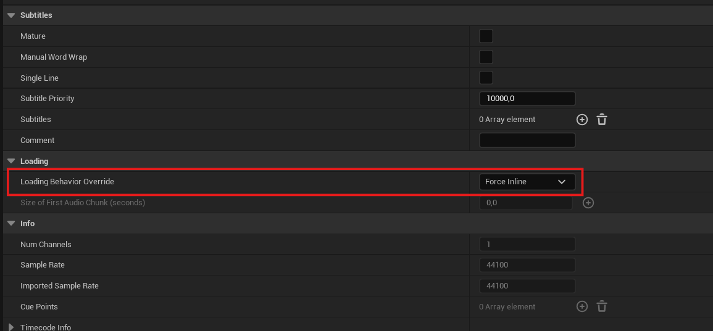 

> Note that you could also generate the audio at runtime and pass it into your SoundWave variable to use it in the runtime lip-sync.    
For more details, please check this [part](./Features.md#32-runtime-phonemes-generation-and-animation-blueprint).

5. Into your Event Graph, call the node `Generate Phonemes (using SoundWave)` and place it after your BeginPlay or any nodes you want in order to call the function.     
Here, we will call the `Space Bar` which act as an event called the input **Space** is pressed.

6. Change the following parameters :

    - `Sound Wave` : Set your **SoundWave** variable
    - `Quality` : Set **High**
    - `Close Mouth at End` : Set it to **true**
    - `Auto Emotion` : Set it to **true**
    - `Remove Noise` : Set it to **false**
    - `On Response` : Create a new custom event from this pin. We will call it `OnPhonemesGenerated`.

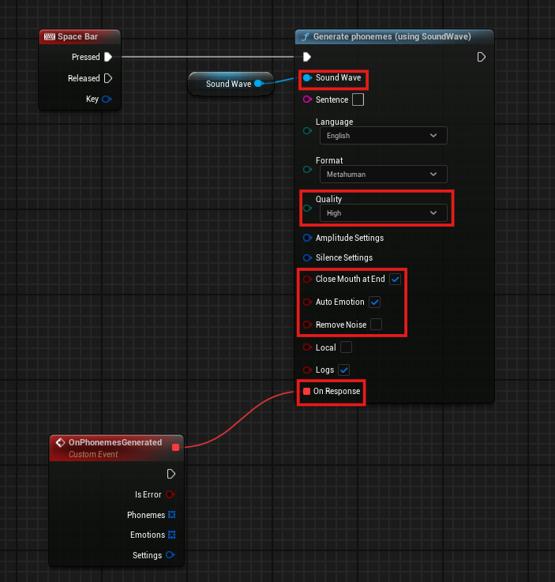

> [!NOTE]
> For a better result with Mike Alger Skeletal Mesh, we recommand to use **Amplitude Settings** between 50 and 100,
> instead of the default values (30-70).  

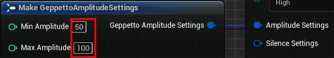

7. On the `OnPhonemesGenerated` custom event, call the function `PlayfromArrays` from `GeppettoSoundWavePlayerComponent`.

8. Bind the SoundWave parameter to your SoundWave variable. Bind the Phonemes and Emotions parameters to those in `OnPhonemesGenerated`.

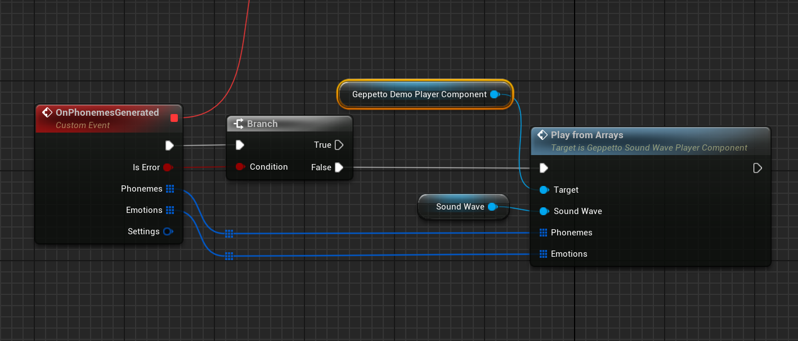 

> In our example we added a Branch node to ensure the validity of our generated phonemes and emotions.

**Well done ! You learned how to generate and play a runtime lip-sync animation !**    

 

<strong>If you use our Ariel plugin to generate the audio files at runtime, please see this example.</strong>

| Field                | Description                                                                                                                                                                                                                                  |
|----------------------|----------------------------------------------------------------------------------------------------------------------------------------------------------------------------------------------------------------------------------------------|
| **URL**              | The audio URL of the speech, in wav format.                                                                                                                                                                                                 |
| **Sound Wave**       | The audio SoundWave. It can be a SoundWave procedural.   ⚠️ **WARNING**: If the SoundWave is an asset, double click on it from the Content Drawer to open it and set the Loading Behavior to **Force Inline** !!!                    |
| **File Bytes**       | The audio wav file bytes data. It must have the wave header bytes as well.   If you only have the PCM bytes, please use **Generate phonemes (using PCM bytes)** instead.                                                                |
| **Filename**         | The name of the file that will be sent through the form POST request.                                                                                                                                                                       |
| **File Content Type**| The MIME content-type of the audio file. [More information here](https://developer.mozilla.org/en-US/docs/Web/HTTP/Guides/MIME_types/Common_types).                                                                                                                 |
| **Sentence**         | The sentence(s) spoken in the audio file, including the emotion tags.                                                                                                      |
| **Format**           | Select the phoneme format returned by the API.  ⚠️ Use **Metahuman** format unless you have a custom Data Table. Even if you don’t use Metahuman characters. See section [**4.2 - Geppetto Phoneme Data Table**]((./API.md#42-geppetto-phoneme-data-table)) for details.             |
| **Amplitude**        | Choose the amplitude range for the animation.  Higher values = more mouth articulation; Lower values = whisper effect.                                                                                                                   |
| **Silences Detection**| Parameters depending on your recording setup.  Use tools like **Audacity** to determine:  - **Threshold**: max dB recorded when you're silent.  - **Time**: min duration (ms) to count as a silence between phonemes.             |
| **Logs**             | Toggle whether Geppetto logs will be printed to console and/or screen (Debug only).                                                                                                                                                        |
| **Event Binding**    | From the **“On Response”** pin, drag to your Event Graph and select **Add Custom Event** or **Create Event**. You can name the event freely.                                                                                                 

Drag the mouse from the “On Response” pin and drop it on your Event Graph. You can then select Add Custom Event or Create Event actions, and name the event as you want:
 
 
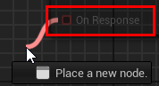
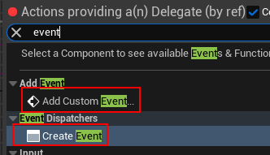
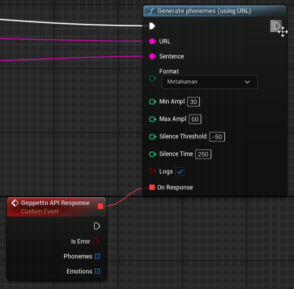
|

 

## 2.6 Play lip-sync on a character

As we talked about before there is two assets that stores generated phonemes : [Geppetto DataAsset](./API.md#48-data-assets) and [Geppetto Sequence](./API.md#49-geppetto-sequence).    
Here is an example on how to use both types to play a lipsync animation on a character.

| Step                        | Geppetto Data Asset                                                                                                                                                                                                                                             | Geppetto Sequence                                                                                                                                          |
|-----------------------------|------------------------------------------------------------------------------------------------------------------------------------------------------------------------------------------------------------------------------------------------------------------|------------------------------------------------------------------------------------------------------------------------------------------------------------|
| **1. Create Blueprint**     | Create a Blueprint class or use an existing one.                                                                                                                                                                                                                | Same logic here, use any Blueprint class or create a new one.                                                                                              |
| **2. Add Components**       | - Skeletal Mesh Component    - Audio Component    - `Geppetto SoundWave Player Component` *(or any child component)*                       | - Skeletal Mesh Component    - Audio Component    - `Geppetto SoundWave Player Component` *(or any child component)*                                    |
| **3. Create Variables**     | Create a variable of type `Geppetto DataAsset` and assign the previously generated DataAsset as its default value.     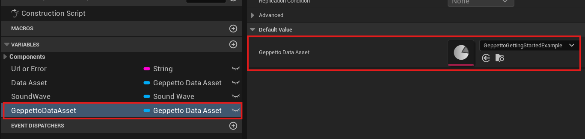                                                                                                  | Create a variable of type `Geppetto Sequence` and assign the previously generated Sequence as its default value.        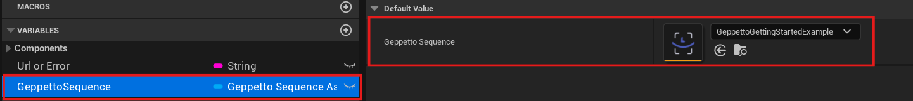                                    |                                            |
| **4. Play Animation**       | Use `Play from Data Asset` node to play phonemes from a DataAsset.       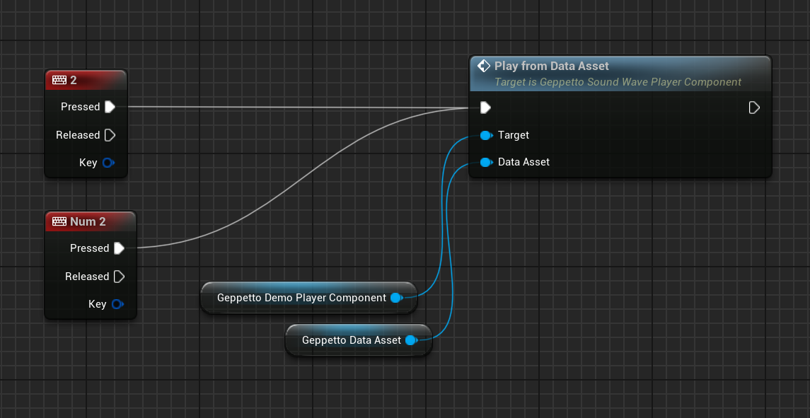 | Use `Play from Sequence` node with a reference to the `Geppetto Sequence` asset.       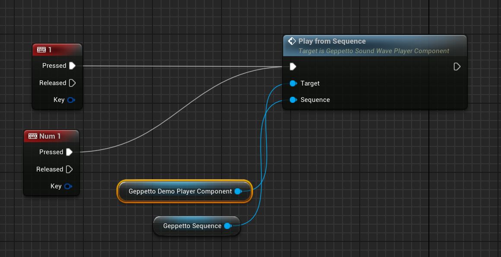                           |

                
> The `Geppetto Demo Player Component` can be subclassed to override default behavior. This is especially useful for custom characters or animation systems that require tailored playback logic or integration with other systems like emotion blending or gameplay triggers.   
Please read the section concerning the [Geppetto Sound Wave Player Component](./API.md#41-geppetto-sound-wave-player-component) for more information.*

That is all about how to play a pre-generated lip-sync.   
You now have all the essentials to create you own animation and play it on any character.   
If you have any question, please feel free to contact us by mail or on Discord.

## 2.7 Export lipsync as an animation

With Geppetto, you can export a lipsync animation as an Animation Asset or as an FBX file, compatible with any external animation software.   
Here is a step by step tutorial to export your lipsync :

1. Generate Geppetto Sequence as explained [above](#24-generate-phonemes-and-emotions-in-the-editor).
2. Open your new Geppetto Sequence and add a `Skeletal Mesh Asset` to preview, a `PhonemeDataTable` and an `EmotionDataTable`.

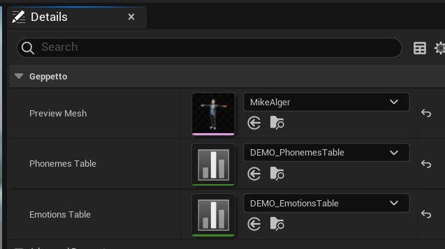

> Be sure that these settings are valid as you will not be able to export your lipsync as an animation otherwise.

3. Right click on your new `GeppettoSequence`, then click on *Export as an AnimSequence*.

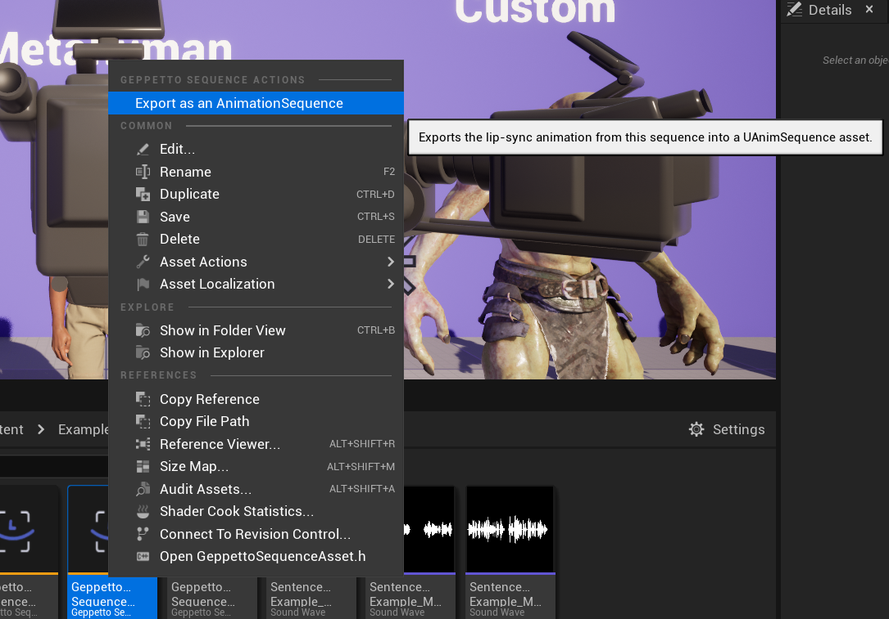

> Depending on your Skeletal Mesh Asset, the exportation might take some time (around 30s most of the time).

4. You lipsync animation was successfully converted into an Animation asset.    
You can now use your lipsync as is or export it as a FBX.

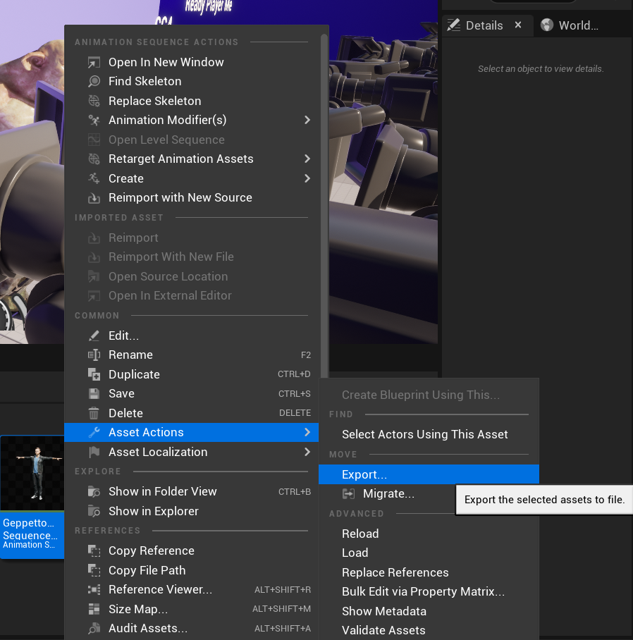

## 2.8 Play an emotion on a character

You will need to use a [Geppetto Sound Wave Player Component](./API.md#41-geppetto-sound-wave-player-component).

The [Geppetto Sound Wave Player Component](./API.md#41-geppetto-sound-wave-player-component) allows you to control character facial animations in real time. You can change emotions using the `Change Emotion` node, specifying the emotion name, intensity (0–100), and transition time.     
 **Emotions must be defined in the Emotion Data Table.**

 >Emotions can be changed when a sentence is pronounced by using tags. Please read section [4.12 - Emotion Tag System](./API.md#412-emotion-tag-system) for more information on how to use tags. 

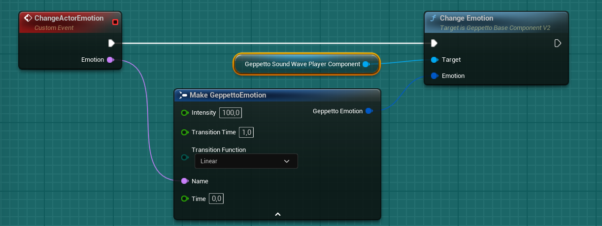

 >Detailled informations about the `GeppettoEmotion` struct available [here](./API.md#4112-geppetto-emotion)

## 2.9 Play a micro expression on a character

Micro-expressions, such as blinks or subtle twitches, can be triggered using either `Play Micro Expression` for single animations or `Start Micro Expression Loop` to repeat them at random intervals.    
**Each expression must exist in the Micro Expressions Data Table.**

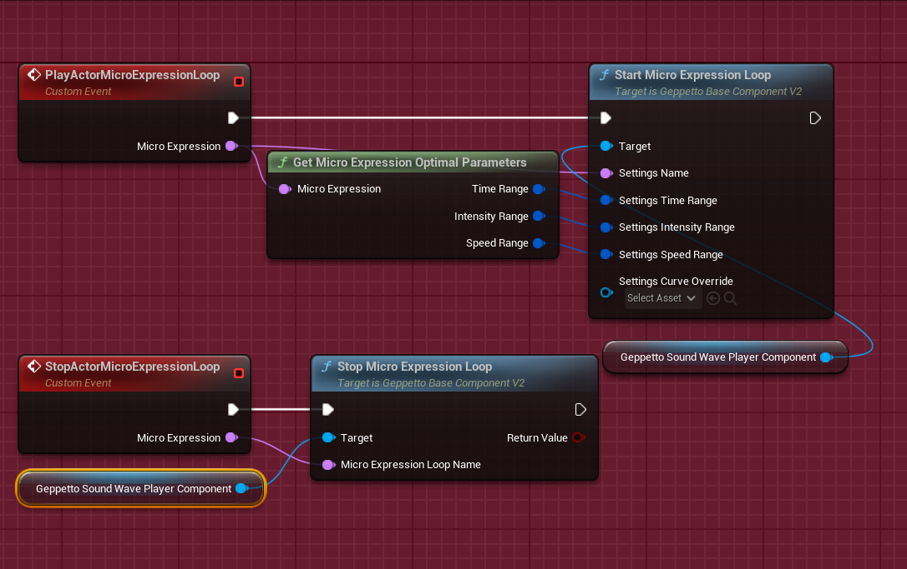

> You are free to customize timing, intensity, and playback speed for natural, lifelike results.    
For more control, stop any loop with `Stop Micro Expression Loop`.

 

<strong>For detailled explanations about each functions parameters, please expand this.</strong>

 
- `Play Micro Expression`

| Field    | Description                                                                                                                                                                                                                                                                                   |
|----------|-----------------------------------------------------------------------------------------------------------------------------------------------------------------------------------------------------------------------------------------------------------------------------------------------|
| Name     | The micro-expression name. The micro-expression must have been defined in the Micro Expressions Data Table.                                                                                                                                             |
| Intensity| The micro-expression intensity. Range 0 - 100. For dynamic micro-expressions (i.e: EyeDart), we recommend always setting the intensity to 100.                                                                                                          |
| Speed    | The micro-expression animation playback speed. Must be greater than 0. The speed is related to the micro-expression curve duration defined in the Data Table. See Micro Expressions Data Table “Curve” parameter for more details.                     |

 

- `Start Micro Expression Loop`

| Field            | Description                                                                                                                                                                                                                                                                                                                                                                                                     |
|------------------|-----------------------------------------------------------------------------------------------------------------------------------------------------------------------------------------------------------------------------------------------------------------------------------------------------------------------------------------------------------------------------------------------------------------|
| Name             | The micro-expression name. The micro-expression must have been defined in the Micro Expressions Data Table.                                                                                                                                                                                                                                                              |
| Time range       | The waiting time ranges between the execution of two micro-expressions. The waiting time will be randomly selected after each time the micro-expression is played, between the specified min and max value (set the min and max fields to the same value in order to always have the exact same waiting time).                                                           |
| Intensity range  | The randomly selected intensity that will be used for the execution of each micro-expression. The value will be randomly selected after each time the micro-expression is played, between min and max value (set the min and max fields to the same value in order to always have the exact same intensity).                                                              |
| Speed range      | The randomly selected speed that will be used for the execution of each micro-expression. The value will be randomly selected after each time the micro-expression is played, between min and max value (set the min and max fields to the same value in order to always have the exact same playback speed).                                                            |

 

- `Stop Micro Expression Loop`

| Field | Description                     |
|-------|---------------------------------|
| Name  | The micro-expression name.      |

|

 