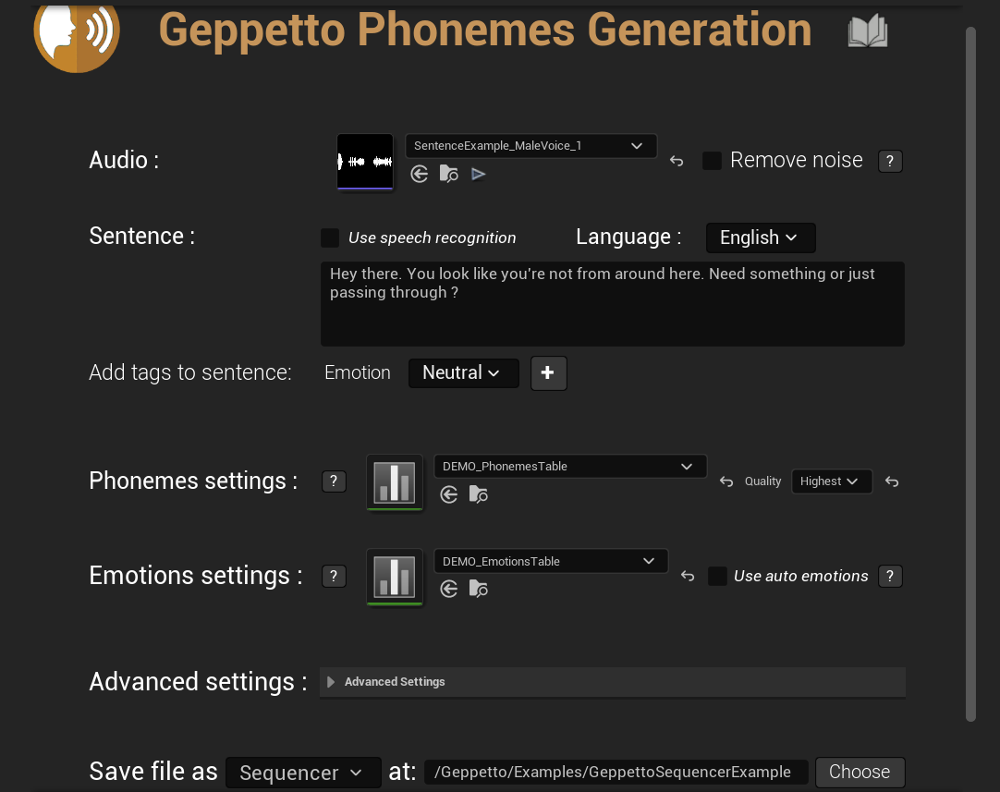

# Geppetto UE 2.0.0 – Getting Started

**[← Table of contents](../README.md#table-of-contents)**

---

### On this page

- **[What is Geppetto ?](#21-what-is-geppetto)**
- **[Character setup](#22-character-setup)**
- **[Geppetto Data Tables](#23-geppetto-data-tables)**
- **[Generate phonemes and emotions in the editor](#24-generate-phonemes-and-emotions-in-the-editor)**
- **[Generate phonemes and emotions on runtime](#245-generate-phonemes-and-emotions-on-runtime)**
- **[Play lip-sync on a character](#25-play-lip-sync-on-a-character)**
- **[Play an emotion or a micro expression on a character](#255-play-an-emotion-or-a-micro-expression-on-a-character)**

---

## 2.1 What is Geppetto ?

**Geppetto is a facial animation and lip-sync plugin for Unreal Engine, designed to automatically generate lip-sync animations from audio or text files.**

**The latest version (2.0.1) introduces the Geppetto Sequence Editor, enabling advanced customization of lip-sync animations with precise timing and amplitude adjustments for morph targets. This version also includes new features like automatic emotion detection and improved voice recognition.**

## 2.2 Character setup

For this example, we will use this  [rigged character](https://sketchfab.com/3d-models/rigged-t-pose-human-male-w-50-face-blendshapes-cc7e4596bcd145208a6992c757854c07) made by [Mike Alger](https://mikealger.com/).    
This character possess 50 face blendshapes that we will use to create a lip-sync animation.

Here are the steps to set up the character in Unreal :

1. Download the character in FBX format from sketchfab with the link given above.
2. Unzip the character archive wherever you want.
3. Create a new Unreal project or open an existing one.
4. Drag and drop the fbx file of the character in the wanted folder. Here we will place it inside the "Example" folder.
5. **Do not forget to import the MorphTarget by checking the appropriate boxes and click on "Import".**

6. To ensure the character was correctly imported, open the skeletal mesh asset and go into the "MorphTargets" tab. Here you should have the 50 blendshapes.

**Well done ! Your character is now setup and can be used with Geppetto !**    
Check the next steps to learn how to bind Geppetto to your character and play a lip-sync animation.

## 2.3 Geppetto Data Tables

### 2.3.1 Phoneme Data Table

**The Geppetto Phoneme Data Table in Unreal Engine is designed to drive facial animation through phoneme-based lip sync.**    
Each row represents a phoneme (like A, E, U, etc.) and contains values for Morph Targets, which are specific facial poses. This allows for detailed, expressive character dialogue.

You can either create a new Phoneme DataTable in Unreal or import an existing one from a csv or json file.    
Predefined tables are available under Plugins > Geppetto Content > Phonemes, and you’re free to duplicate or customize them.    
For more information, please see [4.5 Geppetto Phoneme Data Table](./API.md#45-geppetto-phoneme-data-table).

### 2.3.2 Emotion Data Table

The Geppetto Emotion Data Table is used to animate facial expressions tied to emotions. Each row corresponds to an emotion (like Happy, Sad, Angry, etc.) and specifies Morph Target values that sculpt the facial mesh into an expressive pose. This is ideal for customizing character emotion systems in Unreal Engine.

You can either create a new Emotion DataTable in Unreal or import an existing one from a csv or json file. 
Predefined tables are available under Plugins > Geppetto Content > Emotions, and you’re free to duplicate or customize them.
For more details, see [4.6 Geppetto Emotion Data Table](./API.md#46-geppetto-emotion-data-table).

### 2.3.3 Micro-expression Data Table

The Geppetto Micro Expressions Data Table defines subtle facial movements like blinks or eyebrow twitches. Each row maps a micro expression to Morph Target values, either fixed or dynamic.     
Dynamic targets introduce random variation to keep animations lively and natural.

You can either create a new Micro Expression DataTable in Unreal or import an existing one from a csv or json file.   
For more information, see [4.7 Geppetto Micro Expressions Data Table](./API.md#47-geppetto-micro-expressions-data-table).

## 2.4 Generate phonemes and emotions in the editor

To pre-generate phonemes, you can use the Editor Utility Widget included in the plugin.     
You can open the Window by clicking on the Geppetto icon button or in the menu **Help > Geppetto**:

The interface will open. It contains several parameters to customize your phonemes and emotions generation.     
To find a complete list of all parameters and what they are doing, please read the part [3.1.1 Pre-Generate Phonemes as a Geppetto Data Asset](./Features.md#31-pre-generated-data-asset-editor).

Here a the following steps to generate a basic lip-sync animation :

1. Pass your audio file in the `Audio` parameter.    
For this example, we will use **SentenceExample_MaleVoice_1** which is available in the plugin folder if you want to use it.

2. We will check the checkbox `Use speech recognition` to tell Geppetto to only use the audio file to create the lipsync animation.

3. For `Phonemes settings` and `Emotions settings`, please use the **DEMO_PhonemesTable** and **DEMO_EmotionsTable**.   
These two tables are made for the rigged character we chose previously.
They will convert the generated phonemes and emotions into blendshapes that can animate our character.

4. Enable `Use auto emotions` checkbox to allow Geppetto to automatically detect emotions in your audio file.

5. Then, choose in which asset store your generated phonemes with the `Save file as` parameter.    
There is two types of asset : [Geppetto DataAsset](./API.md#410-data-assets) and [Geppetto Sequence](./API.md#411-geppetto-sequence). Each of them has different use case.   
[Below](#26-play-lip-sync-on-a-character), you will find an example on how to use both assets.

6. Finally, hit the `Generate Phonemes` button to generate your .uasset file.     
**This may take a while according to the audio duration and other parameters.**

## 2.5 Generate phonemes and emotions on runtime

## 2.6 Play lip-sync on a character

As we talked about before there is two assets that stores generated phonemes : [Geppetto DataAsset](./API.md#410-data-assets) and [Geppetto Sequence](./API.md#411-geppetto-sequence).    
Here is an example on how to use both types to play a lipsync animation on a character.

| Step                        | Geppetto Data Asset                                                                                                                                                                                                                                             | Geppetto Sequence                                                                                                                                          |
|-----------------------------|------------------------------------------------------------------------------------------------------------------------------------------------------------------------------------------------------------------------------------------------------------------|------------------------------------------------------------------------------------------------------------------------------------------------------------|
| **1. Create Blueprint**     | Create a Blueprint class or use an existing one.                                                                                                                                                                                                                | Same logic here, use any Blueprint class or create a new one.                                                                                              |
| **2. Add Components**       | - Skeletal Mesh Component    - Audio Component    - `Geppetto SoundWave Player`    - `Geppetto Player Component` (or custom Metahuman version)                       | - Skeletal Mesh Component    - `Geppetto Sequencer Component`                                    |
| **3. Initialize on BeginPlay** | - Call `Geppetto SoundWave Player Initialize`    - Call `Geppetto Player Component Initialize`                                                                           | - Call `Geppetto Sequencer Component Initialize`                                                    |
| **4. Play Animation**       | Use `Play Data Asset` node to play phonemes in sync with audio or the `Play` node for advanced options.            | Use `Play` node with a reference to the `Geppetto Sequence` asset.                                  |
                  
                
> Both the `Geppetto Player Component` and `Geppetto Sequencer Component` can be subclassed to override default behavior. This is especially useful for custom characters or animation systems that require tailored playback logic or integration with other systems like emotion blending or gameplay triggers.

That is all about how to play a pre-generated lip-sync.   
You now have all the essentials to create you own animation and play it on any character.   
If you have any question, please feel free to contact us by mail or on Discord.

## 2.7 Play an emotion or a micro expression on a character