# Geppetto Metahuman Integration

**[← Table of contents](../README.md#table-of-contents)**

---

### On this page

- **[Old Engines (UE5.0 - UE5.5)](#TODO)**
- **[New Engines (UE5.6+)](#TODO)**

---

By default, the Geppetto plugin is **NOT** compatible with Metahuman. However, the process to implement Geppetto on a Metahuman is pretty straightforward. Follow these steps to use Geppetto with your Metahumans!

## Use Geppetto with Metahuman from UE5.0 to UE5.5

1. [Create or open a new Unreal Project](https://dev.epicgames.com/documentation/en-us/unreal-engine/creating-a-new-project-in-unreal-engine)

2. [Add a Metahuman to your project](https://dev.epicgames.com/documentation/en-us/metahuman/metahumans-in-quixel-bridge?application_version=5.0-5.5)

> [!CAUTION]
> If you have downloaded a Metahuman and then have upgraded or downgraded your Unreal project, the Geppetto plugin will likely not work with your Metahuman. In this case, you **must** re-download the Metahuman through Quixel Bridge with the correct Unreal version.

3. If prompted, turn on all missing plugins and restart the Engine

4. Create a new Blueprint class and choose the [Geppetto SoundWave Player Component](API.md#42-geppetto-soundwave-player-component) as parent class. You can name it `Geppetto Metahuman Component`

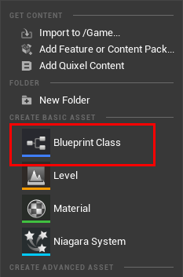
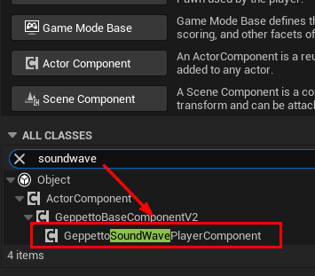
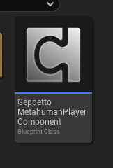

5. Open the Blueprint component and create a new variable of type `Face Anim BP`

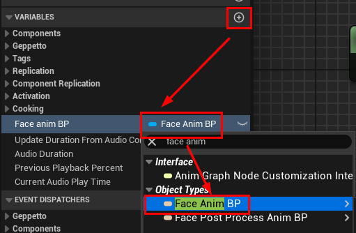

6. Override the Function [Set Morph Target](API.md#431-set-morph-target) as shown in the image below (you can copy the Blueprint nodes [here](https://blueprintue.com/blueprint/gdd346d3/))

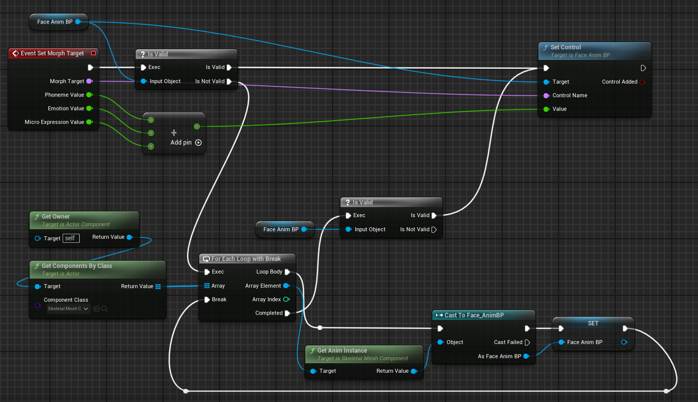

You can now use Geppetto with Metahumans! Follow [Play editor lip-sync asset on a character](GettingStarted.md#25-play-editor-lip-sync-assets-on-a-character) using your Metahuman Blueprint (i.e.: `BP_Ada`) and use the newly created component instead of the `Geppetto SoundWave Player Component`.

> [!TIP]
> To preview Geppetto Sequence with Metahuman in the editor, choose the Metahuman component, the Face Skeletal Mesh and the `Face_animBP` in *Advanced Settings*
>
> 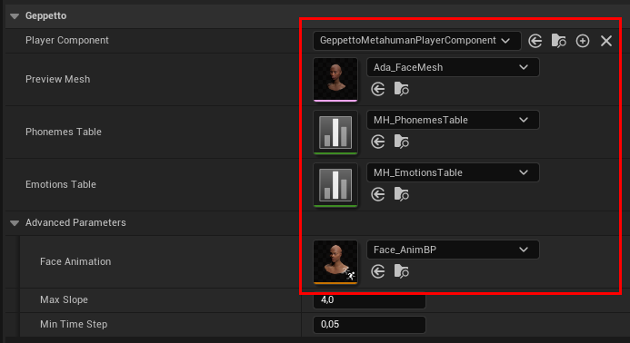

 

## Use Geppetto with Metahuman from UE5.6+

Epic did massive changes on how to integrate and use Metahuman with the release of version 5.6. This also influence the way the Geppetto plugin works with Metahumans.

> [!CAUTION]
> The Metahuman rig and curve controls have changed a lot with the latest version. If you use a recent rig, you may have to recreate the [Phoneme](API.md#44-geppetto-phoneme-data-table), [Emotion](API.md#45-geppetto-emotion-data-table) and [Micro expressions](API.md#46-geppetto-micro-expressions-data-table) Data Table. 

1. [Download and install the Metahuman Creator Plugin](https://dev.epicgames.com/documentation/en-us/metahuman/getting-started-with-metahuman-creator)

2. [Create a new Metahuman character](https://dev.epicgames.com/documentation/en-us/metahuman/creating-a-character?application_version=5.6)

3. Once you are done editing your character, create the rig, download the textures and [assemble](https://dev.epicgames.com/documentation/en-us/metahuman/assembly?application_version=5.6) the Metahuman (use the assembly `UE Cine` *(recommanded)* or `UE Optimized`)

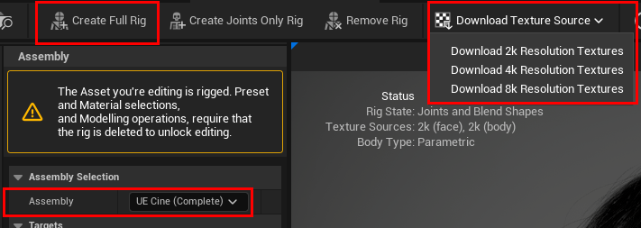

4. Create a new Animation Blueprint and choose `Face_Archetype_Skeleton` as Skeleton. You can name it `Face_AnimBP`

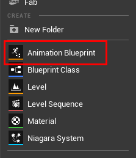
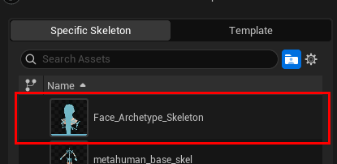
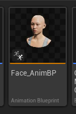

5. Open the Anim Blueprint and create a new variable of type Map of `Fname` -> `float`

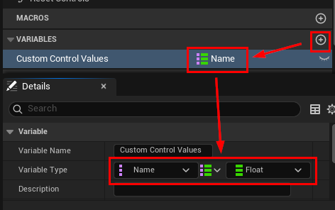

6. Open the **Animation Graph** *(≠EventGraph)* and place the node `Copy Pose From Mesh` and `Modify Curve`. Click on the node `Modify Curve` and expose the Curve Map as a Pin. Then, link the nodes as the image below

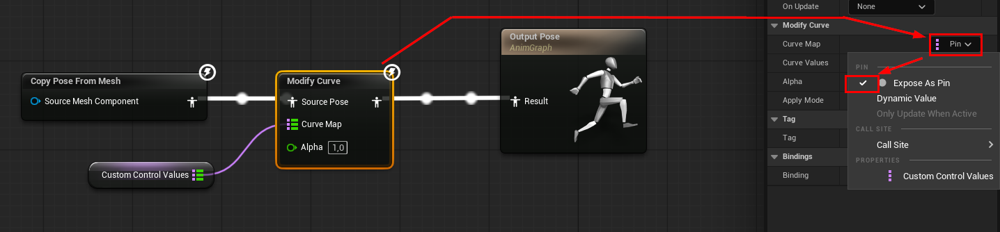

7. Create a new function named `Set Control` as shown in the image below (you can copy the Blueprint nodes [here](https://blueprintue.com/blueprint/xecas-hf/))

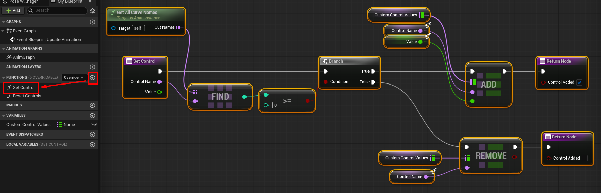

8. Open the Blueprint of the Metahuman you have assembled in step \[3\] (i.e.: `BP_MyMetahuman`) and change the face Skeletal Mesh Component Anim Instance to the one you have created in step \[4\]

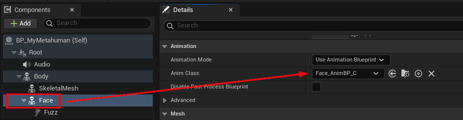

8. Create a new Blueprint class and choose the [Geppetto SoundWave Player Component](API.md#42-geppetto-soundwave-player-component) as parent class. You can name it `Geppetto Metahuman Component`

9. Open the Blueprint component and create a new variable of type `Face Anim BP` *(or whatever name you have set in step \[4\])*

10. Override the Function [Set Morph Target](API.md#431-set-morph-target) as shown in the image below (you can copy the Blueprint nodes [here](https://blueprintue.com/blueprint/gdd346d3/))

> [!WARNING]
> If you have Copy-pasted the nodes from [BlueprintUE](https://blueprintue.com/blueprint/gdd346d3/), you may need to redo the cast node. You should cast to the Anim Blueprint created in step \[4\].
>
> 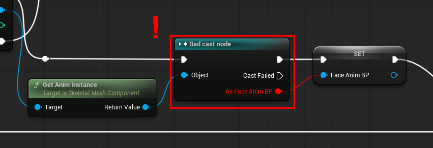

You can now use Geppetto with Metahumans! Follow [Play editor lip-sync asset on a character](GettingStarted.md#25-play-editor-lip-sync-assets-on-a-character) using your Metahuman Blueprint (i.e.: `BP_Ada`) and use the newly created component instead of the `Geppetto SoundWave Player Component`.