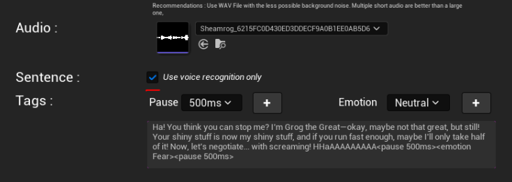
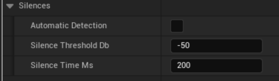
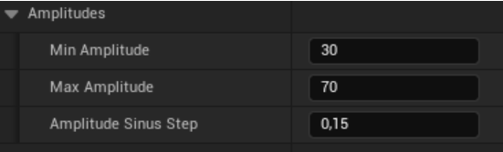

# Geppetto UE 2.0.0 – Others

This chapter documents all the components, nodes, structures, enums, and tools provided by the Geppetto plugin.

**[← Table of contents](../README.md#table-of-contents)**

---

### On this page

- **[Resources & General explanations](#5-resources--general-explanations)**
  - **[How does the Geppetto model work ?](#51-how-does-the-geppetto-model-work)**
  - **[Amplitude Calculation](#52-amplitude-calculation)**
- **[Adding Emotion Tags](#6-adding-emotion-tags)**
- **[Output](#7-output)**

---

## 5. Resources & General explanations

---

### 5.1. How does the Geppetto model work?

---

#### Text Acquisition

The text can either be provided directly or generated through Speech-to-Text, which also captures onomatopoeia. For the best results, it is recommended to provide a text that explicitly includes onomatopoeia. Emotion tags associated with the text are also extracted.

---

#### Silence Detection

Silences in the audio serve as markers to define the start and end of the text. The automatic detection of silence depends on the type of audio:

- For synthetic voices, -50 dB silence threshold and 200 ms silence time are recommended.  
- For noisier recordings, -40 dB and 300 ms may be more suitable.

These parameters should be adjusted based on the characteristics of the audio recording.

---

#### Text-to-Phoneme Conversion

The text is converted into phonemes using a machine learning model. This model is language-sensitive, and currently, Geppetto supports English, French, German, Italian, and Spanish.  
If additional language support is needed, please contact us.

---

#### Alignment with Audio: Two Model Approaches

There are two types of models available:

##### Model 0 (Fast)

This is a machine learning model that aligns silences in the audio with punctuation in the text. Using linear interpolation between the segmented text and audio, it predicts the most probable phonemes for each sequence and assigns a corresponding timestamp based on its position in the text. 

- **Advantage**: This method is fast and requires minimal computing power, making it ideal for real-time applications.  
- **Limitation**: Since it relies on a simple mapping strategy, it may not perfectly capture variations in speech rhythm or nuanced pronunciations.

---

##### Model 1 (Accurate)

This model employs deep learning for a more precise alignment:

- The input audio is converted into a spectrogram.  
- Phonemes from Step 3 are aligned with the silences detected in Step 2.  
- The energy patterns of the spectrogram are matched with the corresponding phonemes.

This approach is highly effective when the audio and text are perfectly synchronized. However, if there are discrepancies, the model might skip or replace onomatopoeia.

- **Advantage**: This model provides high accuracy, making it ideal for cases requiring precise phoneme timing.  
- **Limitation**: It is computationally intensive, requiring more processing power than Model 0.

For both models, each phoneme is assigned an amplitude derived from the audio signal.

---

> Both models are available via API, but local deployment is possible for real-time applications. Please contact us for more details.

## 5.2 Amplitude Calculation

The minimum amplitude is set as the lower bound between 0 and 100, based on the detected phoneme amplitude. This ensures that the phoneme remains visible during execution, even when its natural amplitude is very low.

Similarly, the maximum amplitude acts as an upper limit to prevent excessive deformation of blendshapes, maintaining more natural transitions.

The amplitude sinus step defines the incremental step between two consecutive phonemes' amplitudes, preventing abrupt jumps. This value ranges between 0 and 1:

1. The closer it is to 1, the more significant the amplitude variations between phonemes can be.

2. Lower values ensure smoother transitions, reducing sudden amplitude shifts.

## 6. Adding Emotion Tags

Emotion tags are integrated into the audio at the appropriate timestamps based on their placement within the sentence, ensuring that the speaker’s tone and emotional expression are accurately reflected.

You can also enable the automatic emotion detection parameter. Using a deep learning model, it predicts the most appropriate emotion based on both the text and the audio.

Disable this option if you prefer maximum control and optimized performance speed.

---

## 7. Output

The final output is a structured list of (phoneme, timestamp, amplitude). This list is returned via API, but the computation can also be performed locally for real-time deployment in player environments. Please contact us for this option.

---

## Geppetto Blueprint

Demo blueprint:  
👉 [https://blueprintue.com/blueprint/oczerzxz/](https://blueprintue.com/blueprint/oczerzxz/)

---

## Known bugs

**The plugin shows control-related errors**

If some controls used (named like `CTRL_expressions_…`) are missing in the MetaHuman and you have error messages when you try to initialize the Geppetto Player Component, it is probably due to the MetaHuman version.

✅ Make sure that you have downloaded the MetaHuman with the same Unreal Engine version that you are using for your project.

- MetaHumans downloaded with **UE5.0 and 5.1** are compatible with **UE5.0, 5.1 and 5.2**
- MetaHumans downloaded with **UE5.2 and 5.3** are compatible with **UE5.2 and 5.3**

📺 If the error remains, please watch this tutorial video and ensure that you have done all the steps correctly.
