# Geppetto UE 2.0.0 – Demo

**[← Table of contents](../README.md#table-of-contents)**

---

### On this page

- **[How to Open the Demo Level](#21-how-to-open-the-demo-level)**
- **[Play with the Demo Level](#22-play-with-the-demo-level)**
- **[Understand the Demo Level](#23-understand-the-demo-level)**

---

The Geppetto plugin comes with a demo level and a skeletal mesh with morph targets, thanks to [Rigged T-Pose Human Male w 50 Face Blendshapes](https://sketchfab.com/3d-models/rigged-t-pose-human-male-w-50-face-blendshapes-cc7e4596bcd145208a6992c757854c07) by Mike Alger, licensed under [Creative Commons Attribution](https://creativecommons.org/licenses/by/4.0/).

## 2.1 How to Open the Demo Level

1. 🎮 Open or create a project with the Geppetto plugin installed.
2. 🧰 Open the **Content Drawer** (`Ctrl + Space`) and go to **Settings** (top-right corner).
3. ✅ Ensure the following options are enabled:
   - “Show Plugin Content”
   - “Show Engine Content”

4. 📂 Navigate to the appropriate folder:
   - **Marketplace install**: `All > Engine > Plugins > Geppetto Content > GeppettoExampleScene`
   - **Source install**: `All > Plugins > Geppetto Content > GeppettoExampleScene`

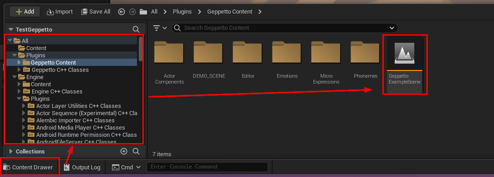

5. ▶️ Open the level and press **Play**.
6. 🕹️ Use number keys (`1` to `0` or numpad) to test the Geppetto Plugin.

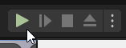

## 2.2 Play with the Demo Level

You can interact with the demo using keys at runtime:

| Key | Action                                                                 |
|-----|------------------------------------------------------------------------|
| 1   | Pre-generated Lip Sync with emotions (uses tags)                      |
| 2   | Pre-generated Lip Sync without emotions                               |
| 3   | Toggle Happy emotion                                                  |
| 4   | Toggle Neutral emotion                                                |
| 5   | Start blink loop                                                      |
| 6   | Stop blink loop                                                       |
| 7   | Start eyedart loop                                                    |
| 8   | Stop eyedart loop                                                     |
| 9   | Runtime Lip Sync from audio URL with emotions (uses tags)            |
| 0   | Runtime Lip Sync from SoundWave (must contain PCM audio)             |

## 2.3 Understand the Demo Level

Open `BP_GeppettoExampleActor > Event Graph` to start exploring how the
Geppetto plugin works.

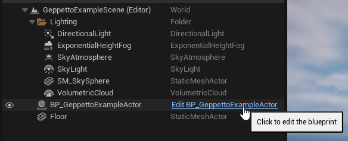

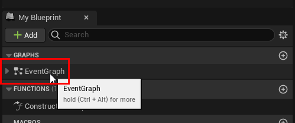

You’ll see a block for each key event and `BeginPlay`.

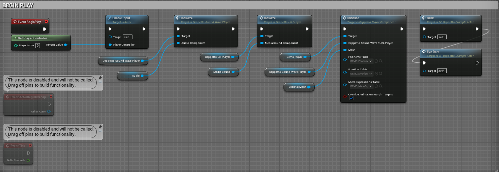

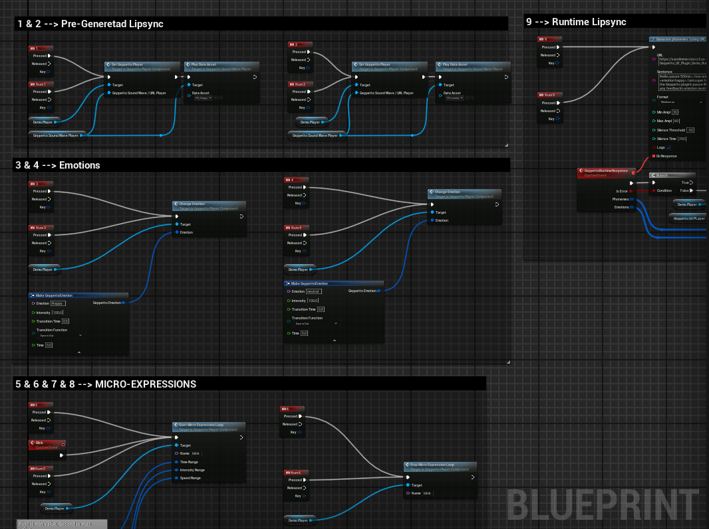

### 2.3.1 Components Required

Every actor using the plugin must have these 4 components:

- ✅ A Skeletal Mesh with Morph Targets
- 🔊 An Audio or MediaSound Component
- 🧠 A [Geppetto Player Component](./API.md#43-geppetto-player-component) (e.g., DemoPlayer)
- 📡 A [Geppetto SoundWave Player](./API.md#42-geppetto-soundwave-player)

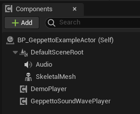

The Audio/MediaSound Component and the Geppetto SoundWave/URL Player used will depend if the plugin is used with pre-generated or runtime assets. You can use both methods on the same character.

### 2.3.2 Begin Play

In the BeginPlay Event, all Geppetto components are initialized. You can find more information about component initialization below:

- `Geppetto SoundWave Player Initialize`
- `Geppetto URL Player Initialize`
- `Geppetto Player Initialize`

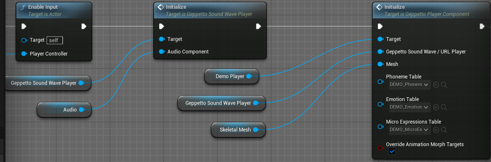

The Geppetto Player initialize node uses a Phoneme, Emotion and Micro Expression table as parameters to animate the character. You can create your own table in order to animate characters with custom Morph Targets. 

Please read section [4.5](./API.md#45-geppetto-phoneme-data-table), [4.6](./API.md#46-geppetto-emotion-data-table) and [4.7](./API.md#47-geppetto-micro-expressions-data-table) for more details.

### 2.3.3. Phonemes / Lipsync

The **keyboard 1 and 2** events are related to pre-generated phonemes.

- Please read section [3.1.1 - Pre-Generated Phonemes generation](./Features.md#311-pre-generate-phonemes-as-a-geppetto-data-asset) of the documentation for more information on how to pre-generate phonemes in a Geppetto Sequence (or a Data Asset) using the Geppetto Editor Interface.

- Please read section [3.1.3 - Play a Geppetto Sequence](./Features.md#313-play-a-geppetto-sequence) of the documentation for more information on how to play the Geppetto phonemes from a Geppetto Sequence

- Please read section [4.11 - Geppetto Sequence](./API.md#411-geppetto-sequence) of the documentation for more information about the Geppetto Sequence asset

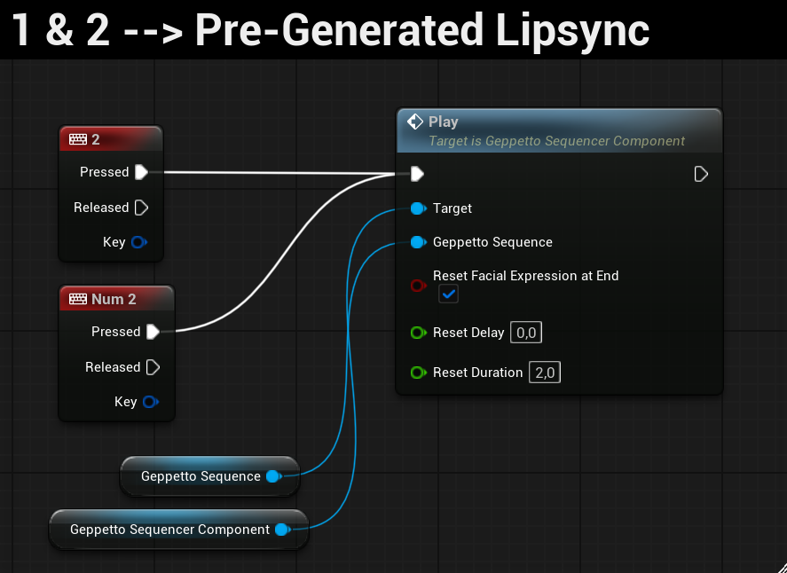

> Note that this is also possible to play the Geppetto phonemes from a Data Asset. For more information, please refer to the section [3.1.2 - Play a Geppetto Data Asset with SoundWave](./Features.md#312-play-a-geppetto-data-asset-with-soundwave).

The **keyboard 9 and 0 events** are related to runtime phonemes.

- Please read section [3.2 - Runtime Phoneme Generation](./Features.md#32-runtime-phonemes-generation-and-animation-blueprint) of the documentation for more information on how to generate and play runtime generated phonemes.
- Please read section [4.9.1 - Generate phonemes (using SoundWave)](./API.md#492-generate-phonemes-using-soundwave) for more
information on how to generate phoneme from a local audio file (SoundWave, PCM or file)

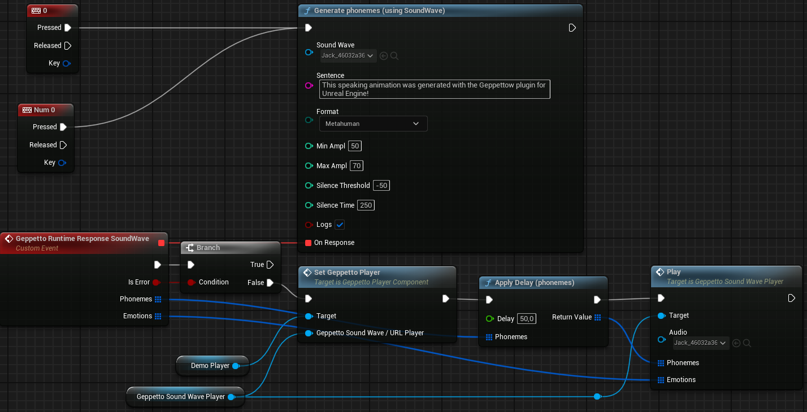

The plugin uses a [Geppetto Phoneme Data Table](./API.md#45-geppetto-phoneme-data-table) to know all Morph Targets values for each phoneme. If the skeletal mesh of your characters have different Morph Targets, it is required to create a new [Geppetto Phoneme Data Table](./API.md#45-geppetto-phoneme-data-table) with the Morph Targets used in your characters.     
**Please note that Data Tables for Metahuman are included in this plugin !**   
The Data Table used by the plugin is passed through the [Geppetto Player Component Initialize](./API.md#442-initialize) or [Set Phoneme Table](./API.md#445-set-phoneme-table) node. Please read section [4.5 - Geppetto Phoneme Data table](./API.md#45-geppetto-phoneme-data-table) of the documentation for more information about phoneme Data Table.

### 2.3.4. Emotions

The **keyboard 3 and 4 events** are related to emotions.

- Please read section [3.3 - Change Emotions](./Features.md#33-change-emotions) for more information on how to change emotions in Blueprints.
- Please read section [3.5 - Emotion Tag System](./Features.md#35-emotion-tag-system) for more information on how to change emotions with tags.
- Please read section [4.12.2 - Geppetto Emotion](./API.md#4122-geppetto-emotion) of the documentation for more information about the Geppetto emotion structure.
- Please read section [4.4.7 - Set Emotion Custom Curve](./API.md#448-set-emotion-custom-curve) of the documentation for more information about the emotion custom transition curves.

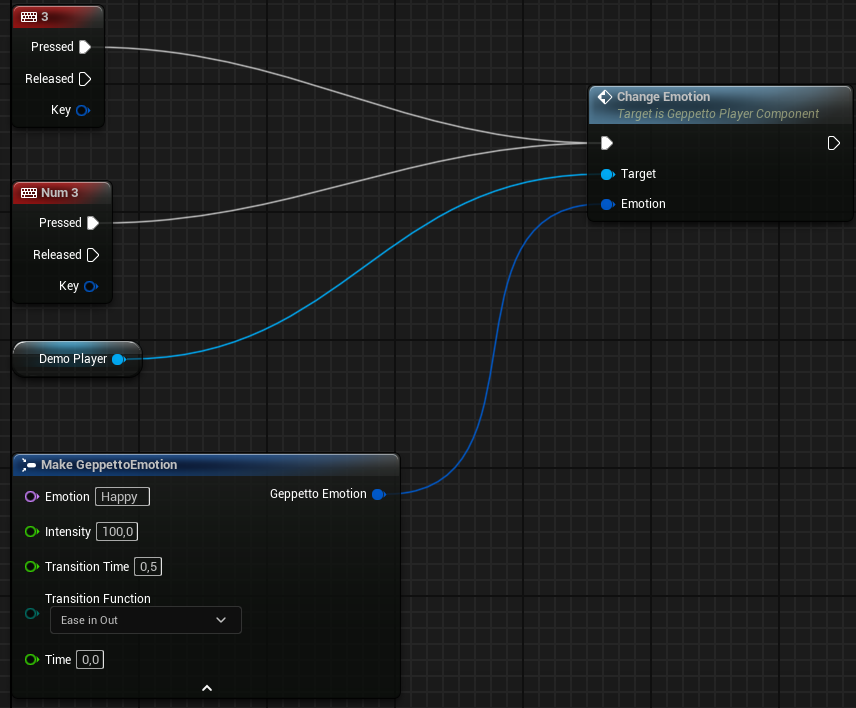

The same way as phonemes, emotions use a [Geppetto Emotion Data Table](./API.md#46-geppetto-emotion-data-table) to determine the Morph Target values for each emotion. Please read section [4.6 - Geppetto Emotion Data Table](./API.md#46-geppetto-emotion-data-table) of the documentation for more information.

### 2.3.5. Micro Expressions

The **keyboard 5, 6, 7 and 8 events** are related to micro expressions.

- Please read section [3.4 - Play or Loop Micro Expressions](./Features.md#34-play-or-loop-micro-expressions) of the documentation for more information on how to use micro expressions.
- Please read section [4.4.9 - Play Micro Expression](./API.md#4410-play-micro-expression) of the documentation for more information about the node.
- Please read section [4.4.11 - Start Micro Expression Loop](./API.md#4411-start-micro-expression-loop) and [Stop 4.4.12 - Stop Micro Expression Loop](./API.md#4412-stop-micro-expression-loop) of the documentation for more information about the nodes.

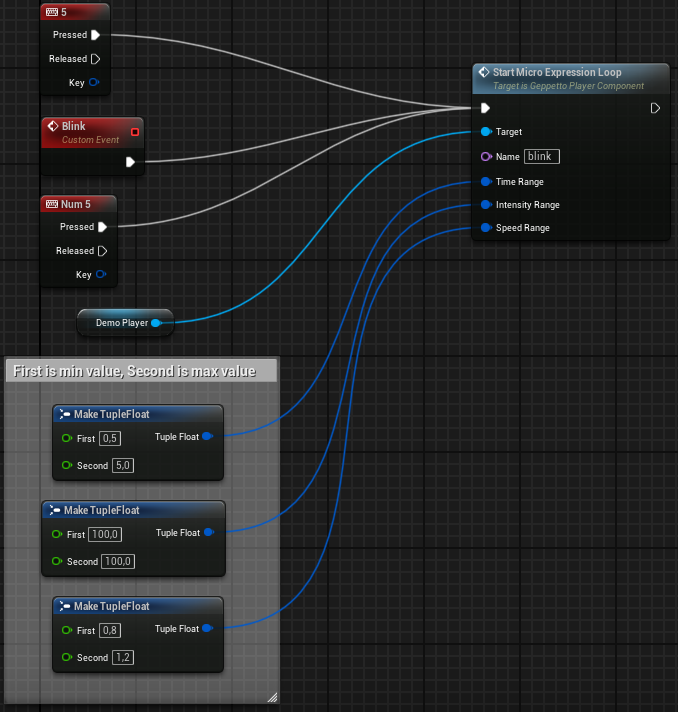

Like phonemes and emotions, micro expressions use a [Geppetto Micro Expressions Data Table](./API.md#47-geppetto-micro-expressions-data-table) to retrieve the Morph Targets values.   
This time, however, the values can be **static** (like phonemes or emotions Morph Targets values) or **dynamic** (the Morph Targets values will change each time the Micro Expression is played).    
Please read section [4.7 - Geppetto Micro Expressions Data Table](./API.md#47-geppetto-micro-expressions-data-table) of the documentation for more information.