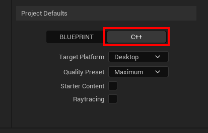
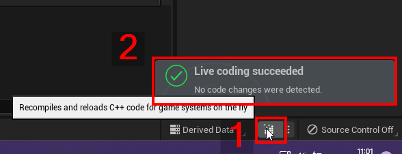
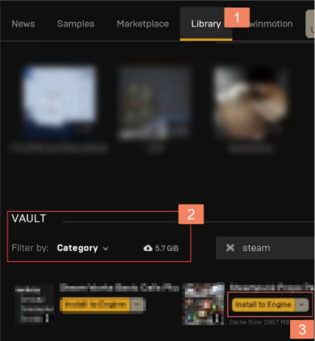
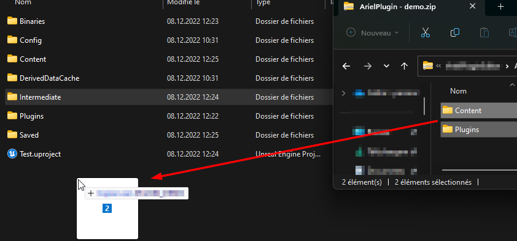
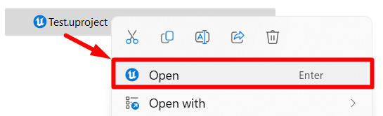
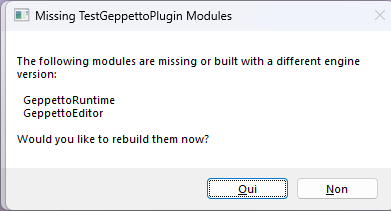
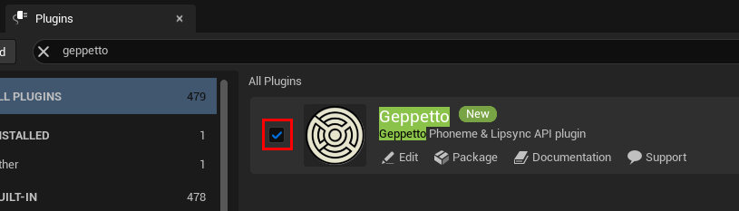

# Geppetto UE 2.0.0 – Setup

**[← Table of contents](../README.md#table-of-contents)**

---

### On this page

- **[Prerequisites](#11-prerequisites)**
- **[Metahuman](#12-metahuman)**
- **[Installation – Fab](#13-installation---fab)**
- **[Installation – Source Code](#14-installation---source-code)**

---

Welcome to the **Geppetto UE Plugin** for Unreal Engine. This document will show you how to use the plugin in Unreal Engine*.

> 📧 *Please note that this notice assumes familiarity with Unreal Engine terminology and workflows. For more detailed information and examples, refer to the accompanying documentation or consult the provided links.*   
*If you have any questions, feel free to contact us: contact@xandimmersion.com*

## 1.1 Prerequisites

There are two versions of the plugin:
- ✅ **Compiled plugin** (for UE 5.2, 5.3, 5.4, and 5.5)
- 🛠️ **Uncompiled plugin** (for UE 5.0 to 5.4)

> ⚠️ *If you download the uncompiled version of the plugin, you must be able to compile C++ code for Unreal Engine. To do so, you need the Visual Studio build tools for Unreal Engine installed as well as the .NET SDK ! You can find more information on how to set up Visual studio for Unreal engine [here](https://dev.epicgames.com/documentation/en-us/unreal-engine/setting-up-visual-studio-development-environment-for-cplusplus-projects-in-unreal-engine).*

*To ensure that you have all build tools installed, try to create a new C++ Unreal Project and make sure that the Editor starts correctly. Once the editor is open, click on the compile button on the bottom right corner and ensure that the compilation succeeded*

## 1.2 Metahuman

To use the Geppetto plugin with Metahuman, follow these links to configure your project:

- [Download & Export Metahumans - Quixel Bridge](https://dev.epicgames.com/documentation/en-us/metahuman/downloading-and-exporting-metahumans/quixel-bridge)
- [Downloading Metahumans](https://dev.epicgames.com/documentation/en-us/metahuman/downloading-and-exporting-metahumans/downloading-metahumans)
- [Requirements & Configuration](https://dev.epicgames.com/documentation/en-us/metahuman/downloading-and-exporting-metahumans/requirements-and-configuration-settings)
- [Using with Unreal Engine 5](https://dev.epicgames.com/documentation/en-us/metahuman/downloading-and-exporting-metahumans/unreal-engine-5)

## 1.3 Installation - Fab

If you bought the plugin through Fab, you can simply click on “Install to engine” plugin button. All plugins are located in the Vault, at the bottom of the Library:

Then, open your project and navigate to Edit > Plugins. Search “Geppetto” and ensure that the plugin is enabled.

## 1.4 Installation - Source Code

1. ❌ **Close the unreal engine project where you want Geppetto to be installed !**

2. 📦 Extract the content of the plugin `.zip` archive.
3. 📁 Paste the extracted folder into the root of your project directory.

4. ▶️ Reopen the project by right-clicking on `<YourProject>.uproject` and choosing **Open**.

5. ✅ If prompted with “Missing Modules”, click **Yes**.

> 🧠 If you see “Could not be compiled. Try rebuilding from source manually”, make sure your Visual Studio and SDKs are correctly installed.

6. Once the project is open, Navigate to `Edit > Plugins` in the Unreal Editor.
7. Search for “Geppetto” and ensure the plugin is enabled.

